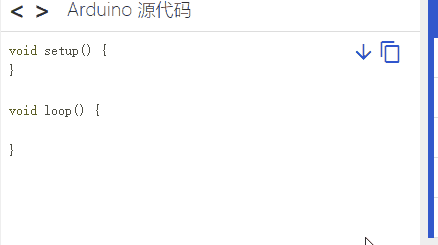
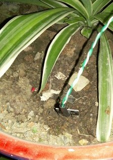
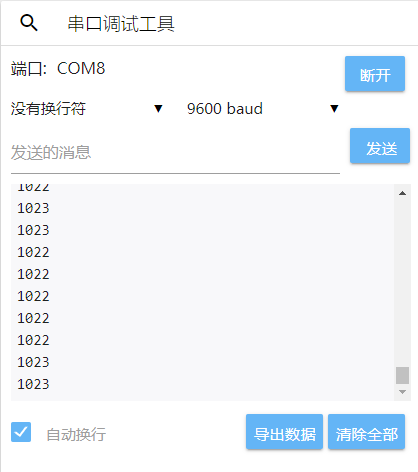
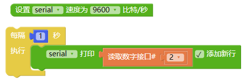

# 第三方传感器基础使用
---

> 为了避免不同类型的电子模块在使用时有接口（Pin out）的冲突，请注意前往[此页面](/cocomod/pinout-map)查看接口示意图

---

	常见问题请注意：使用完串口窗口后上传程序失败

这是因为串口工具连接著开发板端口，导致「主控模块」端口被占用，所以无法上传成功。

#### 解决方法:

切换到串口工具连接区，断开串口连接，再重新上载即可。

---

## 使用土壤湿度传感器

### 原理简介

土壤湿度传感器采用FDR频域反射原理。FDR(Frequency Domain Reflectometry)频域反射仪是一种用于测量土壤水分的仪器，它利用电磁脉冲原理、根据电磁波在介质中传播频率来测量土壤的表现介电常数，从而得到土壤相对含水量。

将传感器插入土壤中，通过模拟／数字转换电压信号，即可检测土壤水分，土壤越干燥，输出电压越小，读取的模拟接口的数值则越大，相反，越湿润输出电压越大（数值越小），读取的模拟接口的数值则越小。

支持：数字信号、模拟信号输入

> 注：高电平数字输出为1，低电平数字输出为0；

### 模块组装

将主控模块和转接模块 A1（或 A2）组合在一起，并拿出几根杜邦线，将转接模块和第三方传感器如下图右边示意组装在一起：

| 序号 |   参数   | 内容 |
|-----|---------|--|
| 1 | 检测深度 | 40mm |
| 2 | 工作温度 | 0~60℃（标称温度20℃） |
| 3 | 工作湿度 | 95%RH 以下非结露（标称湿度 65%RH） |
| 4 | 湿度检测精度 | ±5% |

#### 积木编程

#### 最终效果

程序上传后，将该传感器插入土壤中（如果不方便，可以使用湿的纸巾代替），然后打开 CocoBlockly 的串口监视窗，就可以查看到传感器读取的数据：

注：此处演示用湿的纸巾代替

儅湿的纸巾包裹在土壤湿度传感器上时，串口监控视窗上显示的数值变小

---

## 使用雨滴传感器

### 原理简介
可用于不同天气状况的监测，并转换成数字信号或模拟信号；使用时，传感板上没有水滴时，数字输出为高电平，开关指示灯灭，传感版越干燥，读取的模拟接口的数值越大，滴上一滴水，数字输出为低电平，开关指示灯亮，水滴越多，读取的模拟接口的数值越小。

支持：数字信号、模拟信号输入

### 模块组装

将主控模块和转接模块 A1（或 A2）组合在一起，并拿出几根杜邦线，将转接模块和第三方传感器如下图右边示意组装在一起：

| 序号 | 参数         | 内容 |
|-----|---------|--|
| 1 | 可传感	面积 | 5.0*4.0 cm |

#### 最终效果

程序上传后，将湿的纸巾放在该传感器上，然后打开 CocoBlockly 的串口监视窗，就可以查看到传感器读取的数据：

注：此处演示用湿的纸巾代替

儅湿的纸巾包裹在雨滴传感器上时，串口监控视窗上显示的数值变小

---

## 使用时钟模块

该模块具备时间功能，并且为了断电时依然可以保留时间。

### 模块组装

将主控模块和转接模块 A1（或 A2）组合在一起，并拿出几根杜邦线，将转接模块和第三方传感器如下图右边示意组装在一起：

<table style="margin-top:20px;">
	<tr>
		<td width="8%" style="font-weight: bold;">序号</td>
		<td width="8%" style="font-weight: bold;">参数</td>
		<td style="font-weight: bold;">内容</td>
	</tr>
	<tr>
		<td>1.</td>
		<td>通信</td>
		<td>该模块使用 I2C 通信，能保存秒、分、时、星期、日期、月和年资讯。少于31天的月份，将自动调整月末的日期，包括闰年的修正。</td>
	</tr>
	<tr>
		<td>2.</td>
		<td>电池</td>
		<td>带可充电电池，保证系统断电后，时钟仍然正常走动。</td>
	</tr>
</table>

### 积木编程

1. 使用时钟模块前需要先上传初始时间设置的程序：

2. 设置好初始时间后，可以通过串口监视窗查询时间：

### 最终效果

程序上传后，打开 CocoBlockly 的串口监视窗，就可以查看到对应的数据：

---

## 使用烟雾传感器

### 原理简介

当传感器所处环境中存在可燃性气体时，传感器的电导率随空气中可燃性气体浓度的增加而增大，模拟信号对应的输出电压随浓度越高电压越高。

支持：数字信号、模拟信号输入

### 模块组装

将主控模块和转接模块 A1（或 A2）组合在一起，并拿出几根杜邦线，将转接模块和第三方传感器如下图右边示意组装在一起：

| 序号 | 参数         | 内容 |
|-----|---------|--|
| 1 | 探测范围 | 300 to 10000ppmm（可燃气体） |
| 2 | 模拟输出 | 数据变化介于0-1023；当数字在20-62之间时，表示相对无污染 |
| 3 | 可侦测类型 | 烟雾 |

**使用说明：** 传感器通电后，需要预热20秒左右，测量的数据才稳定，传感器发热属于正常现象，如果烫手就不正常了

### 积木编程

### 最终效果

程序上传后，将传感器靠近沾有酒精的纸巾（注意安全），打开 CocoBlockly 的串口监视窗，就可以查看到对应的数据：

儅沾有酒精的纸巾靠近烟雾传感器时，串口监控视窗上显示的数值变大

<!-- ---

## 使用激光头模块

### 模块组装

### 积木编程

### 最终效果

-->
---

## 使用人体红外传感器

### 原理简介

红外线动作传感器 (PIR Motion Sensor) 或称人体红外线传感器，是一种可以侦测物体移动的电子装置。当有人进入其传感范围则输出高电平，人离开传感范围则自动延时关闭高电平，否则输出低电平。

支持：数字信号输入

### 模块组装

| 序号 | 参数         | 内容 |
|----|---------|--|
| 1 | 侦测距离 | 3米或7米以内(可以调节) |
| 2 | 侦测距离 | 小于120° |
| 3 | 延迟时间 | 5~200秒，预设5秒(可以调节) |
| 4 | 封锁时间 | 2.5秒 |

**使用说明：**
1. 模块通电后有一分钟左右的初始化时间，在此期间模块会间隔地输出0~3次，随后进入待机状态；
2. 使用时，尽量避免灯光等干扰源近距离地直射传感器表面透镜，使用的环境避免流动的风。
3. 可以打开透镜，查看各接口的信号类型；
4. 传感器上有两个调节旋钮，分别是「灵敏度调节」旋钮和「延时调节」旋钮:
 - 「灵敏度调节」旋钮:顺时针旋转电位器，传感距离增大（最大约7米），反之，传感距离减小（最小约3米）
 - 「延时调节」旋钮:时针旋转电位器，传感延时加长（最长约200秒），反之，传感延时减短（最短约5秒）
 

5. 跳线帽需扣在下图所示的位置，以此设置传感器为可重复触发的方式，即能够连续地检测到人体，若扣在靠外侧的两个引脚则为不重复触发的方式。
 

6. 此传感器自带延时，在人离开后，会有5秒（延时最短的情况下）的延时，并且即使传感器已传感到有人，人体需保持活动状态的情况下传感器才会认为此时有人，只要一停止不动5秒，传感器则视为未检测到人体。

### 积木编程

### 最终效果

数字0表示未检测到有人，数字1表示检测到有人

---

## 使用超声波距离传感器

### 原理简介

超声波传感器是将超声波信号转换成其他能量信号（通常是电信号）的传感器。超声波是震动频率高于20kHZ的机械波。它具有频率高、波长短、绕射现象小，特别是方向性好、能够成为射线而定向传播等特点。超声波对液体、固体的穿透泵零很大，尤其是在阳光不透明的固体中。超声波碰到杂质或分界面会产生显著反射形成反射回波，碰到活动物体能产生多普勒效应。

该传感器利用超声波测距离，多应用于机器人避开障碍物或其他距离测量的项目。

支持：数字信号、模拟信号输入

### 模块组装

将主控模块和转接模块 A1（或 A2）组合在一起，并拿出几根杜邦线，将转接模块和第三方传感器如下图右边示意组装在一起：

| 序号 | 参数         | 内容 |
|-----|---------|--|
| 1 | 侦测距离 | 50cm以内 |
| 2 | 传感角度 | 不大于 15° |
| 3 | 被测物体的面积 | 不小于50c㎡ 并且尽量平整 |

### 积木编程

> 超声波积木需要从工具栏中的「第三方传感器」中拖出来

### 最终效果

程序上传后，将传感器靠近障碍物，打开 CocoBlockly 的串口监视窗，就可以查看到对应的数据：

串口监控视窗上显示超声波距离传感器测出来的与障碍物之间的距离值

---

## 使用火焰传感器

### 原理简介

火焰传感器是由各种燃烧生成物、中间物、高温气体、碳氢物质以及无机物质为主题的高温固体微粒构成的。火焰的热辐射具有离散光谱的气体辐射和连续光谱的固体辐射。不同燃烧物的火焰辐射强度、波长分布有所差异，但总体来说，其对应火焰温度的近红外波长域及紫外光域具有很大的辐射强度，根据这种特性可制成火焰传感器。

可监测火焰或者波长在 760nm-1100nm 范围内的光源，打火机测试火焰距离为80cm，与火焰的距离越大，测试距离越远。

支持：数字信号、模拟信号输入

### 模块组装

将主控模块和转接模块 A1（或 A2）组合在一起，并拿出几根杜邦线，将转接模块和第三方传感器如下图右边示意组装在一起：

**使用说明：**
1. 火焰传感器对火焰最敏感，对普通光也是有反应的，一般用做火焰报警等用途。
2. 传感器与火焰要保持一定距离，以免高温损坏传感器，对打火机测试火焰距离为80cm，用来测试的火焰越大，距离应越远。

### 积木编程

### 最终效果

程序上传后，将传感器靠近有火烛附近（注意安全），打开 CocoBlockly 的串口监视窗，就可以查看到对应的数据。

儅打火机测试火焰靠近火焰传感器时，串口监控视窗上显示的数值变小

---

## 使用震动传感器

### 原理简介

震动传感器的作用主要是将机械量接收下来，并转换为与之成比例的电量。它并不是直接将原始要测的机械量转变为电量，而是将原始要测的机械量作为震动传感器的输入量，然后由机械接收部分加以接收，形成另一个适合于变换的机械量，最后由机电变换部分再变换为电量。因此一个传感器的工作性能是由机械接收部分和机电变换部分的工作性能来决定的。

震动传感器用于各种震动触发作用，不震动时，震动开关呈闭合导通状态，输出端输出低电平信号，绿色指示灯亮。

支持：数字信号输入

### 模块组装

将主控模块和转接模块 A1（或 A2）组合在一起，并拿出几根杜邦线，将转接模块和第三方传感器如下图右边示意组装在一起：

**使用说明：**
1. 产品不震动时，震动开关呈闭合导通状态，输出端输出低电平，绿色指示灯亮。
2. 产品震动时，震动开关瞬间断开，输出端输出高电平，绿色指示灯不亮。

### 积木编程

### 最终效果

程序上传后，打开 CocoBlockly 的串口监视窗，然后不断甩动传感器，就可以查看到对应的数据发生变化：

儅晃动震动传感器时，串口监控视窗上显示的数值由0变为1

---

## 使用红外避障传感器

红外避障传感器具有一对红外信号发射与接收二极管，发射管发射一定频率的红外信号，接收管接受这种频率的红外信号，儅传感器的检测方向遇到障碍物（反射面）时，红外信号反射回来被接收管接收，经过比较器电路处理之后，输出指示処的绿色指示灯将被点亮，同时数字端口持续输出低电平信号。

支持：数字信号输入

### 模块组装

将主控模块和转接模块 A1（或 A2）组合在一起，并拿出几根杜邦线，将转接模块和第三方传感器如下图右边示意组装在一起：

| 序号 | 参数         | 内容 |
|-----|---------|--|
| 1 | 侦测距离 | 2cm ~ 30cm |
| 2 | 传感角度 | 35° |

**使用说明：** 目标的反射率和形状是探测距离的关键。其中目标表面为黑色时探测距离最小，为白色最大；小面积物体的探测距离小,大面积探测距离大。

### 积木编程

### 最终效果

程序上传后，打开 CocoBlockly 的串口监视窗，将手掌盖住传感器上的红外线接收管和红外线发射管，就可以查看到对应的数据发生变化：

儅传感器的检测方向遇到阻挡物时，串口监控视窗上显示的数值由1变为0

---

## 使用倾斜传感器

传感器可感知物体角度的变化，将传感器轻轻平放在桌面上，将模块朝一个方向慢慢旋转，开关指示灯会点亮，然后再将模块朝相反的方向旋转，回到最初的状态，开关指示灯会灭。

支持：数字信号输入

### 模块组装

将主控模块和转接模块 A1（或 A2）组合在一起，并拿出几根杜邦线，将转接模块和第三方传感器如下图右边示意组装在一起：

**使用说明：** 传感器可感知物体角度的变化，将传感器平轻放桌面上，将模块朝一个方向慢慢旋转，开关指示灯会点亮，然后再将模块朝相反的方向旋转，回到最初的状态，开关指示灯会灭

### 积木编程

### 最终效果

程序上传后，打开 CocoBlockly 的串口监视窗，倾斜该传感器，就可以查看到对应的数据发生变化：

儅慢慢旋转传感器时，串口监控视窗上显示的数值由1变为0

---

## 使用光照传感器

探测光源处是一个光敏电阻，光敏电阻是用硫化镉或硒化镉等半导体材料制成的特殊电阻器，其工作原理是基于内光电效应。随著光照强度的升高，电阻值迅速降低，由于光照产生的载流子都参与导电，在外加电场的作用下作漂移运动，电子奔向电源的正极，空穴奔向电源的负极，从而使光敏电阻器的组织迅速下降。其在无光照时，几乎呈高阻状态，暗电阻很大。

该光照传感器对环境光线最敏感，一般用来检测周围环境的光线的亮度，触发单片机或继电器模块等。

支持：数字信号、模拟信号输入

### 模块组装

将主控模块和转接模块 A1（或 A2）组合在一起，并拿出几根杜邦线，将转接模块和第三方传感器如下图右边示意组装在一起：

### 积木编程

### 最终效果

程序上传后，打开 CocoBlockly 的串口监视窗，将手掌盖在传感器上方，就可以查看到对应的数据发生变化：

儅用手挡住传感器时，串口监控视窗上显示的数值变大

---
更新时间：2019年8月
