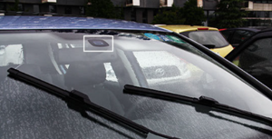
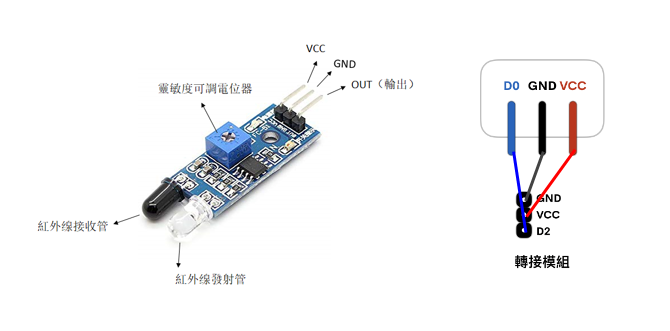

# 轉接模組基礎使用
## 使用土壤濕度感測器
### 模組組裝

> 註：
> 1、檢測深度：40mm
> 2、工作溫度：0~60℃（標稱溫度20℃）
> 3、工作濕度：95%RH 以下非結露（標稱濕度 65%RH）
> 4、濕度檢測精度為 ±5%。
#### 積木編程

#### 最終效果

---

## 使用雨滴感測器
### 模組組裝

### 積木編程

### 最終效果

---

## 使用時鐘模塊
### 模組組裝

### 積木編程

### 最終效果

---

## 使用煙霧感測器
### 模組組裝

> 註：
> 1、探測範圍：300 to 10000ppmm（可燃氣體）
> 2、模擬輸出：數據變化介於0-800；當數字在20-62之間時，表示相對無污染
> 3、可偵側類型：液化氣、丁烷、丙烷、甲烷、酒精、氫氣、煙霧（可燃氣體、煙霧）
> 4、注意：感測器通電後，需要預熱20秒左右，測量的數據才穩定，感測器發熱屬於正常現象，如果燙手就不正常了
### 積木編程

### 最終效果

---

## 使用激光頭模塊
### 模組組裝

### 積木編程

### 最終效果

---

## 使用人體紅外感測器
### 模組組裝

> 1、偵測距離：3~7公尺
> 2、最大感應角度：110°
> 3、訊號輸出信號（OUT）：高電位3.3V、低電位0V
> 4、延遲時間：5~200秒，預設5秒
> 5、封鎖時間：2.5秒
> 
> 4.a 延遲時間代表偵測到人體時，訊號輸出高電位的持續時間。
> 5.a 封鎖時間代表感應模組在每一次感應輸出后，不接受任何感應信號的一段時間
### 積木編程

### 最終效果

---

## 使用超聲波距離感測器

### 模組組裝

1. 偵測距離：2~450cm
2. 感測角度：不大於 15°
3. 被測物體的面積不小於50c㎡ 並且盡量平整
4. 具有溫度補償電路

### 積木編程

### 最終效果

---

## 使用火焰感測器
### 模組組裝

### 積木編程

### 最終效果

---

## 使用震動感測器
### 模組組裝

### 積木編程

### 最終效果

---

## 使用紅外避障感測器
### 模組組裝

### 積木編程

### 最終效果

---

## 使用傾斜感測器
### 模組組裝

### 積木編程

### 最終效果

---

## 使用光照感測器
### 模組組裝

### 積木編程

### 最終效果
