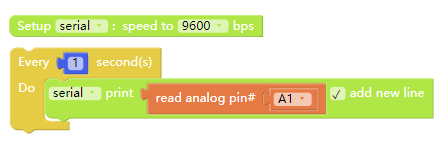

# Basic Application
---

> To avoid pinout clashes between different kinds of modules, please refer to [cocorobo-modules-pinout-map](/cocomod/pinout-map).

---

	FAQ: Why can't the program be successfully uploaded after using the serial monitor window?

Reason: The serial port tool is connecting to development board port so that the port of the main controller is occupied.

#### Solution

Switch to serial port tool connection area, disconnect the serial port tool, and then you can upload the program successfully.

---

## Apply Soil Humidity Sensor

### Principle

The principle behind soil humidity sensor is frequency domain reflection. Frequency Domain Reflectometry (FDR) is an instrument used for detecting soil moisture. It, based on the theory of electromagnetic pulse, measures the dielectric constant of the soil by the transmission frequency of electromagnetic wave in a particular medium.

Insert the sensor into soil. You can detect the moisture of the soil by converting digital/analog signals into voltage signals. The more the moisture, the higher the output voltage. And the higher the output voltage, the bigger the data of the analog interface.

Support the input of digital and analog signal

> Note: the output of high level is "1", and the output of low level is "0".

### Assemble Modules

Put the main controller and hub module A1 (or hub module A2) together. And connect the hub module to the soil humidity sensor via Dupont jumper wires (as shown on the right of the following picture):

| No. |   Parameter   | Content |
|-----|---------|--|
| 1 | Depth | 40mm |
| 2 | Temperature | 0~60℃ (nominal temperature 20℃) |
| 3 | Humidity | 95%RH, below which dew is not formed (nominal humidity 65%RH) |
| 4 | Precision | ±5% |

#### Code by CocoBlockly

#### Effects

After the program is uploaded successfully, insert the sensor into soil (wet napkin can be an alternative if soil is not available). Then you can see the data detected by the sensor on the serial monitor window of CocoBlockly.

Note: Wet napkin is used here.

The data on the serial monitor window becomes smaller when the sensor is wrapped in wet napkin.

---

## Apply Raindrop Sensor

### Principle
The module can be used in different weather conditions and convert the detected data into digital/analog signals. When there is no water on the sensing board, the digital output is at high level and the switch indicator is off. But When you put a water drop on the sensing board, the digital output will be at low level and the switch indicator wll be on. The more the water drops, the smaller the data on the analog signal.

Support the input of digital and analog signal

### Assemble Modules

Put the main controller and hub module A1 (or hub module A2) together. And connect the hub module to the raindrop sensor via Dupont jumper wires (as shown on the right of the following picture):

| No. | Parameter         | Content |
|-----|---------|--|
| 1 | Area that can be sensed | 5.0cm * 4.0cm |

#### Effects

After the program is uploaded successfully, put wet napkin on the sensor. Then you can see the data of the sensor on the serial monitor window of CocoBlockly.

Note: Wet napkin is used here.

The data on the serial monitor window becomes smaller when the sensor is wrapped in wet napkin.

---

## Apply Real-time Clock

The module is used to record time and keeps recording time when it is disconnected with power supply.

### Assemble Modules

Put the main controller and hub module A1 (or hub module A2) together. And connect the hub module to the real-time clock via Dupont jumper wires (as shown on the right of the following picture):

<table style="margin-top:20px;">
	<tr>
		<td width="8%" style="font-weight: bold;">No.</td>
		<td width="8%" style="font-weight: bold;">Parameter</td>
		<td style="font-weight: bold;">Content</td>
	</tr>
	<tr>
		<td>1.</td>
		<td>Communication</td>
		<td>The module applies 12C communication and keeps time information of year, month, date, week, hour, minute and second. It can adjust the last day of the month of less than 31 days. Besides, it can also take leap year into consideration.</td>
	</tr>
	<tr>
		<td>2.</td>
		<td>Battery</td>
		<td>The module has a rechargeable battery in it, which ensures that the clock keeps working after disconnecting with external power supply.</td>
	</tr>
</table>

### Code by CocoBlockly

1. Before using the module, you must upload the initial time setting program:

2. After setting the initial time, you can see the time on the serial monitor window:

### Effects

After the program is uploaded successfully, you can see the data of the real-time clock on the serial monitor window of CocoBlockly.

---

## Apply Gas Sensor

### Principle

The sensor is used to detect combustible gas in its surroundings. The conductivity of the sensor and analog signal's corresponding output voltage grow with the increasing of the combustible gas's concentrations.

Support the input of digital and analog signal

### Assemble Modules

Put the main controller and hub module A1 (or hub module A2) together. And connect the hub module to the gas sensor via Dupont jumper wires (as shown on the right of the following picture):

| No. | Parameter         | Content |
|-----|---------|--|
| 1 | Sensing range | 300 to 10000ppmm (combustible gas) |
| 2 | Analog output | The data range from 0 to 1023; when it is between 20 to 62, the surroundings are relatively free from pollution. |
| 3 | Detectable gas | combustible gas and smoke |

**Instruction:** The sensor needs 20 seconds to warm up after it is electrified. Otherwise the detected data would be unstable. It is normal that the sensor generates heat but it is abnormal that the sensor is scalding.

### Code by CocoBlockly

### Effects

After the program is uploaded successfully, put the sensor close to a piece of napkin soaked by alcohol. Then you can see the data of the sensor on the serial monitor window of CocoBlockly.

When the alcohol-soaked napkin gets close to the sensor, the data on the serial monitor window becomes bigger.

<!-- ---

## 使用激光頭模組

### Assemble Modules

### Code by CocoBlockly

### Effects

-->
---

## Apply Human IR Sensor

### Principle

Human IR sensor, also called PIR motion sensor, is an electrical device used for detecting an object's motion. When someone enters the sensing range, high level will be output. When the person leaves the sensing range, high level will be automatically turned off with delay. Otherwise, low level will be output.

Support the input of digital signal

### Assemble Modules

| No. | Parameter | Content |
|----|---------|--|
| 1 | Detectable distance | from 3 to 7 meters (adjustable) |
| 2 | Detectable angle | less than 120° |
| 3 | Delay time | 5~200 seconds, 5 seconds by default (adjustable) |
| 4 | Blocking time | 2.5 seconds |

**Instruction:**
1. The module needs about 1 minute to initialize itself, during which time it output data for 0 to 3 times. After initialization, the module would be in standby mode.
2. While the sensor is working, you must try to prevent interference such as light from shining directly on the lens of the sensor and keep wind from the surroundings.
3. You can open the lens to check the signal types of the pinouts.
4. There are two rotary knobs in the sensors: sensitivity adjustment rotary knob and delay adjustment rotary knob:
 - Sensitivity adjustment rotary knob: Turn the potentiometer clockwise the sensing distance will be increased (by a maximum of about 7 meters). Turn the potentiometer anticlockwise the sensing distance will be decreased (by a minimum of about 3 meters).
 - Delay adjustment rotary knob: Turn the potentiometer clockwise the sensing time will be increased (by a maximum of about 200 seconds). Turn the potentiometer anticlockwise the sensing time will be decreased (by a minimum of about 5 seconds).
 

5. If you put the jumper cap at the position shown in the picture below, the sensor can be triggered repeatedly, namely detect human presence constantly. But if you put the cap above the other two pins, the sensor cannot be triggered repeatedly.
 

6. The sensor is designed with a time delay. If a detected person leaves the sensing range, the sensor will keep the state for at least 5 seconds. And the sensor will decide that there is a person only when the person keeps moving in the sensing range. If the person keeps still for 5 or over 5 seconds, the sensor will decide that there is no person in the sensing range.

### Code by CocoBlockly

### Effects

"0" indicates that nobody has been detected; "1" indicates someone is detected.

---

## Apply Ultrasonic Ranging Sensor

### Principle

Ultrasonic ranging sensor converts ultrasonic signals into other energy signals (usually electric signal). Ultrasonic wave is a kind of mechanical wave with a frequency of more than 20kHZ. It has many characteristics such as high frequency, short wavelength, little diffraction, especially good directivity and the ability to serve as a ray shining in a particular direction. Ultrasonic wave has a great penetrating power for liquid and solid, especially for the solid opaque in the sun. It reflects significantly when meeting impurities and or interfaces, thus forming reflection echo. And doppler effect will be produced when ultrasonic wave meets moving objects.

The sensor uses ultrasound to measure distance. It is usually used by robots to avoid obstacles or used in some projects to measure distance.

Support the input of digital and analog signal

### Assemble Modules

Put the main controller and hub module A1 (or hub module A2) together. And connect the hub module to the ultrasonic ranging sensor via Dupont jumper wires (as shown on the right of the following picture):

| No. | Parameter | Content |
|-----|---------|--|
| 1 | Detection distance | within 50cm |
| 2 | Sensing angle | no more than 15° |
| 3 | Area of the detected object | smaller than 50c㎡ (and the flatter, the better) |

### Code by CocoBlockly

> The ultrasonic block should be dragged from the "Sensors" of the toolbar.

### Effects

After the program is uploaded successfully, put the sensor close to obstacles. Then you can see the data of the sensor on the serial monitor window of CocoBlockly.

The distance between the sensor and the obstacle will be shown in number on the serial monitor window.

---

## Apply Flame Sensor

### Principle

Flame consists of combustion products, intermediates, high-temperature gases, hydrocarbons and high-temperature particles (mainly inorganic matter). There is gas radiation with discrete spectrum and solid radiation with continuous spectrum in the thermal radiation of flame. Flames of different combustibles are different in radiation and wavelength. But in general, radiation is very strong in the flame corresponding near infrared wavelength domain and ultraviolet light domain. Based on this feature, flame sensor is created.

The sensor can detect light with a wavelength of from 760nm to 1100nm. You must keep the lighter flame at least 80cm away from the sensor. The bigger the flame, the longer the distance.

Support the input of digital and analog signal.

### Assemble Modules

Put the main controller and hub module A1 (or hub module A2) together. And connect the hub module to the flame sensor via Dupont jumper wires (as shown on the right of the following picture):

**Instruction**
1. Flame sensor is most sensitive to flame, but it still has reaction to common light. The sensor is usually used as flame alarm.
2. Proper distance between the sensor and the flame should be kept to ensure the sensor is not damaged by high temperature. The bigger the flame, the longer the distance.

### Code by CocoBlockly

### Effects

After the program is uploaded successfully, put the sensor close to a flame (be careful). Then you can see the data of the sensor on the serial monitor window of CocoBlockly.

When the flame of lighter comes close to the sensor, the number on the serial monitor window becomes smaller.

---

## Apply Vibration Sensor

### Principle

Vibration sensor is used for receiving mechanical parameters and converting them into proportional electricity. It does not convert the original mechanical parameters into electricity; instead, it uses them as the input of the sensor and the receiving part transforms them into the mechanical parameters suitable for converting. In the end, the converting part converts the transformed parameters into electricity. Therefore, the performance of the sensor is determined by both the receiving part and the converting part.

Vibration sensor is activated by vibration. When there is no vibration, the vibration switch is on; the output terminal exhibits a low level; and the green indicator light is on.

Support the input of digital signal

### Assemble Modules

Put the main controller and hub module A1 (or hub module A2) together. And connect the hub module to the vibration sensor via Dupont jumper wires (as shown on the right of the following picture):

**Instruction:**
1. When there is no vibration, the vibration switch is on; the output terminal exhibits a low level; and the green indicator light is on.
2. When there is vibration, the vibration switch is off; the output terminal exhibits a high level; and the green indicator light is off.

### Code by CocoBlockly

### Effects

After the program is uploaded successfully, vibrate the sensor constantly. Then you can see the data of the sensor on the serial monitor window of CocoBlockly.

When there is vibration, the data on the serial monitor window changes from "0" to "1".

---

## Apply IR Proximity Sensor

There is an infrared signal emitting diode and an infrared signal receiving diode in the IR proximity sensor. The emitting one emits infrared signals with a particular frequency and the receiving one receives such signals. When the sensor meets an obstacle (reflector), the emitted infrared signal is reflected and the receiving diode receives the signal. Then the comparator circuit processes the signal, after which the output green indicator light is on and the digital port keeps outputting low level.

Support the input of digital signal

### Assemble Modules

Put the main controller and hub module A1 (or hub module A2) together. And connect the hub module to the IR proximity sensor via Dupont jumper wires (as shown on the right of the following picture):

| No. | Parameter | Content |
|-----|---------|--|
| 1 | Detection distance | 2cm ~ 30cm |
| 2 | Sensing angle | 35° |

**Instruction:** The reflectivity and shape of the obstacle is essential for the detection. The detectable distance of an obstacle with a black surface is shorter than that of an obstacle with a white surface. And the detectable distance of an obstacle with a small area is shorter than that of an obstacle with a relatively big area.

### Code by CocoBlockly

### Effects

After the program is uploaded successfully, use your hand to cover the two diodes on the sensor. Then you can see the data of the sensor on the serial monitor window of CocoBlockly.

When there is an obstacle in the sensing direction, the data on the serial monitor window changes from "1" to "0".

---

## Apply Tilt Sensor

The tilt sensor is used for sensing the angle change of an object. Put the module flat on the table, tilt the module in a particular direction, and the switch indicator light will be on. Then tilt the module in the opposite direction to the original state, the light will be off.

Support the input of digital signal

### Assemble Modules

Put the main controller and hub module A1 (or hub module A2) together. And connect the hub module to the tilt sensor via Dupont jumper wires (as shown on the right of the following picture):

**Instruction:** The tilt sensor is used for sensing the angle change of an object. Put the module flat on the table, tilt the module in a particular direction, and the switch indicator light will be on. Then tilt the module in the opposite direction to the original state, the light will be off.

### Code by CocoBlockly

### Effects

After the program is uploaded successfully, tilt the sensor. Then you can see the data change of the sensor on the serial monitor window of CocoBlockly.

When the sensor is tilted, the data on the serial monitor window changes from "1" to "0".

---

## Apply Light-sensitive Sensor

Photoresistance is used in the sensing part of the sensor. Photoresistance, working on the principle of internal photoelectric effect, is a special electrical resistor made of semiconductor materials such as cadmium sulfide and cadmium selenide. With the light getting more intense, the photoresistance value decreases rapidly. Current carriers generated by light play a role in conducting electricity. External electric field causes electrons to do drift motion. So electrons go to the positive electrode and the electron hole goes to the negative electrode. Consequently the photoresistance value of photoresistance decreases rapidly. But when there is no light, the photoresistance value is very big and dark resistance is very high.

The sensor is most sensitive to the light of the surroundings. It is usually used to detect the light intensity of the surroundings, to activate the singlechip or relay module, and so on.

Support the input of digital and analog signal

### Assemble Modules

Put the main controller and hub module A1 (or hub module A2) together. And connect the hub module to the light-sensitive sensor via Dupont jumper wires (as shown on the right of the following picture):

### Code by CocoBlockly

### Effects

After the program is uploaded successfully, cover the sensor with your hand. Then you can see the data change of the sensor on the serial monitor window of CocoBlockly.

When you use your hand to cover the sensor, the data on the serial monitor window becomes bigger.

---
Updated in August 2019
