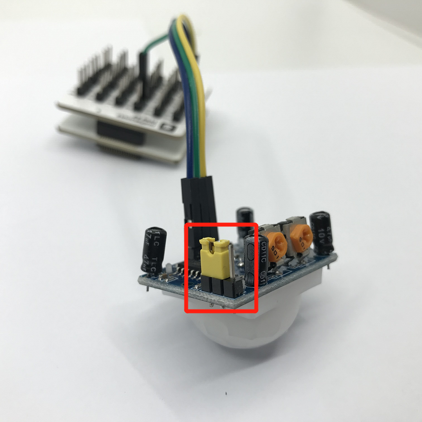
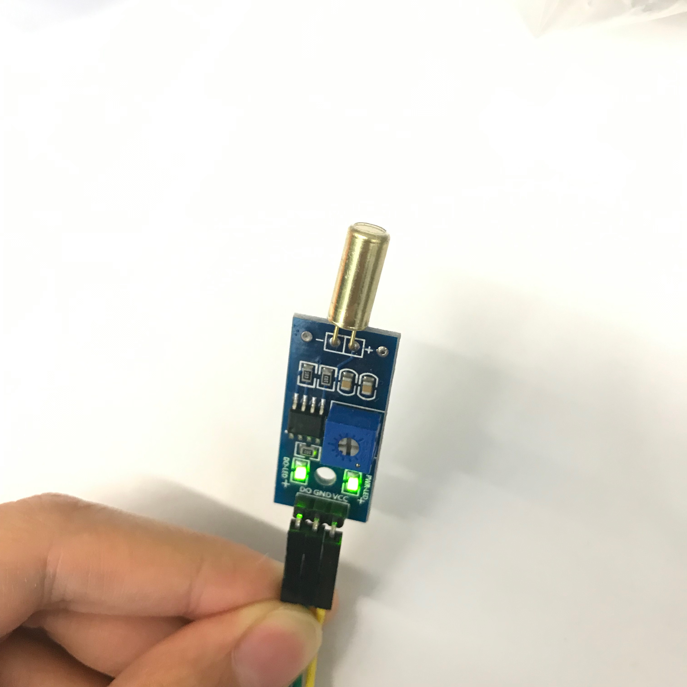

# 第三方感應器基礎使用
---

> 爲了避免不同類型的電子模組在使用時有接口（Pin out）的衝突，請注意前往[此頁面](/cocomod/pinout-map)查看接口示意圖

---

	常見問題請注意：使用完序列埠窗口後上傳程式失敗

這是因爲序列埠工具連接著開發板端口，導致「主機板模組」端口被佔用，所以無法上傳成功。

#### 解決方法:

切換到序列埠工具連接區，斷開序列埠連接，再重新上載即可。

---

## 使用土壤濕度感應器

### 原理簡介

土壤濕度感應器采用FDR頻域反射原理。FDR(Frequency Domain Reflectometry)頻域反射儀是一種用於測量土壤水分的儀器，它利用電磁脈衝原理、根據電磁波在介質中傳播頻率來測量土壤的表現介電常數，從而得到土壤相對含水量。

將感應器插入土壤中，通過類比／數位轉換電壓訊號，即可檢測土壤水分，土壤越乾燥，輸出電壓越小，讀取的模擬接口的數值則越大，相反，越濕潤輸出電壓越大（數值越小），讀取的模擬接口的數值則越小。

支持：數位訊號、類比訊號輸入

> 注：高電平數位輸出為1，低電平數位輸出為0；

### 模組組裝

將主機板模組和轉接模組 A1（或 A2）組合在一起，並拿出幾根杜邦線，將轉接模組和第三方感應器如下圖右邊示意組裝在一起：

| 序號 |   參數   | 内容 |
|-----|---------|--|
| 1 | 檢測深度 | 40mm |
| 2 | 工作溫度 | 0~60℃（標稱溫度20℃） |
| 3 | 工作濕度 | 95%RH 以下非結露（標稱溼度 65%RH） |
| 4 | 濕度檢測精度 | ±5% |

#### 積木編程

#### 最終效果

程式上傳後，將該感應器插入土壤中（如果不方便，可以使用溼的紙巾代替），然後打開 CocoBlockly 的序列埠監視窗，就可以查看到感應器讀取的數據：

注：此處演示用濕的紙巾代替

儅濕的紙巾包裹在土壤濕度感應器上時，序列埠監控視窗上顯示的數值變小

---

## 使用雨滴感應器

### 原理簡介
可用於不同天氣狀況的監測，並轉換成數位訊號或類比訊號；使用時，感應板上沒有水滴時，數位輸出爲高電平，開關指示燈滅，感應版越乾燥，讀取的模擬接口的數值越大，滴上一滴水，數位輸出爲低電平，開關指示燈亮，水滴越多，讀取的模擬接口的數值越小。

支持：數位訊號、類比訊號輸入

### 模組組裝

將主機板模組和轉接模組 A1（或 A2）組合在一起，並拿出幾根杜邦線，將轉接模組和第三方感應器如下圖右邊示意組裝在一起：

| 序號 | 參數         | 内容 |
|-----|---------|--|
| 1 | 可感應	面積 | 5.0*4.0 cm |

#### 最終效果

程式上傳後，將溼的紙巾放在該感應器上，然後打開 CocoBlockly 的序列埠監視窗，就可以查看到感應器讀取的數據：

注：此處演示用濕的紙巾代替

儅濕的紙巾包裹在雨滴感應器上時，序列埠監控視窗上顯示的數值變小

---

## 使用時鐘模組

該模組具備時間功能，並且爲了斷電時依然可以保留時間。

### 模組組裝

將主機板模組和轉接模組 A1（或 A2）組合在一起，並拿出幾根杜邦線，將轉接模組和第三方感應器如下圖右邊示意組裝在一起：

<table style="margin-top:20px;">
	<tr>
		<td width="8%" style="font-weight: bold;">序號</td>
		<td width="8%" style="font-weight: bold;">參數</td>
		<td style="font-weight: bold;">內容</td>
	</tr>
	<tr>
		<td>1.</td>
		<td>通訊</td>
		<td>該模組使用 I2C 通讯，能保存秒、分、時、星期、日期、月和年資訊。少於31天的月份，將自動調整月末的日期，包括閏年的修正。</td>
	</tr>
	<tr>
		<td>2.</td>
		<td>電池</td>
		<td>帶可充電電池，保證系統斷電後，時鐘仍然正常走動。</td>
	</tr>
</table>

### 積木編程

1. 使用時鐘模塊前需要先上傳初始時間設置的程式：

2. 設置好初始時間后，可以通過序列埠監視窗查詢時間：

### 最終效果

程式上傳後，打開 CocoBlockly 的序列埠監視窗，就可以查看到對應的數據：

---

## 使用煙霧感應器

### 原理簡介

當感應器所處環境中存在可燃性氣體時，感應器的電導率隨空氣中可燃性氣體濃度的增加而增大，類比訊號對應的輸出電壓隨濃度越高電壓越高。

支持：數位訊號、類比訊號輸入

### 模組組裝

將主機板模組和轉接模組 A1（或 A2）組合在一起，並拿出幾根杜邦線，將轉接模組和第三方感應器如下圖右邊示意組裝在一起：

| 序號 | 參數         | 内容 |
|-----|---------|--|
| 1 | 探測範圍 | 300 to 10000ppmm（可燃氣體） |
| 2 | 類比輸出 | 數據變化介於0-800；當數位在20-62之間時，表示相對無污染 |
| 3 | 可偵測類型 | 可偵側類型：液化氣、丁烷、丙烷、甲烷、酒精、氫氣、煙霧（可燃氣體、煙霧） |

**使用説明：** 感應器通電後，需要預熱20秒左右，測量的數據才穩定，感應器發熱屬於正常現象，如果燙手就不正常了

### 積木編程

### 最終效果

程式上傳後，將感應器靠近沾有酒精的紙巾（注意安全），打開 CocoBlockly 的序列埠監視窗，就可以查看到對應的數據：

儅沾有酒精的紙巾靠近烟霧感應器時，序列埠監控視窗上顯示的數值變大

<!-- ---

## 使用激光頭模組

### 模組組裝

### 積木編程

### 最終效果

-->
---

## 使用人體紅外感應器

### 原理簡介

紅外線動作感應器 (PIR Motion Sensor) 或稱人體紅外線感應器，是一種可以偵測物體移動的電子裝置。當有人進入其感應範圍則輸出高電平，人離開感應範圍則自動延時關閉高電平，否則輸出低電平。

支持：數位訊號輸入

### 模組組裝

| 序號 | 參數         | 内容 |
|----|---------|--|
| 1 | 偵測距離 | 3米或7米以内(可以調節) |
| 2 | 偵測距離 | 小於120° |
| 3 | 延遲時間 | 5~200秒，預設5秒(可以調節) |
| 4 | 封鎖時間 | 2.5秒 |

**使用説明：**
1. 模組通電后有一分鐘左右的初始化時間，在此期間模組會間隔地輸出0~3次，隨後進入待機狀態；
2. 使用時，盡量避免燈光等干擾源近距離地直射感應器表面透鏡，使用的環境避免流動的風。
3. 可以打開透鏡，查看各接口的訊號類型；
4. 感應器上有兩個調節旋鈕，分別是「靈敏度調節」旋鈕和「延時調節」旋鈕:
 - 「靈敏度調節」旋鈕:順時針旋轉電位器，感應距離增大（最大約7米），反之，感應距離減小（最小約3米）
 - 「延時調節」旋鈕:時針旋轉電位器，感應延時加長（最長約200秒），反之，感應延時減短（最短約5秒）
 

5. 跳綫帽需扣在下圖所示的位置，以此設置感應器為可重複觸發的方式，即能夠連續地檢測到人體，若扣在靠外側的兩個引脚則為不重複觸發的方式。
 

6. 此感應器自帶延時，在人離開后，會有5秒（延時最短的情況下）的延時，并且即使感應器已感應到有人，人體需保持活動狀態的情況下感應器才會認爲此時有人，只要一停止不動5秒，感應器則視爲未檢測到人體。

### 積木編程

### 最終效果

數字0表示未檢測到有人，數字1表示檢測到有人

---

## 使用超聲波距離感應器

### 原理簡介

超聲波感應器是將超聲波信號轉換成其他能量訊號（通常是電訊號）的感應器。超聲波是震動頻率高於20kHZ的機械波。它具有頻率高、波長短、繞射現象小，特別是方向性好、能夠成爲射綫而定向傳播等特點。超聲波對液體、固體的穿透泵零很大，尤其是在陽光不透明的固體中。超聲波碰到雜質或分界面會產生顯著反射形成反射回波，碰到活動物體能產生多普勒效應。

該感應器利用超聲波測距離，多應用於機器人避開障礙物或其他距離測量的項目。

支持：數位訊號、類比訊號輸入

### 模組組裝

將主機板模組和轉接模組 A1（或 A2）組合在一起，並拿出幾根杜邦線，將轉接模組和第三方感應器如下圖右邊示意組裝在一起：

| 序號 | 參數         | 内容 |
|-----|---------|--|
| 1 | 偵測距離 | 50cm以内 |
| 2 | 感應角度 | 不大於 15° |
| 3 | 被測物體的面積 | 不小於50c㎡ 並且儘量平整 |

### 積木編程

> 超聲波積木需要從工具欄中的「第三方感應器」中拖出來

### 最終效果

程式上傳後，將感應器靠近障礙物，打開 CocoBlockly 的序列埠監視窗，就可以查看到對應的數據：

序列埠監控視窗上顯示超聲波距離感應器測出來的與障礙物之間的距離值

---

## 使用火焰感應器

### 原理簡介

火焰感應器是由各種燃燒生成物、中間物、高溫氣體、碳氫物質以及無機物質為主題的高溫固體微粒構成的。火焰的熱輻射具有離散光譜的氣體輻射和連續光譜的固體輻射。不同燃燒物的火焰輻射强度、波長分佈有所差異，但總體來説，其對應火焰溫度的近紅外波長域及紫外光域具有很大的輻射强度，根據這種特性可製成火焰傳感器。

可監測火焰或者波長在 760nm-1100nm 範圍內的光源，打火機測試火焰距離爲80cm，與火焰的距離越大，測試距離越遠。

支持：數位訊號、類比訊號輸入

### 模組組裝

將主機板模組和轉接模組 A1（或 A2）組合在一起，並拿出幾根杜邦線，將轉接模組和第三方感應器如下圖右邊示意組裝在一起：

**使用説明：**
1. 火焰感應器對火焰最敏感，對普通光也是有反應的，一般用做火焰報警等用途。
2. 感應器與火焰要保持一定距離，以免高溫損壞感應器，對打火機測試火焰距離為80cm，用來測試的火焰越大，距離應越遠。

### 積木編程

### 最終效果

程式上傳後，將感應器靠近有火燭附近（注意安全），打開 CocoBlockly 的序列埠監視窗，就可以查看到對應的數據。

儅打火機測試火焰靠近火焰感應器時，序列埠監控視窗上顯示的數值變小

---

## 使用震動感應器

### 原理簡介

震動感應器的作用主要是將機械量接收下來，並轉換為與之成比例的電量。它並不是直接將原始要測的機械量轉變爲電量，而是將原始要測的機械量作爲震動感應器的輸入量，然後由機械接收部分加以接收，形成另一個適合于變換的機械量，最後由機電變換部分再變換為電量。因此一個感應器的工作性能是由機械接收部分和機電變換部分的工作性能來決定的。

震動感應器用於各種震動觸發作用，不震動時，震動開關呈閉合導通狀態，輸出端輸出低電平訊號，綠色指示燈亮。

支持：數位訊號輸入

### 模組組裝

將主機板模組和轉接模組 A1（或 A2）組合在一起，並拿出幾根杜邦線，將轉接模組和第三方感應器如下圖右邊示意組裝在一起：

**使用説明：**
1. 產品不震動時，震動開關呈閉合導通狀態，輸出端輸出低電平，綠色指示燈亮。
2. 產品震動時，震動開關瞬間斷開，輸出端輸出高電平，綠色指示燈不亮。

### 積木編程

### 最終效果

程式上傳後，打開 CocoBlockly 的序列埠監視窗，然後不斷甩動感應器，就可以查看到對應的數據發生變化：

儅晃動震動感應器時，序列埠監控視窗上顯示的數值由0變爲1

---

## 使用紅外避障感應器

紅外避障感應器具有一對紅外訊號發射與接收二極管，發射管發射一定頻率的紅外訊號，接收管接受這種頻率的紅外訊號，儅傳感器的檢測方向遇到障礙物（反射面）時，紅外訊號反射回來被接收管接收，經過比較器電路處理之後，輸出指示処的綠色指示燈將被點亮，同時數位端口持續輸出低電平訊號。

支持：數位訊號輸入

### 模組組裝

將主機板模組和轉接模組 A1（或 A2）組合在一起，並拿出幾根杜邦線，將轉接模組和第三方感應器如下圖右邊示意組裝在一起：

| 序號 | 參數         | 内容 |
|-----|---------|--|
| 1 | 偵測距離 | 2cm ~ 30cm |
| 2 | 感應角度 | 35° |

**使用説明：** 目標的反射率和形狀是探測距離的關鍵。其中目標表面為黑色時探測距離最小，為白色最大；小面積物體的探測距離小,大面積探測距離大。

### 積木編程

### 最終效果

程式上傳後，打開 CocoBlockly 的序列埠監視窗，將手掌蓋住感應器上的 2 個黑色頭，就可以查看到對應的數據發生變化：

儅傳感器的檢測方向遇到阻擋物時，序列埠監控視窗上顯示的數值由1變爲0

---

## 使用傾斜感應器

感應器可感知物體角度的變化，將感應器輕輕平放在桌面上，將模組朝一個方向慢慢旋轉，開關指示燈會點亮，然後再將模組朝相反的方向旋轉，回到最初的狀態，開關指示燈會滅。

支持：數位訊號輸入

### 模組組裝

將主機板模組和轉接模組 A1（或 A2）組合在一起，並拿出幾根杜邦線，將轉接模組和第三方感應器如下圖右邊示意組裝在一起：

**使用説明：** 感應器可感知物體角度的變化，將感應器平輕放桌面上，將模塊朝一個方向慢慢旋轉，開關指示燈會點亮，然後再將模塊朝相反的方向旋轉，回到最初的狀態，開關指示燈會滅

### 積木編程

### 最終效果

程式上傳後，打開 CocoBlockly 的序列埠監視窗，傾斜該感應器，就可以查看到對應的數據發生變化：

儅慢慢旋轉感應器時，序列埠監控視窗上顯示的數值由1變爲0

---

## 使用光照感應器

探測光源処是一個光敏電阻，光敏電阻是用硫化鎘或硒化鎘等半導體材料製成的特殊電阻器，其工作原理是基於内光電效應。隨著光照强度的升高，電阻值迅速降低，由於光照產生的載流子都參與導電，在外加電場的作用下作漂移運動，電子奔向電源的正極，空穴奔向電源的負極，從而使光敏電阻器的組織迅速下降。其在無光照時，幾乎呈高阻狀態，暗電阻很大。

該光照感應器對環境光線最敏感，一般用來檢測周圍環境的光線的亮度，觸發單片機或繼電器模組等。

支持：數位訊號、類比訊號輸入

### 模組組裝

將主機板模組和轉接模組 A1（或 A2）組合在一起，並拿出幾根杜邦線，將轉接模組和第三方感應器如下圖右邊示意組裝在一起：

### 積木編程

### 最終效果

程式上傳後，打開 CocoBlockly 的序列埠監視窗，將手掌蓋在感應器上方，就可以查看到對應的數據發生變化：

儅用手擋住感應器時，序列埠監控視窗上顯示的數值變大

---
更新時間：2019年8月
