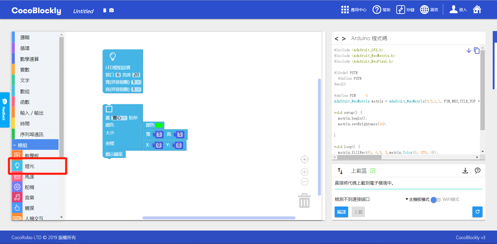
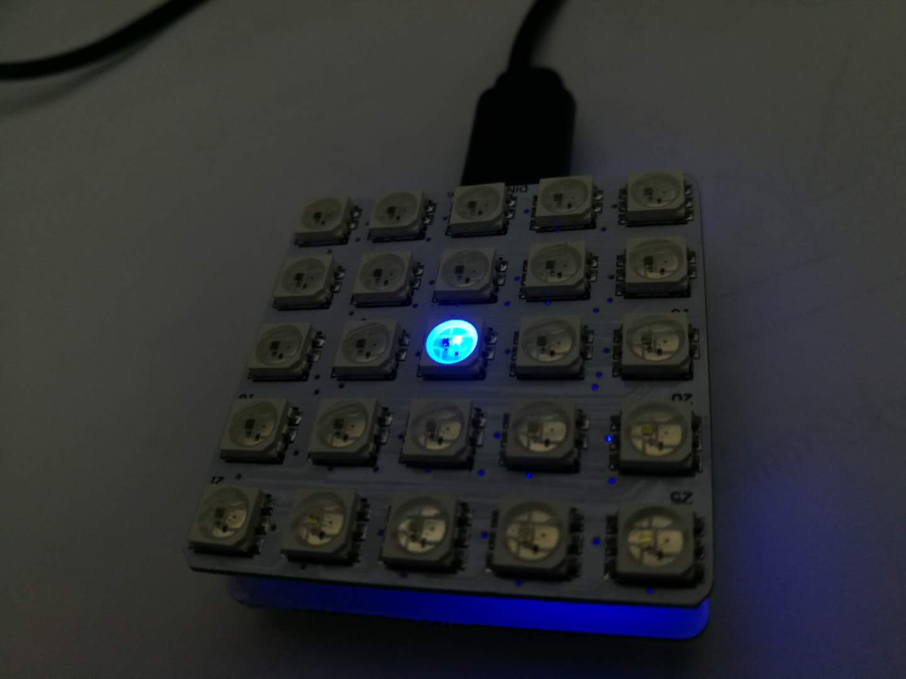
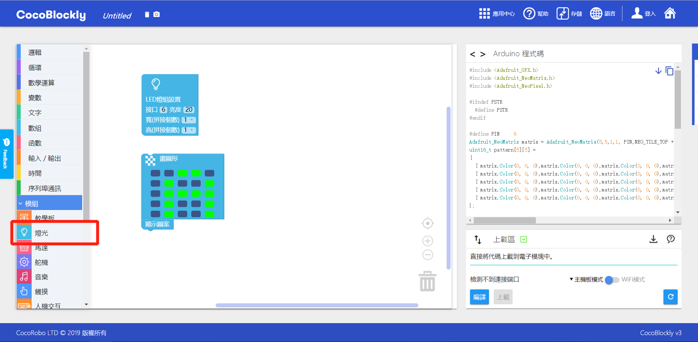
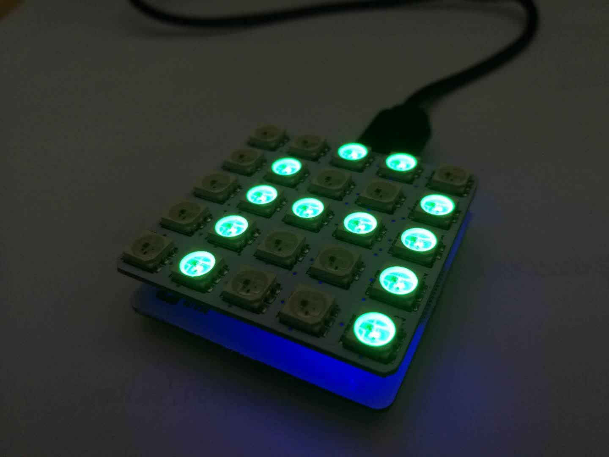
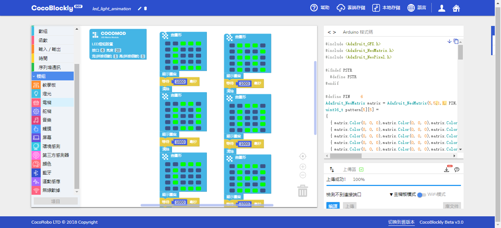

# LED燈屏模組
---

## 模組簡介

LED燈板是將多個LED燈排列一起而成的電子模組，我們可以通過點亮不同的燈，用不同的顏色，去繪製自己想要的圖案

## 模組主要部件

|編號| 部件名稱                 | 部件描述                                                                        |
|---|-------------------------|-------------------------------------------------------------------------------|
|1. |LED燈             |具有RGB屬性，能夠顯示各種顏色              |

## 模組使用說明

1. 一個模組由25個LED燈構成，以右下角為排列起始位置，橫排竪排各5個，構成5X5的方陣
2. 需要連接主機板模組使用
3. LED模組默認占用D6引脚，拼接到轉接模組可以設定其他數字引脚

---

## LED燈屏模組基礎使用

### 亮度調整

#### 模組組裝

主機板模組+LED燈屏模組

#### 積木編程

#### 最終效果

#### 參考鏈接

to be edited.

---

### 座標軸介紹
####坐標信息
|編號| 座標軸                | 範圍                                                                       |
|---|-------------------------|-------------------------------------------------------------------------------|
|1. |  X軸          |  0-4             |
|2. |  Y軸          |  0-4            |

#### 積木編程

#### 最終效果

---
### 基本圖形繪製：點、線、面

#### 模組組裝

主機板模組+LED燈屏模組

#### 積木編程

#### 最終效果

#### 參考鏈接

to be edited.

---
### 清除屏幕

#### 模組組裝

主機板模組+LED燈屏模組

#### 積木編程

#### 最終效果

#### 參考鏈接

to be edited.

---

## LED燈屏模組進階使用

### 打印文字

#### 模組組裝 

主機板模組+LED燈屏模組

#### 積木編程

#### 最終效果

#### 參考鏈接

to be edited.

---

### 逐幀動畫

#### 模組組裝 

主機板模組+LED燈屏模組

#### 積木編程

#### 最終效果

//gif

#### 參考鏈接

//led_block_animation.xml

---

### 呼吸燈

#### 模組組裝 

主機板模組+LED燈屏模組

#### 積木編程

#### 最終效果

//gif

#### 參考鏈接

//led_block_breathe.xml

---

### 多LED拼接

#### 模組組裝 

主機板模組+LED燈屏模組

#### 積木編程

to be edited.

#### 最終效果

to be edited.

#### 參考鏈接

to be edited.

