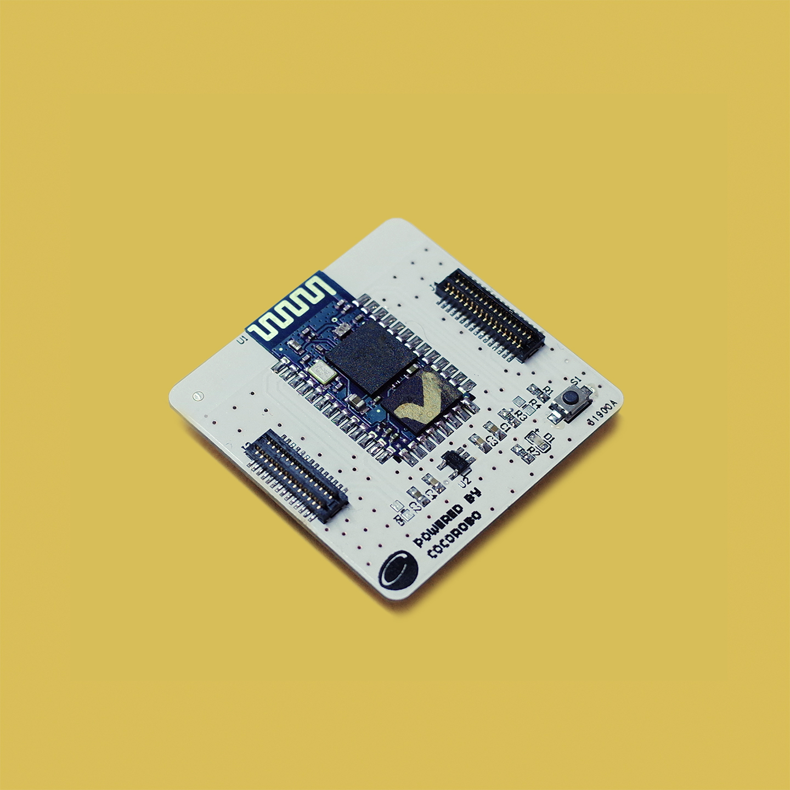
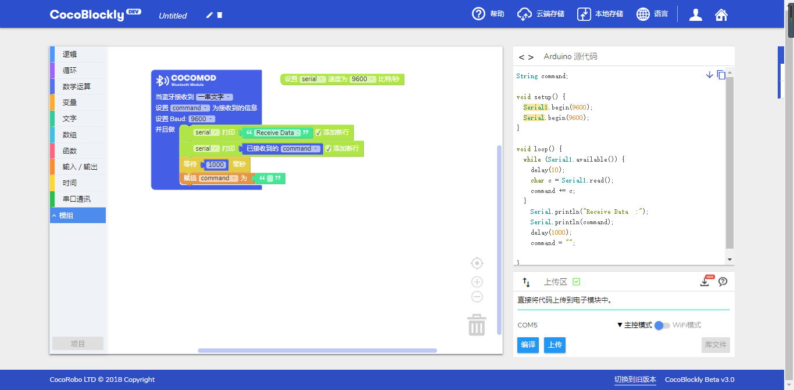
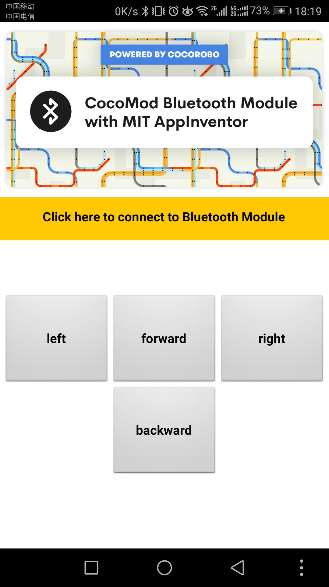
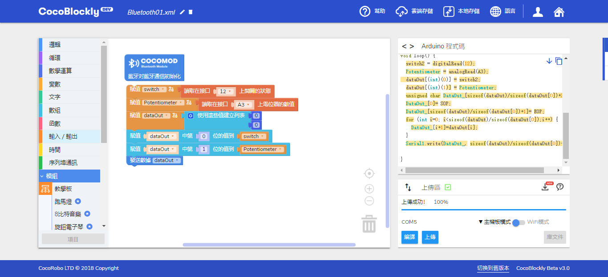
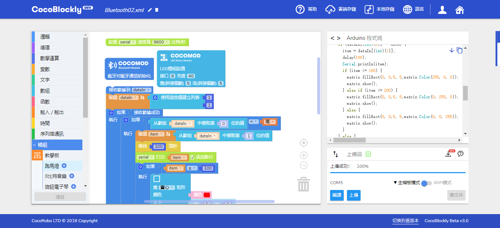

# 藍牙通訊模組
---

## 模組簡介
 藍牙模組是用於能與藍牙配對的設備，遠端控制輸出。藍牙配對前狀態燈會以較快的頻率閃爍，當成功連接後狀態燈以較慢頻率閃爍

## 模組主要部件

 

<table style="margin-top:20px;">
	<tr>
		<td width="6%" style="font-weight: bold;">No.</td>
		<td width="20%" style="font-weight: bold;">部件名稱</td>
		<td style="font-weight: bold;">部件描述</td>
	</tr>
	<tr>
		<td>1.</td>
		<td>藍牙芯片</td>
		<td>藍牙 2.0 芯片 (HC-05)</td>
	</tr>
	<tr>
		<td>2.</td>
		<td>狀態指示燈</td>
		<td>正常情況下分兩種狀態： 快速閃爍（等待配對狀態）和稍慢閃爍（已配對或已連接）</td>
	</tr>
	<tr>
		<td>3.</td>
		<td>AT模式按鈕</td>
		<td>在通電前長按此按鈕，可前往本章後面部分的<a href="http://help.cocorobo.hk/#/cocomod/bluetooth?id=藍牙改名：at模式">進入AT模式</a>瞭解，以進行「修改藍牙模組廣播名稱」、「配對密碼」、「獲取藍牙物理地址」等操作</td>
	</tr>
</table>

#### 模組接口示意

| 接口位置 | 接口描述           |
| -------- | ------------------ |
| (數位訊號) D0: 主機板 Rx    | Tx: 藍牙模組端 (UART 通訊)       |
| (數位訊號) D1: 主機板 Tx   | Rx: 藍牙模組端 (UART 通訊) |

> 爲了避免不同類型的電子模組在使用時有接口（Pin out）的衝突，請注意前往[此頁面](/cocomod/pinout-map)查看接口示意圖

---

## 模組使用說明

1. 藍牙未連接前，狀態燈會快速閃爍，儅成功配對連接後，狀態燈閃爍變慢；
2. 藍牙出廠設置的命名HC-05，連接pin碼爲「1234」；
3. 藍牙重置需要先通電，長按重置按鈕5s，直至狀態燈快速閃爍；
4. 用戶可根據擬藍牙遙控之功用，使用App Inventor來製作遙控App；此外，CocoRobo亦提供下述藍牙遙控實例以供參考；
5. APP Inventor可定製化，可由用戶自己製作

###  MIT - App Inventor - 示例App 
|編號| 二維碼       | App名稱    |   應用介紹   |     使用方法    |
|---|-------------------------|----------|------------------|------------------|
|1. |      |   Coco BT Switch          |    藍牙控制：按鈕開關   | 使用按鈕，發出單個數值數據 |
|2. |               | Coco BT Slider  |  藍牙控制：滑動條    | 通過滑動條上指針的所處位置，發出單個數值數據（0~100 |
|3. |                  | Coco BT Motor Controller    |  藍牙控制：馬達控制    | 操控兩個馬達的正轉反轉和速度 |
|4. |                   | Coco BT Servo Controller    |  藍牙控制：伺服馬達控制    | 可同時操控 6 個伺服馬達的角度（0~180度） |
|5. |                 | Coco Robot Arm    |  藍牙控制機械臂        | 在 CocoBlockly 中打開「藍牙」，選擇「藍牙控制機械臂」 | 
|6. |                  | Coco Robot Car    |  藍牙控制小車    | 在 CocoBlockly 中打開「藍牙」，選擇「藍牙控制小車」 |

---

## 藍牙通訊模組基礎使用

### 藍牙接收 MIT App Inventor App 發送的數據

#### 模組組裝 

to be edited.

#### 積木編程

 

#### 使用app

 

#### 最終效果

 

#### 參考鏈接

to be edited.

---

### 學習如何製作 MIT AI2 的app

#### 待補充

#### 參考鏈接

* https://web.17coding.net/
* https://www.jianshu.com/p/9c462581bbcf

---

## 藍牙通訊模組進階使用

### 藍牙配對藍牙模組（模組間的數據傳輸）

#### 藍牙改名：AT模式

AT 模式對應 Arduino 程式下載：
* https://cocorobo.hk/downloads/Bluetooth_AT_Mode.ino

<object width="100%" height="860px" data="../media/at-mode.pdf" type="application/pdf">
        <embed src="../media/at-mode.pdf" type="application/pdf" />
    </object>

#### 模組組裝 

to be edited.

#### 積木編程

藍牙模組1

 

藍牙模組2

 

#### 最終效果

to be edited.

#### 參考鏈接
