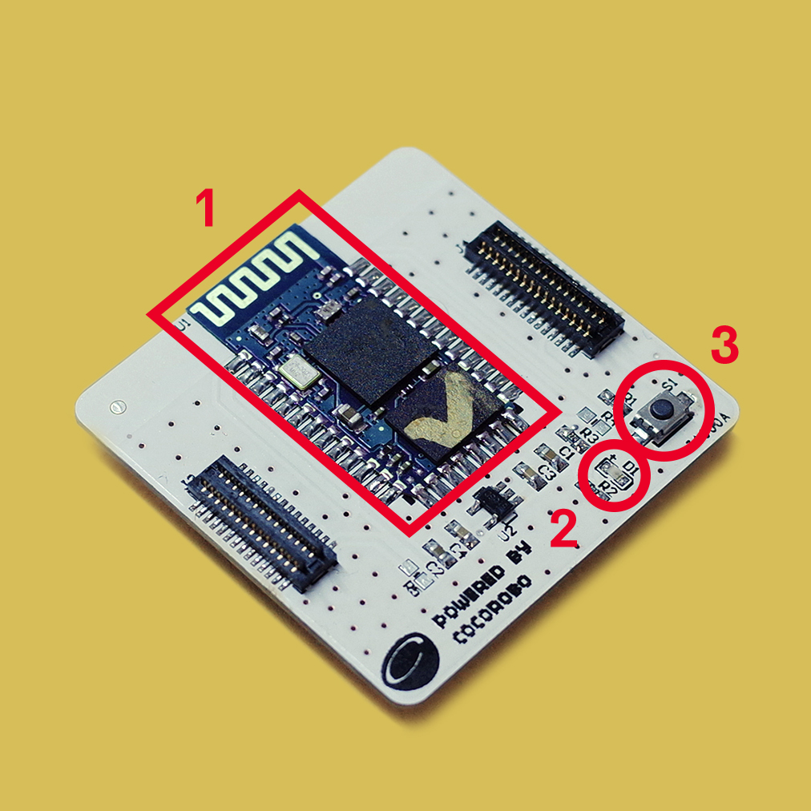

# 藍牙通訊模組
---

## 模組簡介
 藍牙通訊模組是用於能與藍牙配對的設備，遠端控制輸出。藍牙配對前狀態燈會以較快的頻率閃爍，當成功連接後狀態燈以較慢頻率閃爍

## 模組主要部件

 

<table style="margin-top:20px;">
	<tr>
		<td width="6%" style="font-weight: bold;">No.</td>
		<td width="20%" style="font-weight: bold;">部件名稱</td>
		<td style="font-weight: bold;">部件描述</td>
	</tr>
	<tr>
		<td>1.</td>
		<td>藍牙芯片</td>
		<td>藍牙 2.0 芯片 (HC-05)</td>
	</tr>
	<tr>
		<td>2.</td>
		<td>狀態指示燈</td>
		<td>正常情況下分兩種狀態： 快速閃爍（等待配對狀態）和稍慢閃爍（已配對或已連接）</td>
	</tr>
	<tr>
		<td>3.</td>
		<td>AT模式按鈕</td>
		<td>在通電前長按此按鈕，可前往本章後面部分的<a href="http://help.cocorobo.hk/#/cocomod/bluetooth?id=藍牙改名：at模式">進入AT模式</a>瞭解，以進行「修改藍牙通訊模組廣播名稱」、「配對密碼」、「獲取藍牙物理地址」等操作</td>
	</tr>
</table>

#### 模組接口示意

| 接口位置 | 接口描述           |
| -------- | ------------------ |
| (數位訊號) D0: 主機板 Rx    | Tx: 藍牙通訊模組端 (UART 通訊)       |
| (數位訊號) D1: 主機板 Tx   | Rx: 藍牙通訊模組端 (UART 通訊) |

> 爲了避免不同類型的電子模組在使用時有接口（Pin out）的衝突，請注意前往[此頁面](/cocomod/pinout-map)查看接口示意圖

---

## 模組使用說明

1. 藍牙未連接前，狀態燈會快速閃爍，儅成功配對連接後，狀態燈閃爍變慢；
2. 藍牙出廠設置的命名HC-05，連接pin碼爲「1234」；
3. 藍牙重置需要先通電，長按重置按鈕5s，直至狀態燈快速閃爍；
4. 用戶可根據擬藍牙遙控之功用，使用App Inventor來製作遙控App，APP Inventor可定製化，可由用戶自己製作App；
5. 此外，CocoRobo亦提供下述藍牙遙控實例以供參考。

###  MIT - App Inventor - 示例App

不同功能的藍牙控制是在不同的App上實現的，如：若要使用滑動條來控制模組，需下載對應的 Coco BT Slider。
請根據您的需要，使用 Android 手機的瀏覽器掃描下表的二維碼下載對應的示例App：

|編號| 二維碼       | App名稱    |   應用介紹   |     使用方法    |
|---|-------------------------|----------|------------------|------------------|
|1. |      |   Coco BT Switch          |    藍牙控制：按鈕開關   | 使用按鈕，發出單個數值數據 |
|2. |               | Coco BT Slider  |  藍牙控制：滑動條    | 通過滑動條上指針的所處位置，發出單個數值數據（0~100） |
|3. |                  | Coco BT Motor Controller    |  藍牙控制：馬達控制    | 操控兩個馬達的正轉、反轉和速度，發出數據為按鈕上顯示的單個文本或數值 |
|4. |                   | Coco BT Servo Controller    |  藍牙控制：伺服馬達控制    | 可同時操控 6 個伺服馬達的角度（0~180度），發出單個數值數據 |
|5. |                 | Coco Robot Arm    |  藍牙控制機械臂        | 在 CocoBlockly 中打開「藍牙」，選擇「藍牙控制機械臂」，發出數據為滑動條的單個數值 |
|6. |                  | Coco Robot Car    |  藍牙控制小車    | 在 CocoBlockly 中打開「藍牙」，選擇「藍牙控制小車」，發出數據為按鈕上顯示的單個文本 |

---

## 藍牙通訊模組基礎使用

使用 Android 手機 App 來與藍牙通訊模組進行連接，由此來控制主控模組。

### 藍牙接收 Android App 發送的數據

#### 模組組裝

將藍牙通訊模組和主機板模組拼在一起，並讓主機板模組連接好 USB 綫至電腦：

#### 連接配置

關於如何讓 Android 手機與藍牙通訊模組配對連接，請參考下面這個文檔：

<object width="100%" height="500px" data="../media/移動端(Android)配對藍牙通訊模組教程.pdf" type="application/pdf">
	<embed src="../media/移動端(Android)配對藍牙通訊模組教程.pdf" type="application/pdf" />
</object>

配對連接成功後，便可以使用 Android app 控制模組了：

#### 積木編程

#### 最終效果

---

### 學習如何使用 MIT App Inventor 製作 Android App

用戶可根據擬藍牙遙控之功用，使用App Inventor來製作遙控App

#### 參考鏈接

* https://web.17coding.net/
* https://www.jianshu.com/p/9c462581bbcf

---

<!--
## 藍牙通訊模組進階使用

**本小節介紹如何進行兩個蓝牙通訊模組之間的數據傳輸：**

要使兩個蓝牙通訊模組能夠進行數據傳輸，首先要分別進入兩個藍牙通訊模組的AT模式進行配置，儅兩個藍牙通訊模組配對成功后便可傳輸數據

* AT 模式對應 Arduino 程式下載：
	* https://cocorobo.hk/downloads/Bluetooth_AT_Mode.ino

<object width="100%" height="800px" data="../media/CocoRobo藍牙通訊模組間配對流程.pdf" type="application/pdf">
	<embed src="../media/CocoRobo藍牙通訊模組間配對流程.pdf" type="application/pdf" />
</object>

<b>視頻：「如何進入藍牙通訊模組的 AT 模式」</b>
<video width="100%" height="480px" controls>
  <source src="media/entering_at-mode.mp4" type="video/mp4">
  Your browser does not support the video tag.
</video>

<b>視頻：「藍牙通訊模組綁定完成，再次通電後連接的效果」</b>
<video width="100%" height="480px" controls>
  <source src="media/bluetooth_comm-pairing.mp4" type="video/mp4">
  Your browser does not support the video tag.
</video>

#### 模組組裝

##### 藍牙通訊模組1

將教學模組、藍牙通訊模組及主機板模組拼在一起，並讓主機板模組連接好 USB 綫至電腦：

##### 藍牙通訊模組2

將LED燈屏模組、藍牙通訊模組及主機板模組拼在一起，並讓主機板模組連接好 USB 綫至電腦：

#### 積木編程

分別對藍牙通訊模組1、藍牙通訊模組2編寫程序並上載到對應模組的主機板模組中

##### 藍牙通訊模組1

##### 藍牙通訊模組2

#### 最終效果

to be edited.
-->
