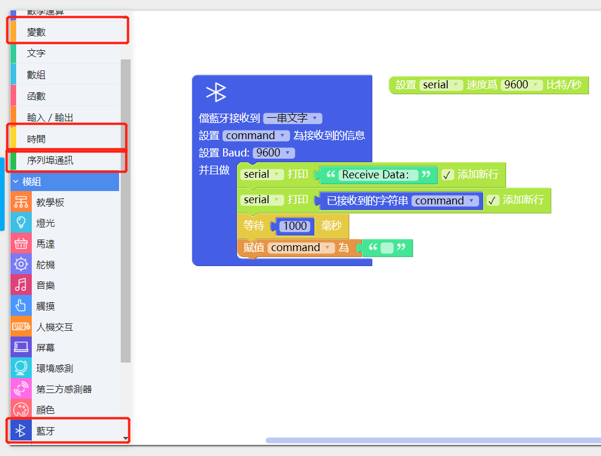

# 藍牙通訊模組
---

## 模組簡介
 藍牙通訊模組是用於能與藍牙配對的設備，遠端控制輸出。藍牙配對前狀態燈會以較快的頻率閃爍，當成功連接後狀態燈以較慢頻率閃爍

## 模組主要部件

 

<table style="margin-top:20px;">
	<tr>
		<td width="6%" style="font-weight: bold;">No.</td>
		<td width="20%" style="font-weight: bold;">部件名稱</td>
		<td style="font-weight: bold;">部件描述</td>
	</tr>
	<tr>
		<td>1.</td>
		<td>藍牙芯片</td>
		<td>藍牙 2.0 芯片 (HC-05)</td>
	</tr>
	<tr>
		<td>2.</td>
		<td>狀態指示燈</td>
		<td>正常情況下分兩種狀態： 快速閃爍（等待配對狀態）和稍慢閃爍（已配對或已連接）</td>
	</tr>
	<tr>
		<td>3.</td>
		<td>AT模式按鈕</td>
		<td>在通電前長按此按鈕，可前往本章後面部分的<a href="http://help.cocorobo.hk/#/cocomod/bluetooth?id=藍牙改名：at模式">進入AT模式</a>瞭解，以進行「修改藍牙通訊模組廣播名稱」、「配對密碼」、「獲取藍牙物理地址」等操作</td>
	</tr>
</table>

#### 模組接口示意

| 接口位置 | 接口描述           |
| -------- | ------------------ |
| (數位訊號) D0: 主機板 Rx    | Tx: 藍牙通訊模組端 (UART 通訊)       |
| (數位訊號) D1: 主機板 Tx   | Rx: 藍牙通訊模組端 (UART 通訊) |

> 爲了避免不同類型的電子模組在使用時有接口（Pin out）的衝突，請注意前往[此頁面](/cocomod/pinout-map)查看接口示意圖

---

## 模組使用說明

1. 藍牙未連接前，狀態燈會快速閃爍，儅成功配對連接後，狀態燈閃爍變慢；
2. 藍牙出廠設置的命名HC-05，連接pin碼爲「1234」；
3. 藍牙重置需要先通電，長按重置按鈕5s，直至狀態燈快速閃爍；
4. 用戶可根據擬藍牙遙控之功用，使用App Inventor來製作遙控App；
5. 此外，CocoRobo亦提供下述藍牙遙控實例以供參考。

###  MIT - App Inventor - 示例App

不同功能的藍牙控制是在不同的App上實現的，如：若要使用滑動條來控制模組，需下載對應的 Coco BT Slider。
請根據您的需要，使用 Android 手機的瀏覽器掃描下表的二維碼下載對應的示例App：

	<table style="margin-top:20px;width:1600px;">
		<tr>
			<td width="90" style="font-weight: bold;text-align:center;">類別</td>
			<td width="120" style="font-weight: bold;text-align:center;">二維碼</td>
			<td width="130" style="font-weight: bold;text-align:center;">App名稱</td>
			<td width="200" style="font-weight: bold;text-align:center;">應用介紹</td>
			<td width="210" style="font-weight: bold;text-align:center;">使用方法</td>
			<td width="410" style="font-weight: bold;text-align:center;">下載鏈接</td>
			<td width="180" style="font-weight: bold;text-align:center;">AIA源文件</td>
			<td width="180" style="font-weight: bold;text-align:center;">匹配程序</td>
			<td width="80" style="font-weight: bold;text-align:center;">適配平台</td>
		</tr>
		<tr>
			<td>基礎類</td>
			<td>  </td>
			<td>Cocorobo:  Basic controller</td>
			<td>藍牙控制模組：8合1控制器</td>
			<td>應用內提供按鈕、滑動條、手機加速儀數據、首季接近傳感器數據的控制選項。 <u><strong>注意要將藍牙初始化及木中的數據數量調整為8</strong></u></td>
			<td>https://cocorobo.hk/downloads/apps/basic-controller.apk</td>
			<td>NEW_CocoBasicController.aia</td>
			<td>CocoBasicController.xml</td>
			<td>Android</td>
		</tr>
		<tr>
			<td rowspan="5">原型類</td>
			<td>  </td>
			<td>CocoRobo: Env Dashboard</td>
			<td>藍牙控制模組： 環境數據信息控制面板</td>
			<td>應用內顯示環境模塊上的光照強度、聲音強度、溫度及溫度數值</td>
			<td>https://cocorobo.hk/downloads/apps/env-dashboard.apk</td>
			<td>NEW_CocoEnvDashboard.aia</td>
			<td>CocoEnvDashboard.ino</td>
			<td>Android</td>
		</tr>
		<tr>
			<td>  </td>
			<td>CocoRobo: Env Control</td>
			<td>藍牙控制模組：控制環境模組元件</td>
			<td>應用內顯示環境模塊上的RGB LED燈以及蜂鳴器。 <u><strong>注意要將藍牙初始化及木中的數據數量調整為4</strong></u></td>
			<td>https://cocorobo.hk/downloads/apps/env-control.apk</td>
			<td>NEW_CocoEnvControl.aia</td>
			<td>CocoEnvControl.xml</td>
			<td>Android</td>
		</tr>
		<tr>
			<td>  </td>
			<td>CocoRobo: Arm Controller</td>
			<td>藍牙控制模組：機械臂控制</td>
			<td>應用內通過滑動條控制插在舵機轉接模組上的4個或者三個舵機 <u><strong>注意要將藍牙初始化及木中的數據數量調整為4</strong></u>
			</td>
			<td>https://cocorobo.hk/downloads/apps/arm-controller.apk</td>
			<td>NEW_CocoRobotArm.aia</td>
			<td>CocoRobotArmController.xml</td>
			<td>Android</td>
		</tr>
		<tr>
			<td>  </td>
			<td>Cocorobo:  Car Controller</td>
			<td>藍牙控制模組：小車控制</td>
			<td>應用內通過4個按鈕控制小車的前進後退以及左轉右轉</td>
			<td>https://cocorobo.hk/downloads/apps/car-controller.apk</td>
			<td>NEW_CocoRobotCar.aia</td>
			<td>CocoRobotCarController.xml</td>
			<td>Android</td>
		</tr>
		<tr>
			<td>  </td>
			<td>Cocorobo:  Shooter</td>
			<td>藍牙控制模組：投射裝置</td>
			<td>應用內通過1個滑動條控制發射管的垂直角度（30-110）度範圍和1個按鈕來控制發射管上的送球用的舵機<u><strong>注意要將藍牙初始化及木中的數據數量調整為2</strong></u></td>
			<td>https://cocorobo.hk/downloads/apps/shooter.apk</td>
			<td>NEW_CocoRoboShooter.aia</td>
			<td>CocoRoboShooter.xm</td>
			<td>Android</td>
		</tr>
	</table>

---------

## 藍牙通訊模組基礎使用

使用 Android 手機 App 來與藍牙通訊模組進行連接，由此來控制主控模組。

### 藍牙接收 Android App 發送的數據

#### 模組組裝

將藍牙通訊模組和主機板模組拼在一起，並讓主機板模組連接好 USB 綫至電腦：

#### 連接配置

關於如何讓 Android 手機與藍牙通信模組配對連接，請參考連接步驟： 
1、確定 app 已安裝成功（這裡以 Coco Robot Car 應用為例），且藍牙處於通電狀態，藍牙未連接前，狀態燈會快速閃爍。

2、移動終端開啓藍牙，搜索藍牙模組的信號（出廠設置的命名為 HC-05）

3、點擊連接，輸入密碼（連接 pin 碼爲「1234」 ）， 當成功配對連接後，狀態燈閃爍變慢

4、打開 app，點擊黃色區域「Click here to connect to Bluetooth Module」

5、選擇連接藍牙（出廠設置的命名為 HC-05），當顯示「Bluetooth is now connected」則代表連接成功

6、配對連接成功後，便可以使用 Android app 控制模組了：

#### 積木編程

#### 最終效果

---

### 學習如何使用 MIT App Inventor 製作 Android App

用戶可根據擬藍牙遙控之功用，使用App Inventor來製作遙控App

#### 參考鏈接

* https://web.17coding.net/
* https://www.jianshu.com/p/9c462581bbcf

---

<!--
## 藍牙通訊模組進階使用

**本小節介紹如何進行兩個蓝牙通訊模組之間的數據傳輸：**

要使兩個蓝牙通訊模組能夠進行數據傳輸，首先要分別進入兩個藍牙通訊模組的AT模式進行配置，儅兩個藍牙通訊模組配對成功后便可傳輸數據

* AT 模式對應 Arduino 程式下載：
	* https://cocorobo.hk/downloads/Bluetooth_AT_Mode.ino

<object width="100%" height="800px" data="../media/CocoRobo藍牙通訊模組間配對流程.pdf" type="application/pdf">
	<embed src="../media/CocoRobo藍牙通訊模組間配對流程.pdf" type="application/pdf" />
</object>

<b>視頻：「如何進入藍牙通訊模組的 AT 模式」</b>
<video width="100%" height="480px" controls>
  <source src="media/entering_at-mode.mp4" type="video/mp4">
  Your browser does not support the video tag.
</video>

<b>視頻：「藍牙通訊模組綁定完成，再次通電後連接的效果」</b>
<video width="100%" height="480px" controls>
  <source src="media/bluetooth_comm-pairing.mp4" type="video/mp4">
  Your browser does not support the video tag.
</video>

#### 模組組裝

##### 藍牙通訊模組1

將教學模組、藍牙通訊模組及主機板模組拼在一起，並讓主機板模組連接好 USB 綫至電腦：

##### 藍牙通訊模組2

將LED燈屏模組、藍牙通訊模組及主機板模組拼在一起，並讓主機板模組連接好 USB 綫至電腦：

#### 積木編程

分別對藍牙通訊模組1、藍牙通訊模組2編寫程序並上載到對應模組的主機板模組中

##### 藍牙通訊模組1

##### 藍牙通訊模組2

#### 最終效果

to be edited.
-->

更新時間：2019年8月
