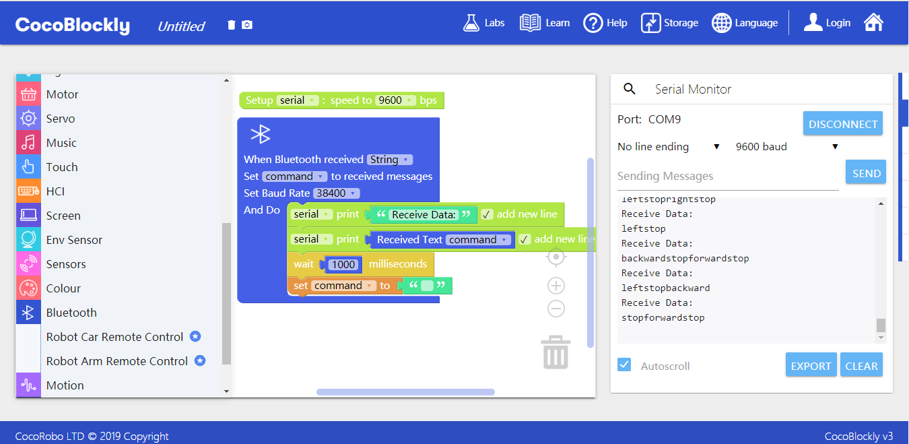

# Apply Bluetooth Communication Module
---

## Introduction
 Bluetooth communication module is used in combination with the equipment that is compatible with it. It is used to remotely control output. The status indicator blinks at a high frequency before successful paring with other equipment while after successful paring with other equipment it blinks at a relatively low frequency.

## Main Components

 

<table style="margin-top:20px;">
	<tr>
		<td width="6%" style="font-weight: bold;">No.</td>
		<td width="20%" style="font-weight: bold;">Name</td>
		<td style="font-weight: bold;">Description</td>
	</tr>
	<tr>
		<td>1.</td>
		<td>Bluetooth chip</td>
		<td>Bluetooth 2.0 chip (HC-05)</td>
	</tr>
	<tr>
		<td>2.</td>
		<td>status light</td>
		<td>There are normally two states: Blinking at a high frequency (waiting to pair with other equipment) and Blinking at a relatively low frequency (paired or connected)</td>
	</tr>
	<tr>
		<td>3.</td>
		<td>AT mode button</td>
		<td>Long press the button before electrification. You can refer to the  <a href="http://help.cocorobo.hk/#/cocomod/bluetooth?id=藍牙改名：at模式">"go to AT mode"</a> at the end of this chapter to learn more about operations such as "rename the module's radio name", "set a paring password" and "get the physical address".</td>
	</tr>
</table>

#### Pinout

| Pinout Position | Pinout Description           |
| -------- | ------------------ |
| (digital signal) D0: main controller Rx    | Tx: Bluetooth communication module terminal (UART Communication)       |
| (digital signal) D1: main controller Tx   | Rx: Bluetooth communication module terminal  (UART Communication) |

> To avoid pinout clashes between different kinds of modules, please refer to [cocorobo-modules-pinout-map](/cocomod/pinout-map).

---

## Instructions

1. The status indicator blinks at a high frequency before successful paring with other equipment while after successful paring with other equipment it blinks at a relatively low frequency.
2. The initial name and pin of the Bluetooth communication module is "HC-05" and "1234" respectively.
3. You need to electrify the module before resetting it. Press the resetting button for 5s till the status indicator begins to blink at a high frequency.
4. Besides, CocoRobo provides the following examples of Bluetooth remote control for your reference.

###  MIT - App Inventor - App Example

Bluetooth controls, based on the functions concerned, are realized in respective Apps. For example, you need to download "Coco BT Slider" if you want to use slider to control a module.
Please use the browser in your Android mobile phone to scan the QR code below and download the App you need.

|No.| QR Code       | App Name    |   Introduction   |     Using Method    |
|---|-------------------------|----------|------------------|------------------|
|1. |      |   Coco BT Switch          |    Bluetooth control: button switch   | use switch button; send the data (a number) |
|2. |               | Coco BT Slider  |  Bluetooth control: slider    | control the position of pointer in the slider; send the data (a number ranging from 0 to 100) |
|3. |                  | Coco BT Motor Controller    |  Bluetooth control: motor controller    | control the two motors' rotation direction and speed; send the data (the number or text shown on the button) |
|4. |                   | Coco BT Servo Controller    |  Bluetooth control: servo motor controller    | control the angles of the 6 servo motors simultaneously; send the data (a number) |
|5. |                 | Coco Robot Arm    |  Bluetooth control: robot arm        | open "Bluetooth" in the CocoBlockly and then select "Robot Arm Remote Control"; send the data (a number in the slider) |
|6. |                  | Coco Robot Car    | Bluetooth control: robot car    | open "Bluetooth" in the CocoBlockly and then select "Robot Remote Control"; send the data (a text shown on the button) |

---

## Basic Application

Control the Main Controller by Connecting Android App to Bluetooth Communication Module

### Receive the Data Sent by Android App via Bluetooth

#### Assemble Modules

Put the Bluetooth communication module and the main controller together, and connect the main controller to a computer via a USB data cable.

#### Connection Configuration

For more information about how to connect Android mobile phone and Bluetooth communication module, please refer to the following document:

<object width="100%" height="500px" data="../media/移動端(Android)配對藍牙通訊模組教程.pdf" type="application/pdf">
	<embed src="../media/移動端(Android)配對藍牙通訊模組教程.pdf" type="application/pdf" />
</object>

After successful connecting, you can use Android app to control the module:

#### Code by CocoBlockly

#### Effects

---

### Learn to Use MIT App Inventor to Make Android App

You can, based on the remote control function of Bluetooth, use App Inventor to make remote control App.

#### Reference

* https://web.17coding.net/
* https://www.jianshu.com/p/9c462581bbcf

---

<!--
## Advanced Application

**This section introduces how to transmit data between two Bluetooth communication modules:**

To transmit data between two Bluetooth communication modules, you need to configure the AT modes of the two modules first. And after successfully pairing the two modules, you can transmit data between them.

* Download the corresponding Arduino program of the AT mode:
	* https://cocorobo.hk/downloads/Bluetooth_AT_Mode.ino

<object width="100%" height="800px" data="../media/CocoRobo藍牙通訊模組間配對流程.pdf" type="application/pdf">
	<embed src="../media/CocoRobo藍牙通訊模組間配對流程.pdf" type="application/pdf" />
</object>

<b>video：「How to go to the AT mode of the Bluetooth Communication Module」</b>
<video width="100%" height="480px" controls>
  <source src="media/entering_at-mode.mp4" type="video/mp4">
  Your browser does not support the video tag.
</video>

<b>video：「After linking to the Bluetooth Communication Module, electrify the module and you will see the results」</b>
<video width="100%" height="480px" controls>
  <source src="media/bluetooth_comm-pairing.mp4" type="video/mp4">
  Your browser does not support the video tag.
</video>

#### Assemble Modules

##### Bluetooth Communication Module 1

Put the Bluetooth communication module, the sensor 101 module and the main controller together, and connect the main controller to a computer via a USB data cable.

##### Bluetooth Communication Module 2

Put the Bluetooth communication module, the LED matrix module and the main controller together, and connect the main controller to a computer via a USB data cable.

#### Code by CocoBlockly

Program Bluetooth Communication Module 1 and Bluetooth Communication Module 2 respectively and upload the programs to their corresponding main controller.

##### Bluetooth Communication Module 1

##### Bluetooth Communication Module 2

#### Effects

to be edited.
-->

Updated in August 2019
