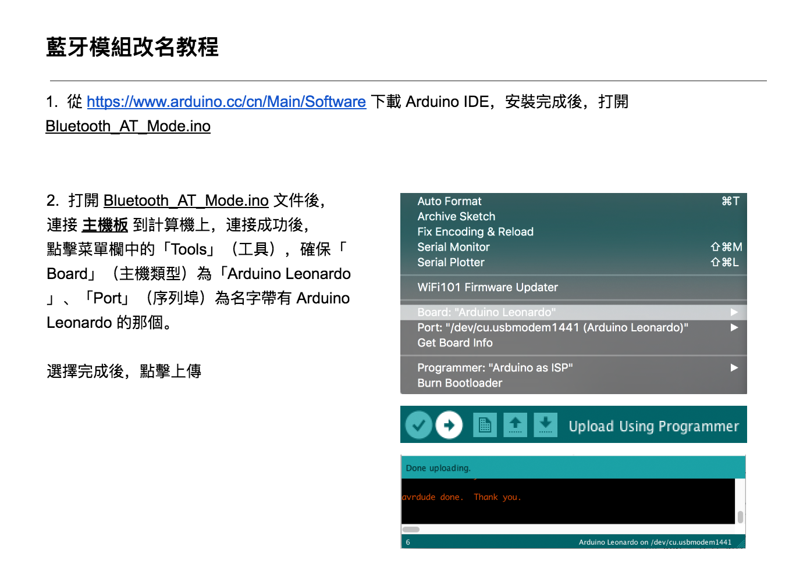
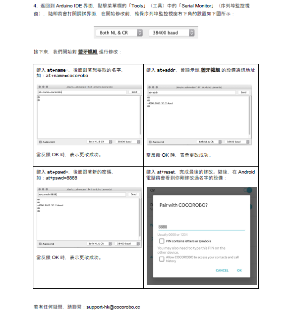

# 藍牙通訊模組
---

## 模組簡介
 藍牙模組是用於能與藍牙配對的設備，遠端控制輸出。藍牙配對前狀態燈會以較快的頻率閃爍，當成功連接後狀態燈以較慢頻率閃爍

## 模組主要部件

|編號| 部件名稱                 | 部件描述                                                                        |
|---|-------------------------|-------------------------------------------------------------------------------|
|1. |藍牙芯片                |藍牙通訊的基本芯片              |
|2. |狀態燈                 | 通過狀態燈閃爍快慢來顯示藍牙模組不同狀態      |
|2. |重置按鈕                  | 長按可以重置芯片           |

> 為了避免不同類型的電子模組在使用時有接口（Pin out）的衝突，請注意前往[此頁面](/cocomod/pinout-map)查看接口示意圖

## 模組使用說明

1. 藍牙未連接前，狀態燈會快速閃爍，儅成功配對連接後，狀態燈閃爍變慢
2. 藍牙出廠設置的命名HC-05，連接pin碼為1234
3. 藍牙重置需要先通電，長按重置按鈕5s，直至狀態燈快速閃爍
4. 藍牙模組需要配合定制化的APP Inventor使用
5. APP Inventor可定制化，可由用戶自己製作

###  MIT - App Inventor - 示例App 
|編號| 二維碼       | App名稱    |   應用介紹   |     使用方法    |
|---|-------------------------|----------|------------------|------------------|
|1. |      |   Coco BT Switch          |    藍牙控制：按鈕開關   | 使用按鈕，發出單個數值數據 |
|2. |               | Coco BT Slider  |  藍牙控制：滑動條    | 通過滑動條上指針的所處位置，發出單個數值數據（0~100 |
|3. |                  | Coco BT Motor Controller    |  藍牙控制：電機控制    | 操控兩個電機的正轉反轉和速度 |
|4. |                   | Coco BT Servo Controller    |  藍牙控制：舵機控制    | 可同時操控 6 個舵機的角度（0~180度） |
|5. |                 | Coco Robot Arm    |  蓝牙控制机械臂        | 在 CocoBlockly 中打开「蓝牙」，选择「蓝牙控制机械臂」 | 
|6. |                  | Coco Robot Car    |  蓝牙控制小车    | 在 CocoBlockly 中打开「蓝牙」，选择「蓝牙控制小车」 |

---

## 藍牙通訊模組基礎使用
### 藍牙接收 MIT App Inventor App 發送的數據

#### 模組組裝 

to be edited.

#### 積木編程

 

#### 使用app

 

#### 最終效果

 

#### 參考鏈接

to be edited.

---

### 學習如何製作 MIT AI2 的app

#### 待補充

#### 參考鏈接
https://web.17coding.net/
https://www.jianshu.com/p/9c462581bbcf

---

## 藍牙通訊模組進階使用

### 藍牙配對藍牙模組（模組間的數據傳輸）
#### 藍牙改名：AT模式
 
 

#### 模組組裝 

to be edited.

#### 積木編程
藍牙模組1
 
藍牙模組2
 

#### 最終效果
//gif
to be edited.

#### 參考鏈接

//colorAnalysize_setLED.xml

