# 使用 Coco Cloud

## 簡介

Coco Cloud 是 CocoRobo 推出的雲平臺。用戶可以在平臺上進行事件的管理，以及事件狀態的查看。Coco Cloud 亦支持數據可視化功能，用戶可以在 Dashboard 中創建，查看各類數據。

https://cocorobo.hk/cloud

## 平臺主要組件

|編號 |組件名稱 | 組件描述  |
|-  |-  |-  |
|1. |事件  | 事件管理 包括創建以及查看事件內的資料|
|2. |儀表板  | 數據視覺化面板以及控制按鈕面板 |

## 組件使用說明

## 賬號註冊

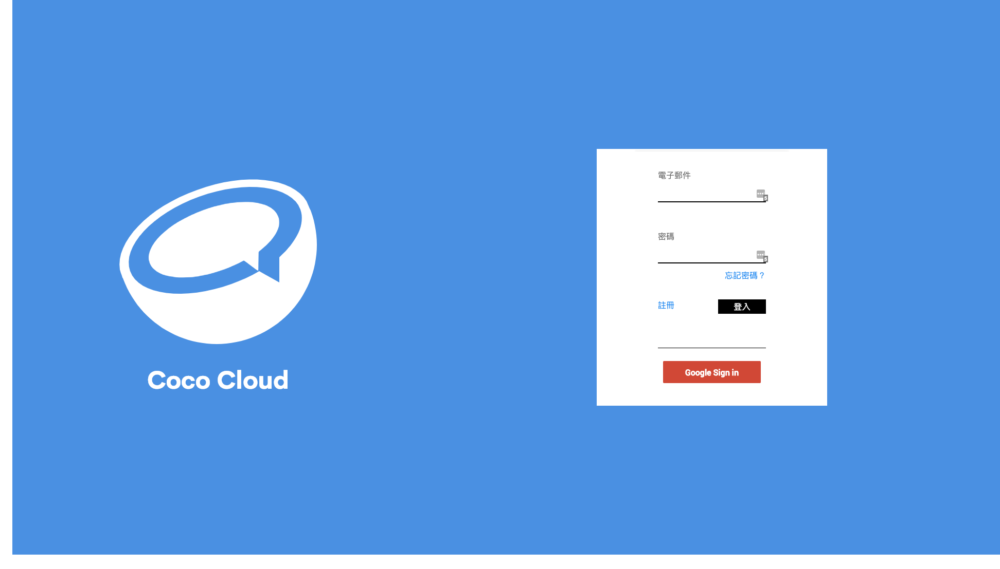

### 方式一

登入[Coco Cloud](https://cocorobo.hk/cloud),點擊註冊按鍵，填寫帳戶名同密碼， 點擊註冊以完成註冊。

### 方式二

點擊 Google Sign In，點選您的 Google 帳號，待Google Sign In 之後，頁面會跳轉到註冊頁面，在頁面中填入密碼，以完成註冊。之後便可使用 Google Sign In 一鍵登陸。

---

## 事件

在**事件**中，用戶可以創建事件，以此來儲存各種各樣的資料。（想像像是一個文件夾）

### 創建方法

點擊新增按鈕（ + ）

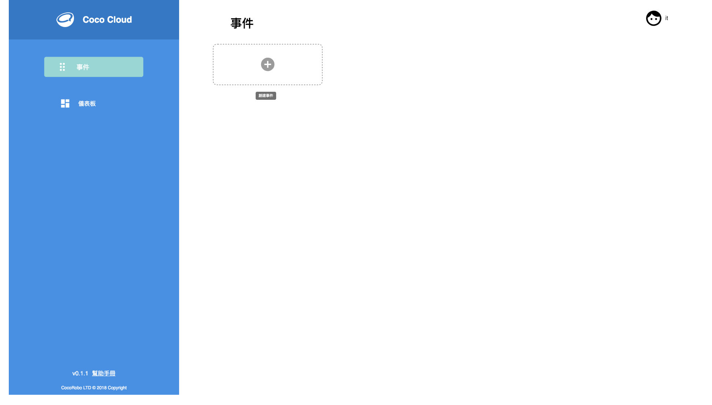
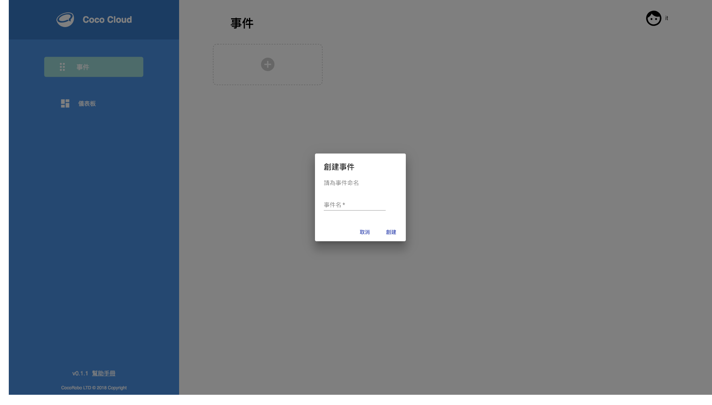

輸入事件名稱，點擊創建即可完成事件的建立

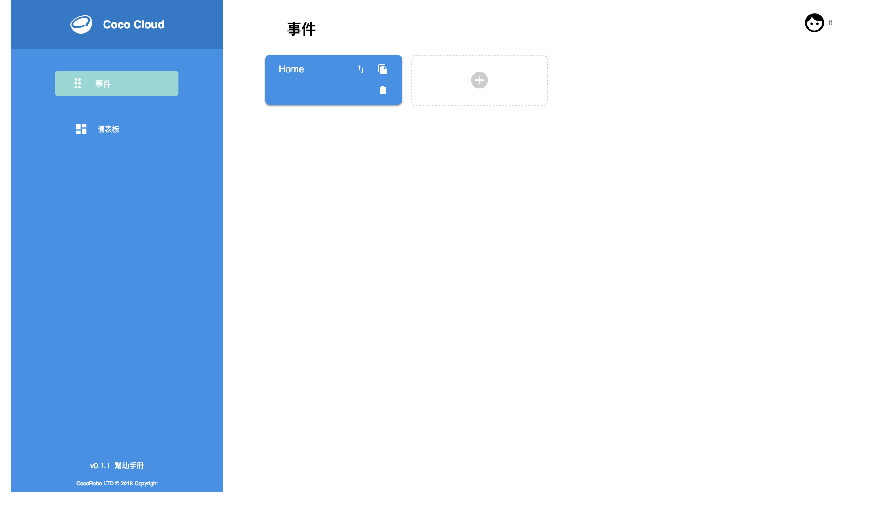

### 使用方法

#### 獲取API鑰匙
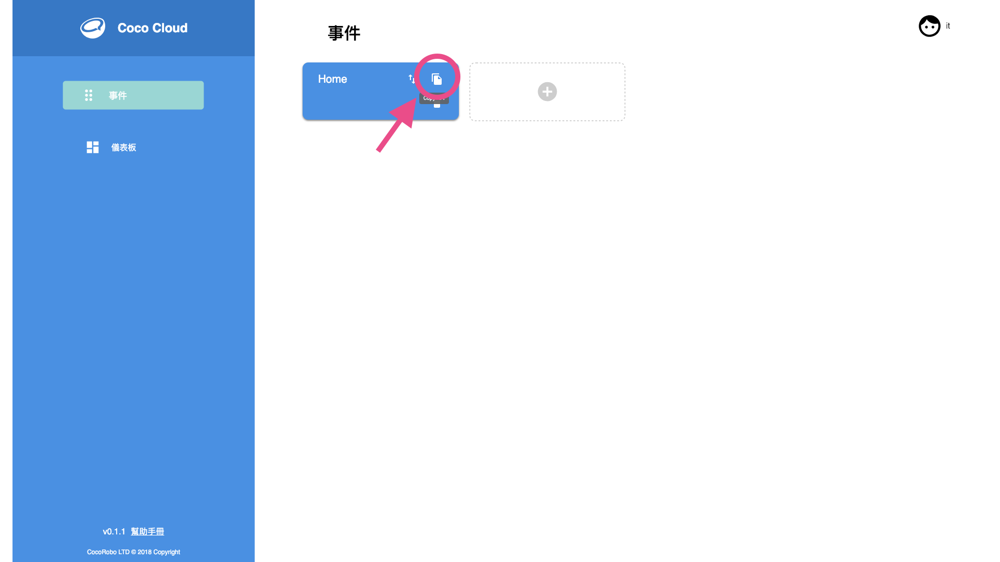

點擊複製圖標即可獲取事件的API鑰匙，由此來對事件在 [CocoBlockly](https://cocorobo.hk/cocoblockly/dev/?lang=zh-hant) 中進行數據 **(包括屬性)** 的新增。

#### 創建事件屬性

事件屬性的創建伴隨 CocoBlockly 數據的上傳進行設定。用戶無需在 CocoCloud 中設定。

下面舉例在 CocoBlockly 中的設定

1. 進入 [CocoBlockly](https://cocorobo.hk/cocoblockly/dev/?lang=zh-hant)

2. 依照下圖所示 在 WiFi 模組中 的 **聯網** 以及 **Web 服務** 中 拖曳出以下積木

⚠️ 注意：為避免數據發送不成功，建議多設置一個等待時間大於**三秒**的積木，因為間隔少於**三秒**的資料上傳會被服務器阻擋

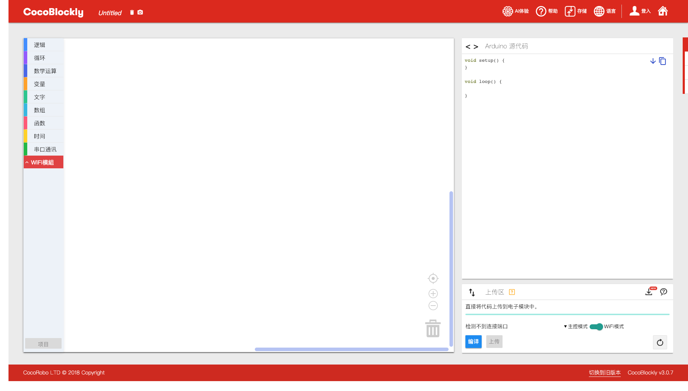

3. 在積木中設置無線名稱同密碼。

4. 在 CocoCloud 積木中設置在 CocoCloud 中複製的 [API鑰匙](#獲取API鑰匙) 並設置數據名（屬性) (如上圖中的*Temp*）以及欲發送的數據（如上圖中的 *20*)。

到此完成在 CocoBlockly 中的設定。

此時點開 Cloud 中的 *Home* 事件，則可看到相應的結果。

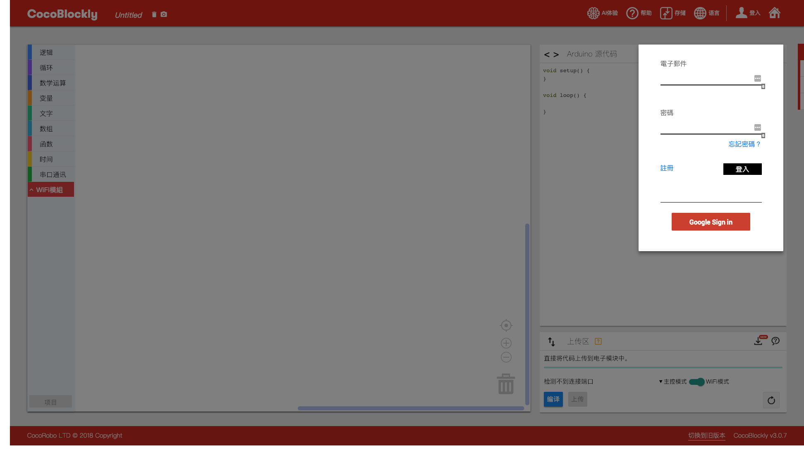

#### 事件查看

點擊事件，即可看到事件的屬性，以及最後一筆數據的內容

#### 數據導出

打開事件，點擊數據導出按鈕，即可得到歷史所有數據的 CSV 檔案

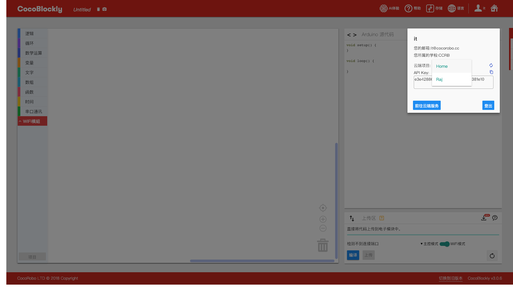

#### 事件刪除

打開事件，點擊刪除事件按鈕，將會刪除事件。

⚠️ 注意 刪除的事件不可恢復。

## 儀表板

在儀表板中，用戶可以創建數據可視化的面板，在面板中觀察數據的變化，也可以創建插件，用來對事件的某個屬性進行開關的控制。儀表板建立於事件之上。

### 創建方法

點擊新增按鈕（ + ）

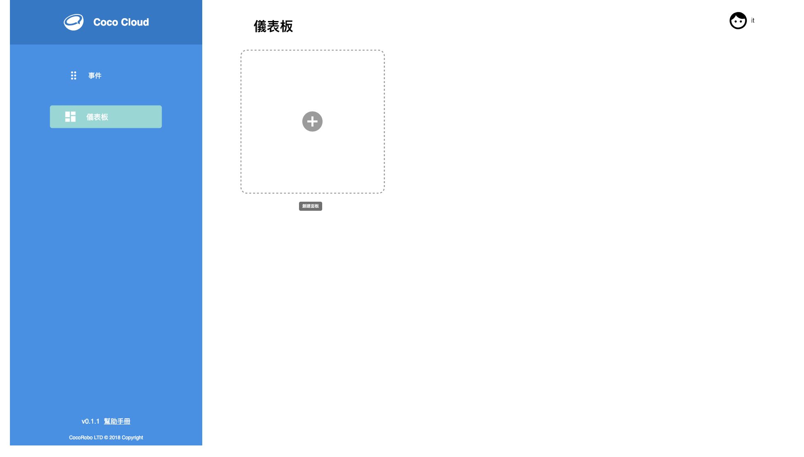

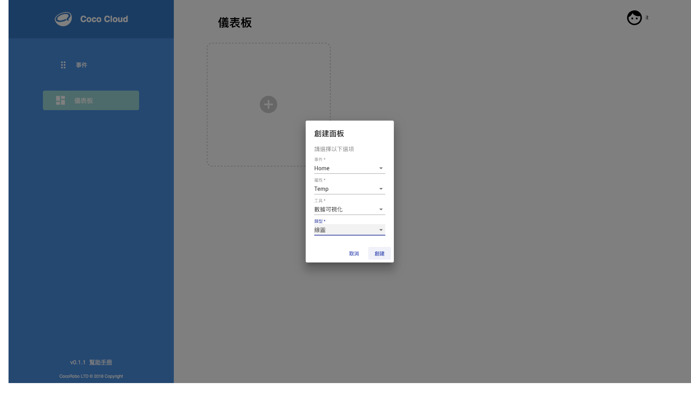

1. 選擇事件的名稱

2. 選擇欲觀察或改變的屬性

3. 輸入要創建的工具種類，目前支持

  * 數據可視化
  * 插件

4. 輸入要創建的可視化類型或按鍵類型，目前支持

  * 數據可視化
    * 線型圖
    * 區域圖

  * 插件
    * 開關

點擊創建後即可看見數據的歷史數據所構成的圖表

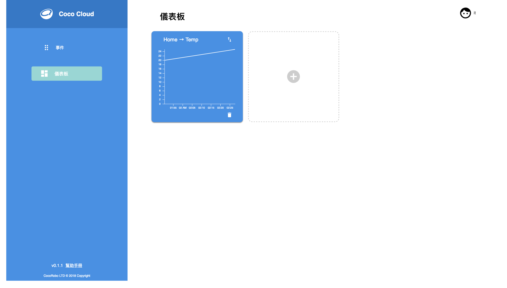
