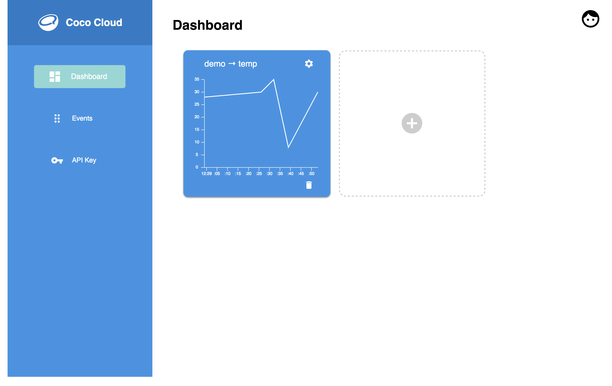
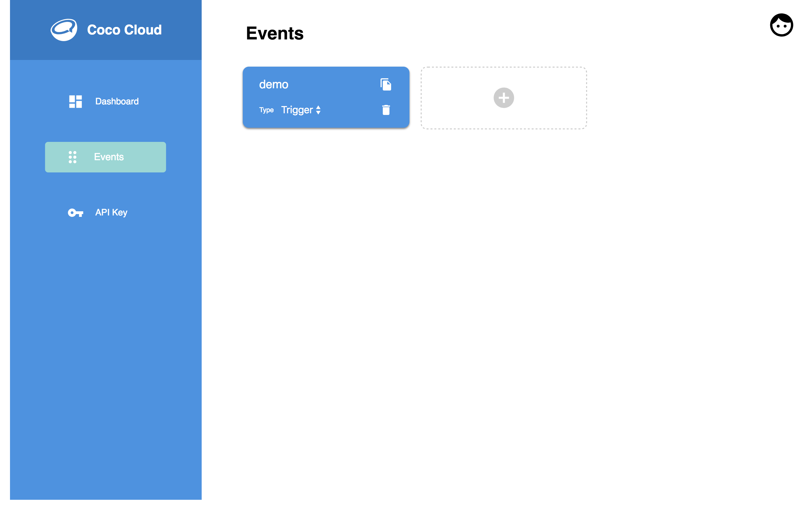
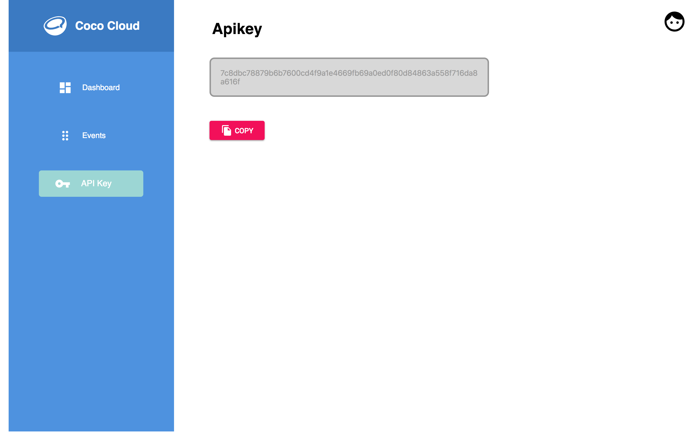
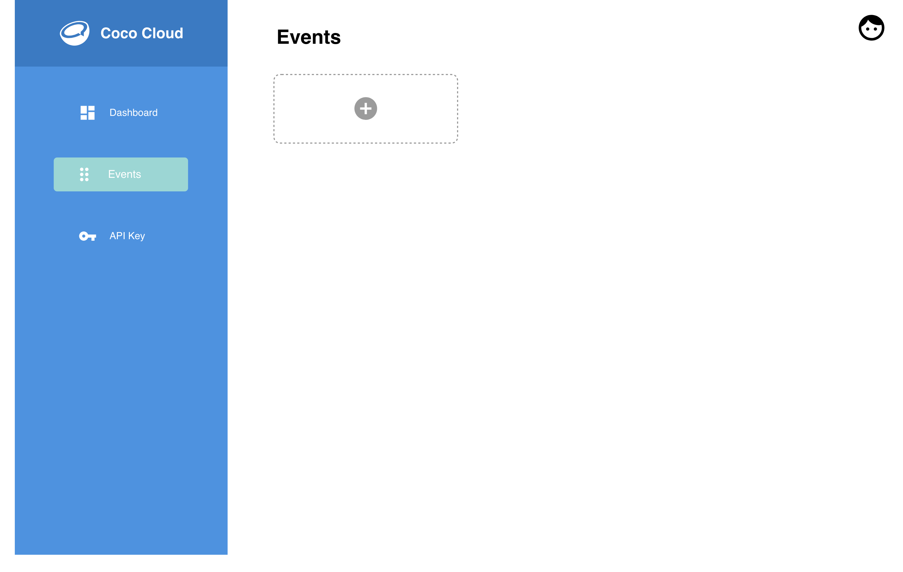
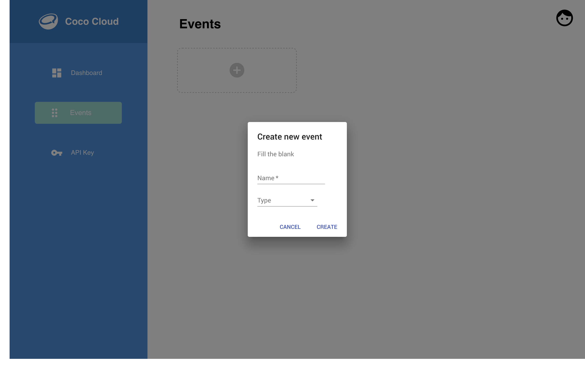
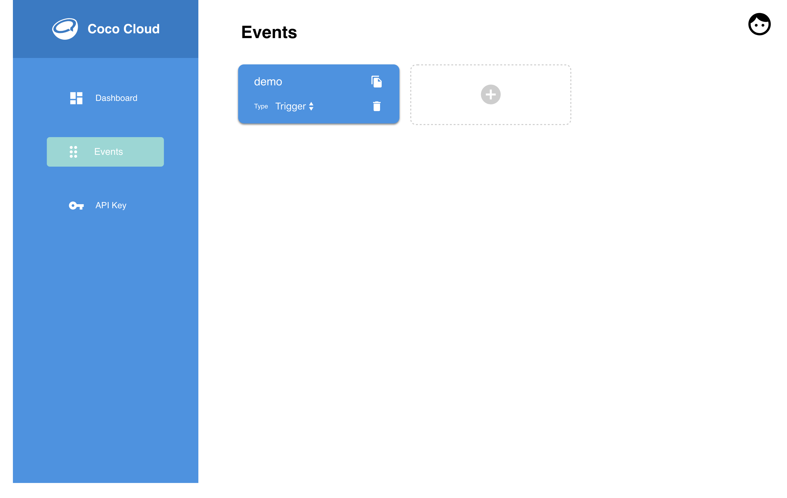
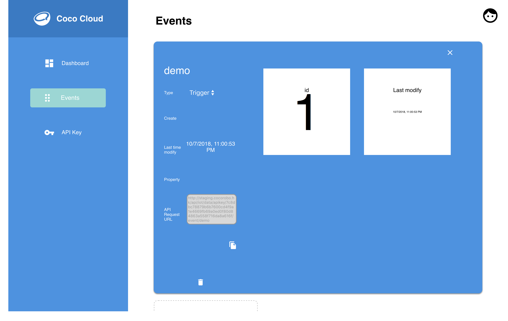
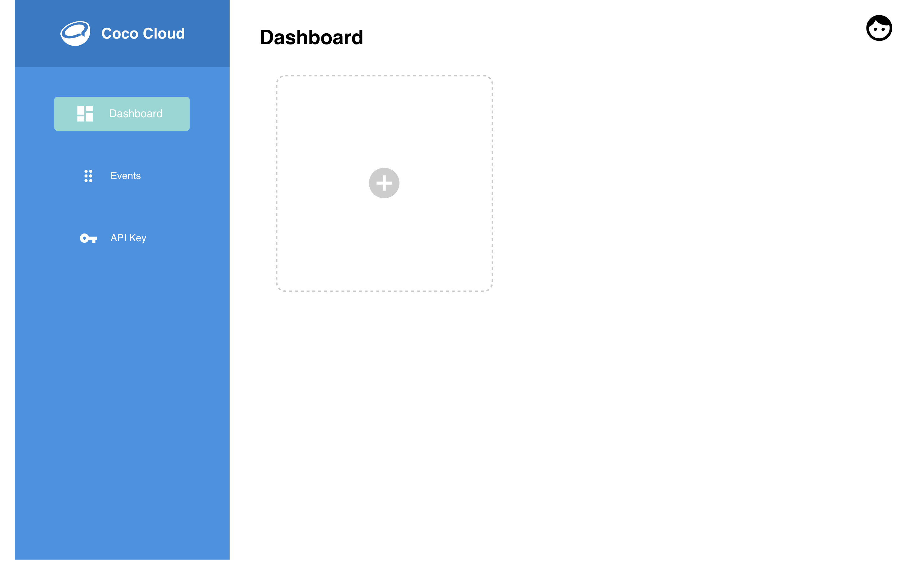

# 使用 Coco Cloud

## 簡介

Coco Cloud 是 CocoRobo 推出的雲平臺。用戶可以在平臺上進行事件的管理，以及事件狀態的查看。Coco Cloud 亦支持數據可視化功能，用戶可以在 Dashboard 中創建，查看各類數據。

https://cocorobo.hk/cloud

## 平臺主要組件

|編號 |組件名稱 | 組件描述  |
|-  |-  |-  |
|1. |Dashboard  | 數據視覺化面板，控制按鈕面板 |
|2. |Event  | 事件管理|
|3. |APIKEY  | 用戶的APIKEY  |

## 組件使用說明

## 賬號註冊

### 方式一

登入[Coco Cloud](https://cocorobo.hk/cloud),點擊註冊按鍵，填寫帳戶名同密碼， 點擊註冊以完成註冊。

### 方式二

點擊 Google Sign In，點選您的 Google 帳號，待Google Sign In 之後，頁面會跳轉到註冊頁面，在頁面中填入密碼，以完成註冊。之後便可使用 Google Sign In 一鍵登陸。

---

## Events

在 Events 中，用戶可以創建命名事件，以此來對每個屬性以及數據進行管理。

### 創建方法

點擊新增按鈕（ + ）

輸入事件名稱，與類別（非必填），點擊創建即可完成事件的建立

### 使用方法

#### 獲取URL

點擊複製圖標即可獲取事件的URL，由此來對事件進行數據的新增。

#### 事件查看

點擊事件，即可看到事件的屬性，以及最後一筆數據的內容

## Dashboard

在 Dashboard 中，用戶可以創建數據可視化的面板，在面板中觀察數據的變化，也可以創建插件，用來對事件的某個屬性進行開關的控制。Dashboard 建立於 Events 之上。

### 創建方法

點擊新增按鈕（ + ）

輸入要創建的工具種類，目前支持

* 數據可視化
* 插件

輸入要創建的可視化類型或按鍵類型，目前支持

* 數據可視化
  * 線型圖
  * 區域圖

* 插件
  * 開關

輸入事件的名稱

輸入欲觀察或改變的屬性

點擊創建後即可看見數據的歷史數據所構成的圖表

## API Key

用戶的唯一識別碼。

***

## 項目一覽

| 項目類型 | 項目內容 | 備註 |
| :------ | :------ | :------: |
| CocoCloud | 雲端呈現環境模組數據 | [查看此處](#項目一)  |
| CocoCloud | 雲端控制LED亮暗 | [查看此處](#項目二)  |

---

## 項目

### 項目一

####  項目簡介 : 雲端呈現環境模組數據

雲端呈現環境模組數據: 將數據從主機板傳輸至WiFi通訊模組，然後傳輸至CocoCloud雲端，在CocoCloud展示數據

#### 主機板程式預覽

* 主機板 - 設置環境積木，設置數據傳輸至WiFi通訊模組
  程式下載 <a href="../xml/cocoCloud_project1/project1_main.xml" download >project1_main.xml</a>

#### WiFi程式預覽

* WiFi - 設置連網，接收主機板數據，設置CocoCloud發送積木發起請求發送數據至雲端
  程式下載 <a href="../xml/cocoCloud_project1/project1_main.xml" download >project1_wifi.xml</a>

---

### 項目二

####  項目簡介 : 雲端控制LED亮暗

雲端控制LED亮暗: WiFi模組接收雲端CocoCloud項目內開關Switch的開或關的數據，來遠程控制LED的亮暗

#### 主機板程式預覽

* 主機板 - 接收WiFi通訊模組傳輸過來的數據，設置LED 
  程式下載 <a href="../xml/cocoCloud_project2/project2_main.xml" download >project2_main.xml</a>

#### WiFi程式預覽

* WiFi - 設置連網，設置CocoCloud接收積木發起請求，向雲端獲取數據，發送獲取到的數據到主機板
  程式下載 <a href="../xml/cocoCloud_project2/project2_wifi.xml"
  download >project2_wifi.xml</a>

