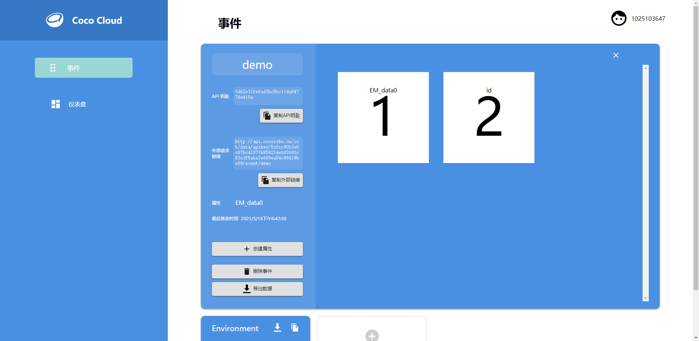
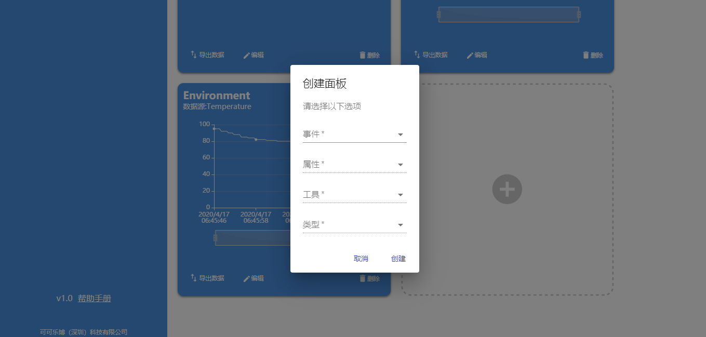
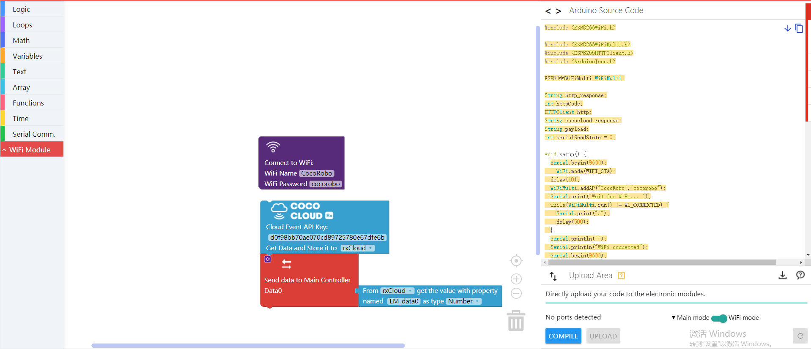

# Apply Coco Cloud

## Introduction

Coco Cloud is a cloud platform developed by CocoRobo. You can manage events and check the status of events on this platform. In addition, Coco Cloud supports data visualization. You can establish and check various kinds of data in the Dashboard.

https://cocorobo.hk/cloud

## Main Components

|No. |Name | Description  |
|-  |-  |-  |
|1. |Event  | Event management |
|2. |Dashboard  | Data visualization panel and Controlling button panel |

## Instructions

## Create an Account

### Option One

Log into [Coco Cloud](https://cocorobo.hk/cloud), click "register", then enter your email and password, and click "register" to finish the creation.

### Option Two

Click "Google Sign In" and then click your Google account. It will jump to register page after successfully logging into your Google account. Enter password to finish the creation. From then on, you can use "Google Sign In" to log into "Coco Cloud" in one click.

---

## Event

In "Event", you can create and name an event, by which you can manage properties and data.

### Creation Method

Click the button "+" to add a new event.

Enter the event name and click the "創建" to complete the creation.

### Instruction

#### Get API Key

Click the copy icon to get the API Key of the event to add value data to the event. Please refer to [API Key](#APIKey) for more information on API Key。

#### Add Attributes

In the first time you add attributes, you can directly send data to Coco Cloud in WiFi mode, and then the attributes of an event are generated.

##### Code by CocoBlockly

In WiFi mode, click the "login" in the toolbar at the upper right corner to log into the Coco Cloud account: [cocoCloud__events](../media/cocoCloud_property_3.png)

Set the WiFi connection, the API Key and the attribute name:

##### Effects

You can see the following result in the Coco Cloud platform:

#### Check the Event

Click the event, then you can see the properties of the event and their latest data.

## Dashboard

"Dashboard" is founded based on "Event". In "Dashboard", you can create a data visualization panel, on which you can see the change of the data. You can also create a "switch button" to control turn on or off a particular attribute of an event.

### Creation Method

Click the button "+" to add a new board.

Choose the type of the tool to be created. Two tools are available at present:

* Data visualization
* Plugin

Enter the type of data visualization or plugin.

* Data visualization
  * line chart

  * area chart
  

  
  

* Plugin
  * switch button
  

  
  

Choose an event name and its attributes to be observed or changed. Click "創建", then you can see a chart composed of the previous data.

## API Key

Every event has an API Key (the only indentification code). You can send or get the attribute data of an event by entering corresponding API Key to the "Coco Cloud blocks".

***
<!--
## 項目一覽

| 項目類型 | 項目內容 | 備註 |
| :------ | :------ | :------: |
| CocoCloud | 雲端呈現環境模組數據 | [查看此處](#項目一)  |
| CocoCloud | 雲端控制LED亮暗 | [查看此處](#項目二)  |
-->

## Project
<!--
### 項目一
-->
####  Introduction: Display the data of the environmental sensing module on the CocoCloud and visualize them.

Display the data of the environmental sensing module on the CocoCloud: transmit data from the main controller to the WiFi communication module, and transmit the data from the WiFi communication module to Coco Cloud. Then the data can be shown on the Coco Cloud.

#### Assemble Modules

Put the main controller, the WiFi communication module and the environmental sensing module together.

> Note: You must upload programs separately to the main controller and the WiFi communication module before putting them together.

  
  

#### Coco Cloud Event Creation

Create an event named "Environment" for the environmental sensing module on the Coco Cloud platform.

#### Main Controller Program Preview

* Main controller mode - set environmental blocks, set data and transmit the data to WiFi communication module, and
  download program: <a href="../xml/cocoCloud_project1/project1_main.xml" download >project1_main.xml</a>

#### WiFi Program Preview

* WiFi mode - set network connection, receive data, set "Coco Cloud sending block", request to send the data to the cloud, and
  download program: <a href="../xml/cocoCloud_project1/project1_wifi.xml" download >project1_wifi.xml</a>

> Note: Please change the WiFi information and password to serve your own connection when writing programs.

  
  

#### Data Visualization

Create visualization tool for the attribute of the event "Environment" in the "Dashboard" list of the Coco Cloud platform.

#### Effects

<!--
---

### 項目二

####  項目簡介 : 雲端控制LED亮暗

雲端控制LED亮暗: WiFi模組接收雲端CocoCloud項目內開關Switch的開或關的數據，來遠程控制LED的亮暗

#### 主機板程式預覽

* 主機板 - 接收WiFi通訊模組傳輸過來的數據，設置LED
  程式下載 <a href="../xml/cocoCloud_project2/project2_main.xml" download >project2_main.xml</a>

#### WiFi程式預覽

* WiFi - 設置連網，設置CocoCloud接收積木發起請求，向雲端獲取數據，發送獲取到的數據到主機板
  程式下載 <a href="../xml/cocoCloud_project2/project2_wifi.xml"
  download >project2_wifi.xml</a>

-->
---
Updated in August 2019
