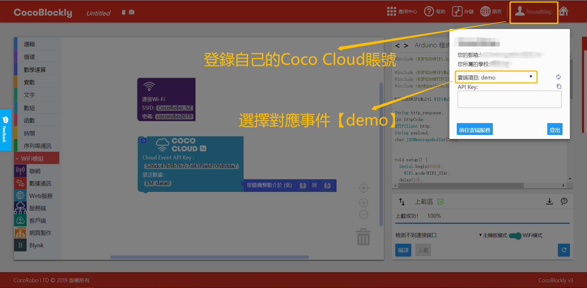

# 使用 Coco Cloud

## 简介

Coco Cloud 是 CocoRobo 推出的云平台。用户可以在平台上进行事件的管理，以及事件状态的查看。Coco Cloud 亦支持数据可视化功能，用户可以在 Dashboard 中创建，查看各类数据。

https://cocorobo.cn/cloud

## 平台主要组件

|编号 |组件名称 | 组件描述  |
|-  |-  |-  |
|1. |事件  | 事件管理 |
|2. |仪表板  | 数据可视化面板，控制按钮面板 |

## 组件使用说明

## 账号注册

### 方法

登入[Coco Cloud](https://cocorobo.cn/cloud),点击注册按键，填写帐户名同密码， 点击注册以完成注册。

---

## 事件

在 「事件」 中，用户可以创建命名事件，以此来对每个属性以及数据进行管理。

### 创建方法

点击新增按钮（ + ）

输入事件名称，点击创建即可完成事件的建立

### 使用方法

#### 获取 API Key

点击「复制图标」即可获取该事件的 API Key，由此来对事件进行数据的新增。有关 API Key 的介绍请前往 [API Key](#APIKey) 查看。

#### 添加属性

初次添加属性时，直接在CocoBlockly的wifi模式上向Coco Cloud发送数据，即可生成对应事件的属性。

##### 积木编程

在wifi模式中点击右上角工具栏「登入」按钮登录自己的Coco Cloud账号：

设置连接 Wi-Fi，设置 API Key，设置属性名称：

##### 最终效果

Coco Cloud平台上：

#### 事件查看

点击事件，即可看到事件的属性，以及获取到的属性的最新数据

## 仪表板

在 「仪表板」 中，用户可以创建数据可视化的面板，在面板中观察数据的变化，也可以创建插件「切换按钮」 ，用来对事件的某个属性进行开关的控制。「仪表板」 建立于 「事件」 之上。

### 创建方法

点击新增按钮（ + ）

选择要创建的工具种类，目前支持的工具种类有：

* 数据可视化
* 插件

输入要创建的可视化类型或按键类型，目前支持

* 数据可视化
  * 线型图

  * 区域图
  

  
  

* 插件
  * 切换按钮
  

  
  

选择事件的名称，选择欲观察或改变的属性，点击创建后即可看见数据的历史数据所构成的图表

## API Key

用户的唯一识别码。用户创建的每个事件都有独立且唯一的 API Key ，在「Coco Cloud 积木」中填入对应事件的 API Key 即可向该事件发送或获取属性的数据。

***
<!--
## 项目一览

| 项目类型 | 项目内容 | 备注 |
| :------ | :------ | :------: |
| CocoCloud | 云端呈现环境模块数据 | [查看此处](#项目一)  |
| CocoCloud | 云端控制LED亮暗 | [查看此处](#项目二)  |
-->

## 项目
<!--
### 项目一
-->
####  项目简介 : 云端呈现环境模块数据并将数据可视化

云端呈现环境模块数据: 将数据从主控传输至 WiFi 通信模块，然后由 WiFi 通信模块传输至 Coco Cloud 云端，在 Coco Cloud 展示数据

#### 模块组装

将主控模块、WiFi 通信模块以及环境传感模块拼接在一起

> 注：必须先对主控模块和 WiFi 通信模块分别上传对应模式下的积木程序后，再将这些模块拼接在一起

  
  

#### Coco Cloud 事件创建

在 Coco Cloud 云端平台上为环境模块收集的数据创建一个事件「Environment」

#### 主控程序预览

* 主控模式 - 设置环境积木，设置数据传输至WiFi通信模块
  程序下载： <a href="../xml/cocoCloud_project1/project1_main.xml" download >project1_main.xml</a>

#### WiFi程序预览

* WiFi模式 - 设置连网，接收主控数据，设置「 Coco Cloud 发送积木」发起请求发送数据至云端
  程序下载： <a href="../xml/cocoCloud_project1/project1_wifi.xml" download >project1_wifi.xml</a>

> 注：编写程序时，请注意将联网积木中的 WiFi 信息和密码改成你自己要连接的

  
  

#### 数据可视化

在 Coco Cloud 云端平台上的「仪表板」列表中为事件「Environment」的属性依次创建可视化工具

#### 最终效果

<!--
---

### 项目二

####  项目简介 : 云端控制LED亮暗

云端控制LED亮暗: WiFi模块接收云端CocoCloud项目内开关Switch的开或关的数据，来远程控制LED的亮暗

#### 主控程序预览

* 主控 - 接收WiFi通信模块传输过来的数据，设置LED
  程序下载 <a href="../xml/cocoCloud_project2/project2_main.xml" download >project2_main.xml</a>

#### WiFi程序预览

* WiFi - 设置连网，设置CocoCloud接收积木发起请求，向云端获取数据，发送获取到的数据到主控
  程序下载 <a href="../xml/cocoCloud_project2/project2_wifi.xml"
  download >project2_wifi.xml</a>

-->
---
更新时间：2019年8月
