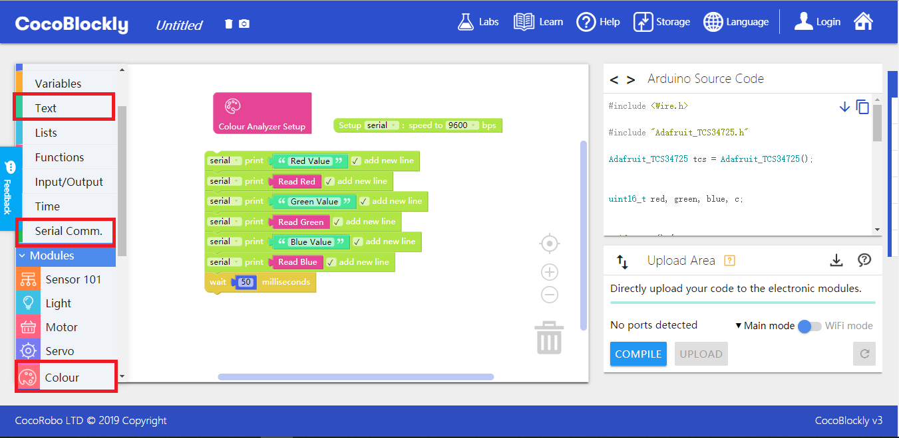
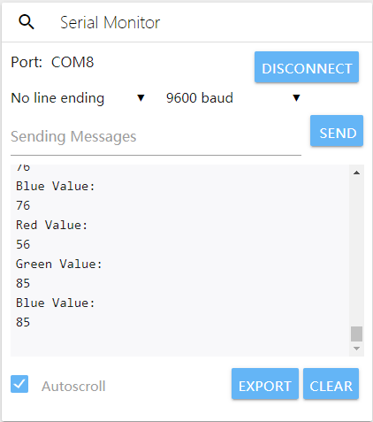
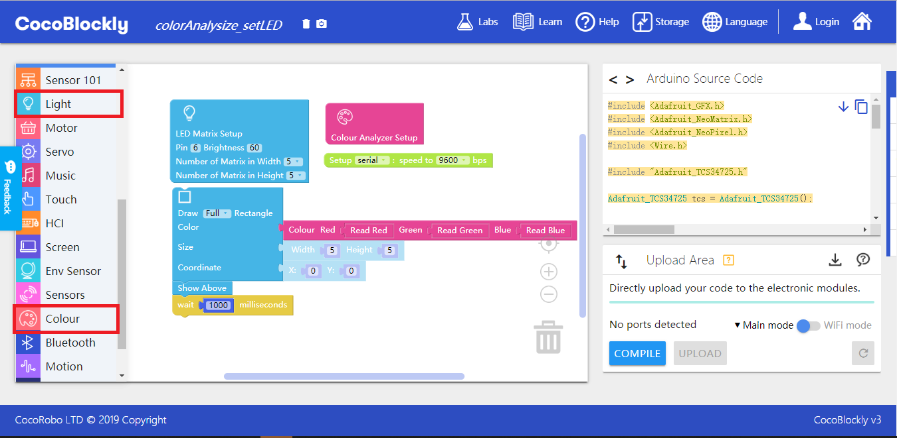

# Apply Color Analyzing Module
---

## Introduction

Color analyzing module can recognize and react to the colors of an object. The built-in LED light in the module emits and shines white light on the object. Then the color analyzer in the module receives part of the light reflected by the object and gets the RGB values of the light through spectrum analysis.

## Main Components

<table style="margin-top:20px;">
	<tr>
		<td width="6%" style="font-weight: bold;">No.</td>
		<td width="20%" style="font-weight: bold;">Name</td>
		<td style="font-weight: bold;">Description</td>
	</tr>
	<tr>
		<td>1.</td>
		<td>color analyzing sensor</td>
		<td>analyze the RGB values of the reflected light emitted by the LED lights in the module</td>
	</tr>
	<tr>
		<td>2.</td>
		<td>sensitivity adjustment</td>
		<td>The potentiometer (the rotary knob) is used to control the sensitivity of the shade analyzer. With the sensitivity becoming lower, the white light in the sensor gradually becomes weaker.</td>
	</tr>
	<tr>
		<td>3.</td>
		<td>Built-in LED lights</td>
		<td>The two LED lights are used for showing RGB colors. Their usage is the same as those on the LED matrix module. But the pinout is D7.</td>
	</tr>
</table>

#### Pinout

| Pinout Position | Pinout Description           |
| -------- | ------------------ |
| (digital signal) D2, D3, D4    | used by color-analyzing chip       |
| (digital signal) D7   | used by the LED lights in the module |

> To avoid pinout clashes between different kinds of modules, please refer to [cocorobo-modules-pinout-map](/cocomod/pinout-map).

---

## Instructions
1. You can turn the potentiometer to control the brightness of the lights. When the lights are the brightest, the sensitivity is the highest.
2. The sensitivity of the shade analyzer is related to the material of the reflective object. When it comes to transparent or less-reflective objects, you may see differences of RGB values.
3. Please protect your eyes when the lights are the brightest.
---

## Basic Application

### Read the sensor to get the three RGB values

> NOTE: RGB stands for RED, GREEN and BLUE, namely the primary colors, by blending which we can get all colors. The design enables you to set backlight colors by a chip.

#### Assemble Modules

Put the color analyzing module and the main controller together, and connect the main controller and a computer via a USB data cable.

#### Code by CocoBlockly

#### Effects

After the program is uploaded successfully, please click serial port window of the toolbar at the right side to check the output data of the module:

---

## Advanced Application

### Create color-picking LED lights

#### Assemble Modules

Put the color analyzing module, LED matrix module, parallel adapting module and the main controller together, and connect the main controller and a computer via a USB data cable.

	
	

#### Code by CocoBlockly

#### Effects

After the program is uploaded successfully, put the "yellow" part of the module close to a colorful object (colorful cards are recommended). Then on the basis of the RGB values gotten by the color-analyzing module, similar colors will be shown on the LED matrix module.

---

## RGB Colorpicker

	<iframe style="border: 0" id="inlineColorPicker"
    title="Inline Color Picker"
    width="100%"
    frameBorder="0"
    height="450px"
    scrolling="no"
    src="../tools/FlexiColorPicker/examples/showcase.html">
</iframe>

---
Updated in August 2019
