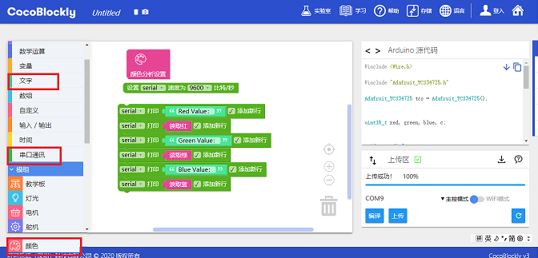
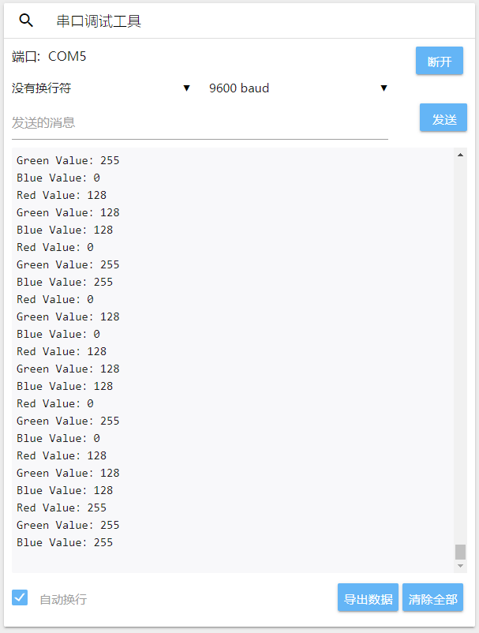
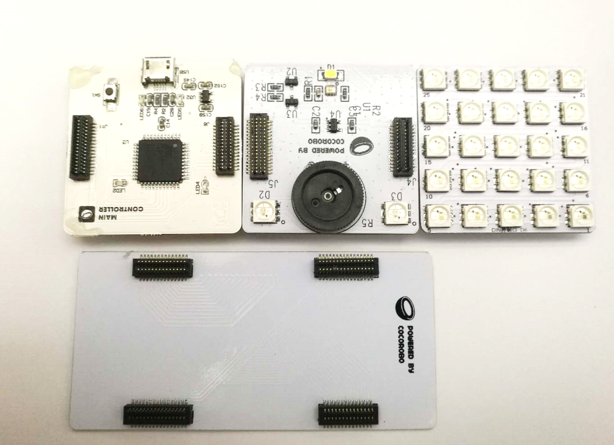
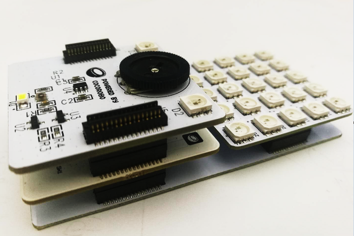
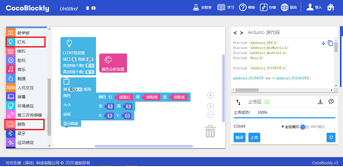

# 使用颜色分析模块
---

## 模块简介

颜色分析模块能识别外在物体的颜色并作出反应。颜色分析模块内置有一LED灯，能发出白光照射到物体上。被照射物体反射部分色光并被颜色分析模块的色光分析器所接收，通过色谱分析来确定物体的 RGB 数值进而判断出物体的颜色。

## 模块主要部件

<table style="margin-top:20px;">
	<tr>
		<td width="6%" style="font-weight: bold;">No.</td>
		<td width="20%" style="font-weight: bold;">部件名称</td>
		<td style="font-weight: bold;">部件描述</td>
	</tr>
	<tr>
		<td>1.</td>
		<td>颜色分析传感器</td>
		<td>分析由板载的白色灯光反射的颜色 RGB 值</td>
	</tr>
	<tr>
		<td>2.</td>
		<td>分析灵敏度调节</td>
		<td>通过这个电位器（即旋钮）控制颜色分析的灵敏度，随著灵敏度的降低，传感器的白色灯光也会逐渐变弱</td>
	</tr>
	<tr>
		<td>3.</td>
		<td>板载 LED 灯</td>
		<td>用于显示 RGB 颜色，这两粒 LED 灯的使用方法与 LED 灯屏模块一样，只不过接口是 D7</td>
	</tr>
</table>

#### 模块接口示意

| 接口位置 | 接口描述           |
| -------- | ------------------ |
| (数字信号) D2, D3, D4    | 用于颜色分析芯片使用的接口       |
| (数字信号) D7   | 板载 LED 灯的显示 |

> 为了避免不同类型的电子模块在使用时有接口（Pin out）的冲突，请注意前往[此页面](/cocomod/pinout-map)查看接口示意图

---

## 模块使用说明
1. 电位器旋转控制灯光亮度，儅灯光最亮时灵敏度最高
2. 检测RGB灵敏度跟反光材质有关，透明、反光效果差等材质容易得到的RGB数值出现色差
3. 检测颜色的灯光调至最亮时比较耀眼，注意保护眼睛
---

## 颜色分析模块基础使用

### 读取传感器得到的 RGB 三个值

> 注：什么是 RGB？RGB是指三原色RED GREEN BLUE，即红、绿、蓝，三原色可以混合出所有的颜色，这样的设计就可以通过软件自定义背光的颜色。

#### 模块组装

将颜色分析模块与主控模块拼接在一起，并让主控模块连接好 USB 数据线至电脑：

#### 积木编程

#### 最终效果

程序上传成功后，请点击右侧工具栏的串口窗口来查看触摸传感的数据输出：

---

## 颜色分析模块进阶使用

### 制作颜色吸取 LED 灯

#### 模块组装

将主控模块与颜色分析模块、LED 灯屏模块、平行转接模块结合在一起，并将主控模块好 USB 数据线至电脑端：

	
	

#### 积木编程

#### 最终效果

程序上传成功后，将颜色分析模块上的「黄色」部分靠近有色物体（建议使用彩色卡纸），随后 LED 灯屏便会根据颜色分析模块读取到的 RGB 数值，显示近似的颜色

---

## RGB 取色器

	<iframe style="border: 0" id="inlineColorPicker"
    title="Inline Color Picker"
    width="100%"
    frameBorder="0"
    height="450px"
    scrolling="no"
    src="../tools/FlexiColorPicker/examples/showcase.html">
</iframe>

---
更新时间：2019年8月
