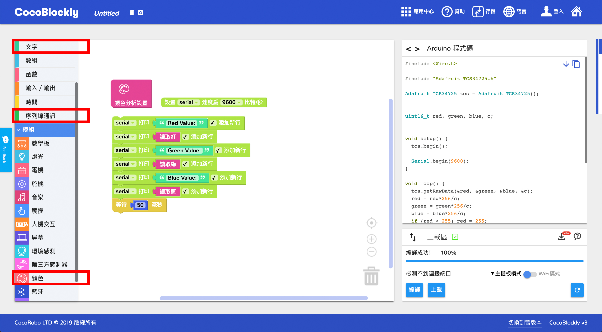

# 使用顏色分析模組
---

## 模組簡介

顏色分析模組能識別外在物體的顏色並作出反應。顏色分析模組內置有一LED燈，能發出白光照射到物體上。被照射物體反射部分色光並被顏色分析模組的色光分析器所接收，透過色譜分析來確定物體的 RGB 數值進而判斷出物體的顏色。

## 模組主要部件

<table style="margin-top:20px;">
	<tr>
		<td width="6%" style="font-weight: bold;">No.</td>
		<td width="20%" style="font-weight: bold;">部件名稱</td>
		<td style="font-weight: bold;">部件描述</td>
	</tr>
	<tr>
		<td>1.</td>
		<td>顏色分析感應器</td>
		<td>分析由板載的白色燈光反射的顏色 RGB 值</td>
	</tr>
	<tr>
		<td>2.</td>
		<td>分析靈敏度調節</td>
		<td>通過這個電位器（即旋鈕）控制顏色分析的靈敏度，隨著靈敏度的降低，感應器的白色燈光也會逐漸變弱</td>
	</tr>
	<tr>
		<td>3.</td>
		<td>板載 LED 燈</td>
		<td>用於顯示 RGB 顏色，這兩粒 LED 燈的使用方法與 LED 燈屏模組一樣，只不過接口是 D7</td>
	</tr>
</table>

#### 模組接口示意

| 接口位置 | 接口描述           |
| -------- | ------------------ |
| (數位訊號) D2, D3, D4    | 用於顏色分析芯片使用的接口       |
| (數位訊號) D7   | 板載 LED 燈的顯示 |

> 爲了避免不同類型的電子模組在使用時有接口（Pin out）的衝突，請注意前往[此頁面](/cocomod/pinout-map)查看接口示意圖

---

## 模組使用說明
1. 電位器旋轉控制燈光亮度，儅燈光最亮時靈敏度最高
2. 檢測RGB靈敏度跟反光材質有關，透明、反光效果差等材質容易得到的RGB數值出現色差
3. 檢測顏色的燈光調至最亮時比較耀眼，注意保護眼睛
---

## 顏色分析模組基礎使用

### 讀取感應器得到的 RGB 三個值

> 註：什麼是 RGB？RGB是指三原色RED GREEN BLUE，即紅、綠、藍，三原色可以混合出所有的顏色，這樣的設計就可以通過軟件自定義背光的顏色。

#### 模組組裝

將顏色分析模組與主機板模組拼接在一起，並讓主機板模組連接好 USB 數據線至電腦：

#### 積木編程

#### 最終效果

程式上傳成功後，請點擊右側工具欄的序列埠窗口來查看觸摸感應的數據輸出：

---

## 顏色分析模組進階使用

### 製作顏色吸取 LED 燈

#### 模組組裝

將主機板模組與顏色分析模組、LED 燈屏模組、平行轉接模組結合在一起，並將主機板模組好 USB 數據線至電腦端：

	
	

#### 積木編程

#### 最終效果

程式上傳成功後，將顏色分析模組上的「黃色」部分靠近有色物體（建議使用彩色卡紙），隨後 LED 燈屏便會根據顏色分析模組讀取到的 RGB 數值，顯示近似的顏色

---

## RGB 取色器

	<iframe style="border: 0" id="inlineColorPicker"
    title="Inline Color Picker"
    width="100%"
    frameBorder="0"
    height="450px"
    scrolling="no"
    src="../tools/FlexiColorPicker/examples/showcase.html">
</iframe>

