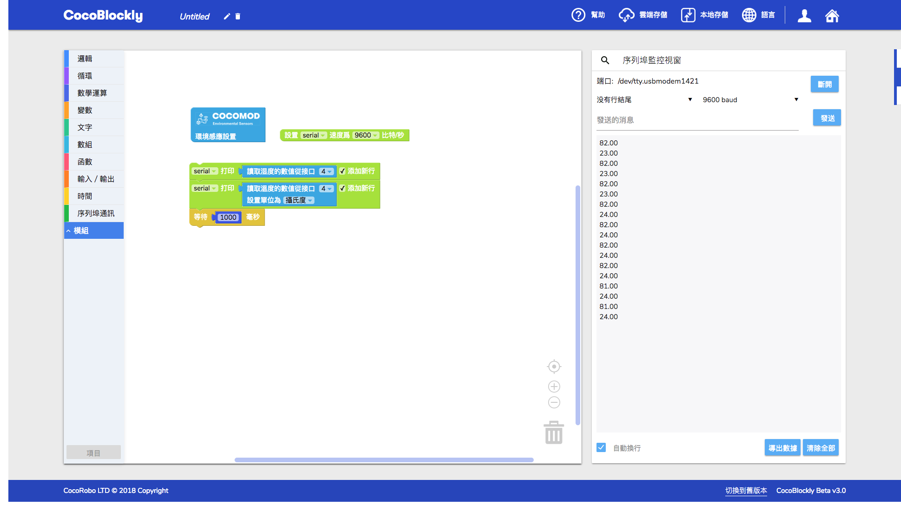
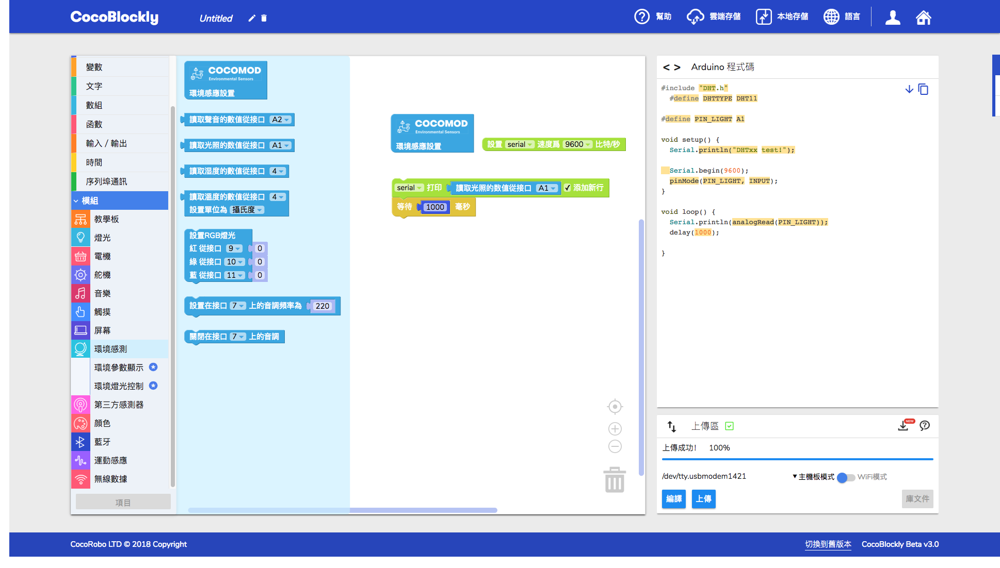
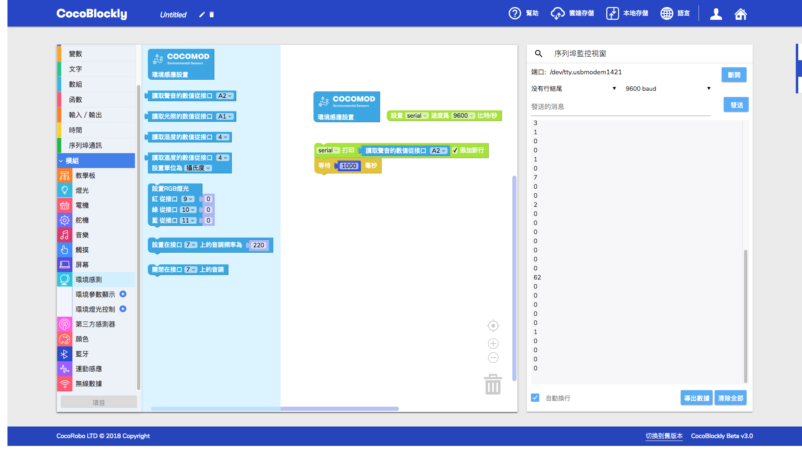
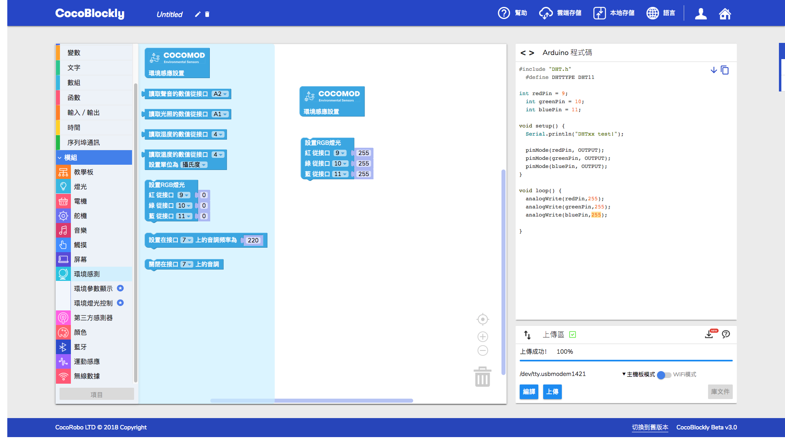
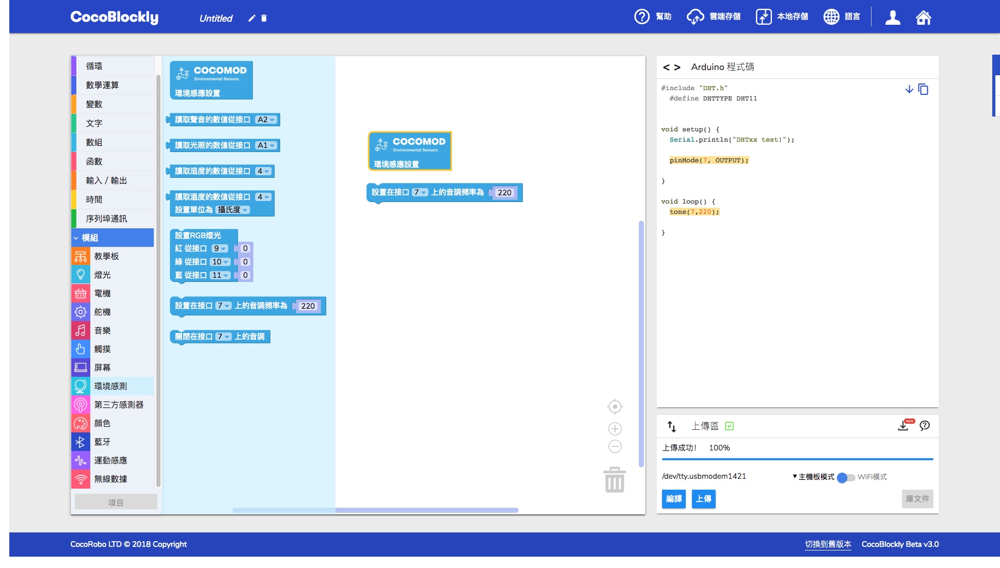
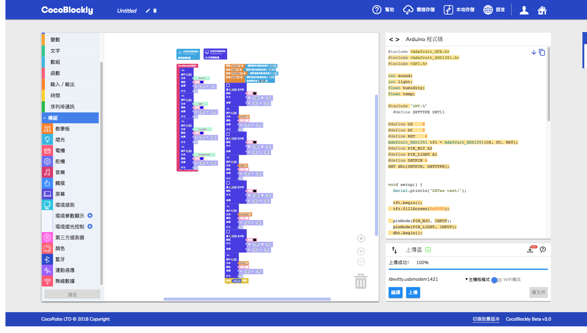

# 使用環境感測模組

## 模組簡介

環境感測模組既能夠蒐集包括溫度、濕度、聲音的強弱程度、光線的強弱程度等環境數據，也可以根據環境數據變化作出反應。

## 模組主要部件

|編號 |部件名稱 | 部件描述  |
|-  |-  |-  |
|1. |光照感應元件  |資料接口為A1 |
|2. |聲音感應元件  |資料接口為A2 |
|3. |溫度/濕度感應元件  |資料接口為D4  |
|4. |蜂鳴器元件  |資料接口為D7  |
|5. |RGB燈光元件  |對應接口分別為D9,D10,D11  |

> 為了避免不同類型的電子模組在使用時有接口（Pin out）的衝突，請注意前往[此頁面](/cocomod/pinout-map)查看接口示意圖

## 環境感測模組

### 獲取溫溼度度數據

#### 模組組裝

#### 積木編程

#### 最終效果

---

### 獲取光照數據

#### 模組組裝

#### 積木編程

#### 最終效果

---

### 獲取聲音數據

#### 模組組裝

#### 積木編程

#### 最終效果

---

### 點亮 RGB LED 燈

#### 模組組裝

#### 積木編程

#### 最終效果

---

### 響起蜂鳴器

#### 模組組裝

#### 積木編程

#### 最終效果

蜂鳴器發出聲音

---

### 將環境數據打印在屏幕模組上

#### 模組組裝

#### 積木編程

#### 最終效果

