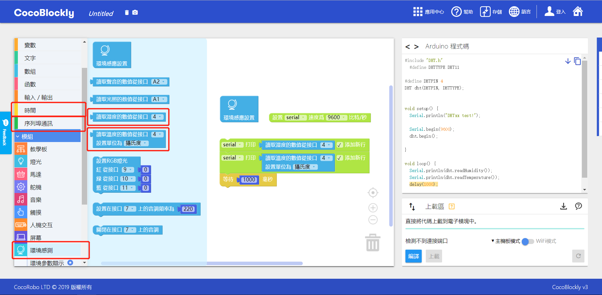
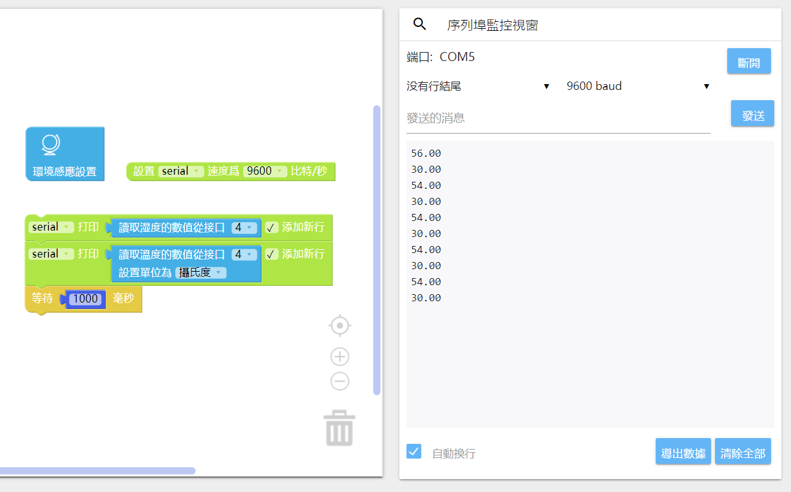
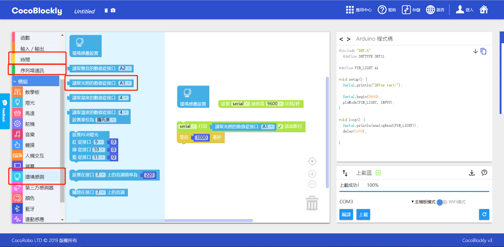
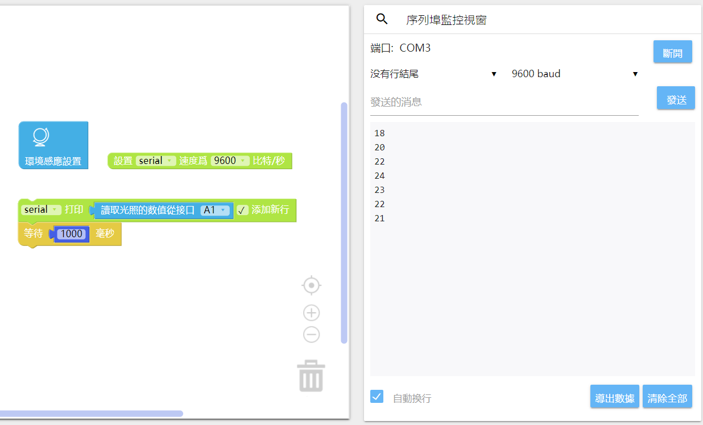
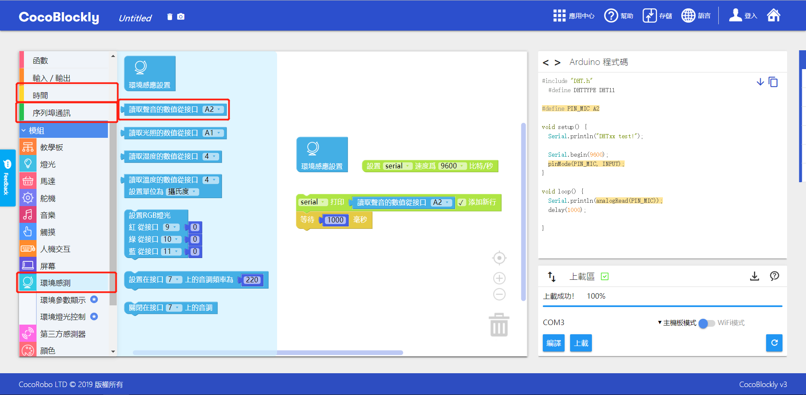
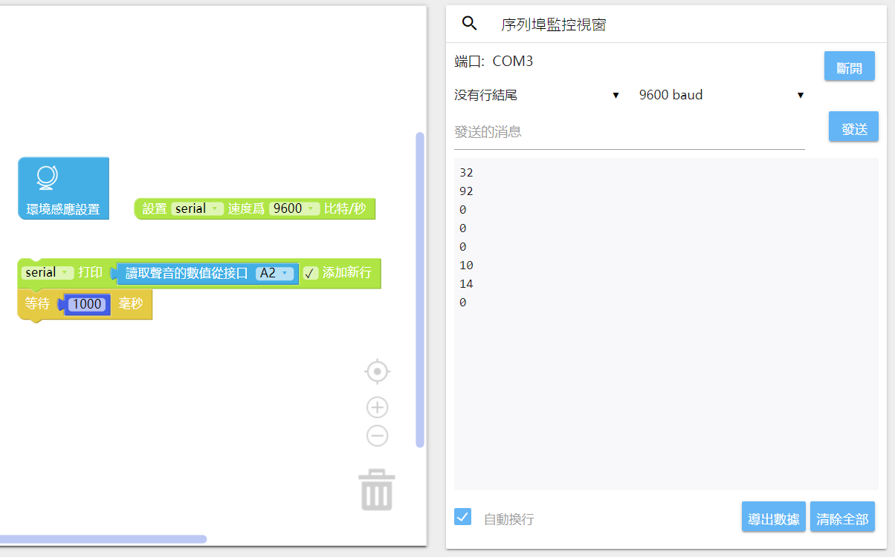
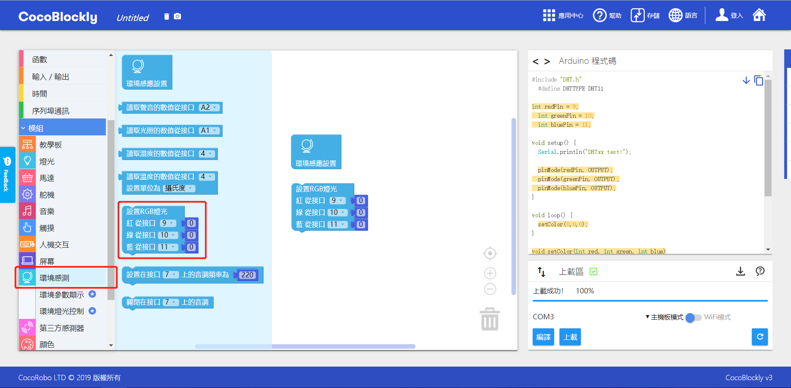
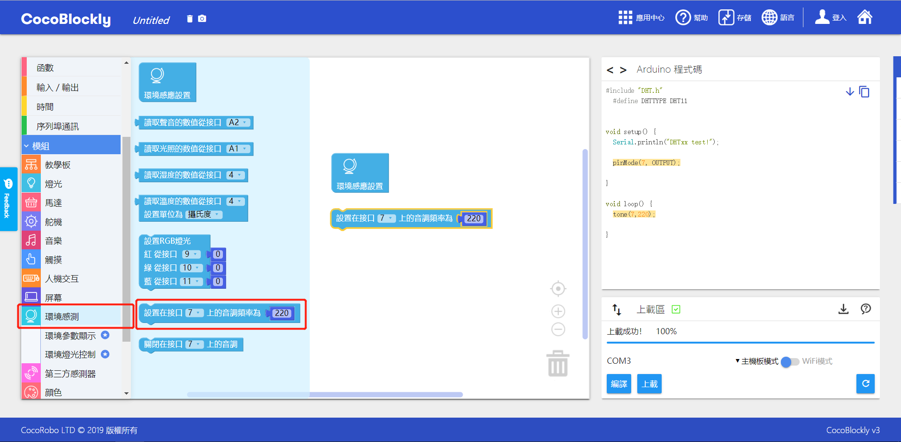
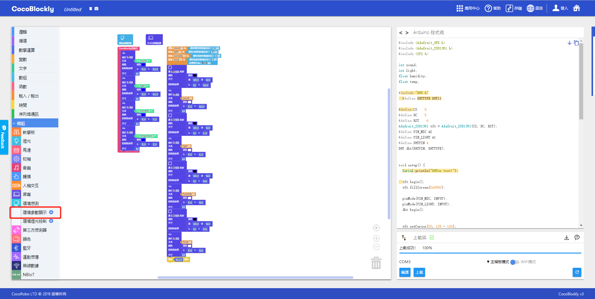

# 使用环境传感模块

## 模块简介

环境传感模块既能够获取包括温度、湿度、声音的强弱程度、光线的强弱程度等环境数据，也可以根据环境数据变化作出反应。

## 模块主要部件

<table style="margin-top:20px;">
	<tr>
		<td width="6%" style="font-weight: bold;">No.</td>
		<td width="20%" style="font-weight: bold;">部件名称</td>
		<td style="font-weight: bold;">部件描述</td>
	</tr>
	<tr>
		<td>1.</td>
		<td>光照传感元件</td>
		<td>用于监测周边环境的光照强度，数据范围在0至1023之间</td>
	</tr>
	<tr>
		<td>2.</td>
		<td>声音传感元件</td>
		<td>用于监测周边环境的声音强度，数据范围在0至1023之间</td>
	</tr>
	<tr>
		<td>3.</td>
		<td>温度/湿度传感元件</td>
		<td>用于监测周边环境的温度（可选摄氏或者华氏）和湿度（单位是%）</td>
	</tr>
	<tr>
		<td>4.</td>
		<td>温度/湿度传感元件 灵敏度调节旋钮</td>
		<td>用于调节改传感元件的灵敏度，一般在该元件出问题的情况下进行调整，但正常情况下请不要转动</td>
	</tr>
	<tr>
		<td>5.</td>
		<td>蜂鸣器</td>
		<td>用于产生震动音频，数值通过赫兹来控制</td>
	</tr>
	<tr>
		<td>6.</td>
		<td>RGB灯光元件</td>
		<td>通过RGB数值发出不同颜色灯光</td>
	</tr>
	<tr>
		<td>7.</td>
		<td>第三方传感器 接口 A3</td>
		<td>可接入其他厂商生产的传感器，该接口为模拟数据类型（A3）</td>
	</tr>
	<tr>
		<td>8.</td>
		<td>第三方传感器 接口 A0</td>
		<td>可接入其他厂商生产的传感器，该接口为模拟数据类型（A0）</td>
	</tr>
</table>

#### 模块接口示意

| 接口位置 | 接口描述           |
| -------- | ------------------ |
| (模拟信号) A1    |    光照传感元件    |
| (模拟信号) A2   | 声音传感元件 |
| (数字信号) D4    | 温度/湿度传感元件       |
| (数字信号) D7   | 蜂鸣器 |
| (数字信号) D9,D10,D11    | RGB灯光元件：D9为红色量控制接口，D10为绿色量控制，D11为蓝色量控制      |

> 为了避免不同类型的电子模块在使用时有接口（Pin out）的冲突，请注意前往[此页面](/cocomod/pinout-map)查看接口示意图

---

## 环境传感模块

### 获取温度和湿度数据

#### 模块组装

将主控模块和环境传感模块组合在一起，并让主控模块连接好 USB 数据线至电脑：

#### 积木编程

#### 最终效果

---

	常见问题请注意：使用完串口窗口后上传程序失败

这是因为串口工具连接著开发板端口，导致「主控模块」端口被占用，所以无法上传成功。

#### 解决方法:

切换到串口工具连接区，断开串口连接，再重新上传即可。

---

### 获取光照数据

#### 模块组装

将主控模块和环境传感模块组合在一起，并让主控模块连接好 USB 数据线至电脑：

#### 积木编程

#### 最终效果

---

### 获取声音数据

#### 模块组装

将主控模块和环境传感模块组合在一起，并让主控模块连接好 USB 数据线至电脑：

#### 积木编程

#### 最终效果

---

### 点亮 RGB LED 灯

#### 模块组装

将主控模块和环境传感模块组合在一起，并让主控模块连接好 USB 数据线至电脑：

#### 积木编程

#### 最终效果

---

### 响起蜂鸣器

#### 模块组装

将主控模块和环境传感模块组合在一起，并让主控模块连接好 USB 数据线至电脑：

#### 积木编程

#### 最终效果

蜂鸣器发出声音

---

### 将环境数据打印在屏幕模块上

#### 模块组装

将主控模块、环境传感模块以及屏幕模块组合在一起，并让主控模块连接好 USB 数据线至电脑：

#### 积木编程

#### 最终效果

---
更新时间：2019年8月
