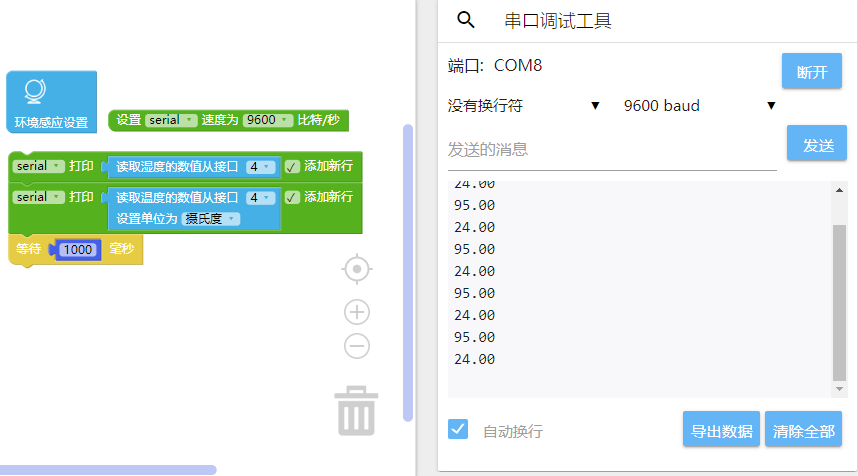
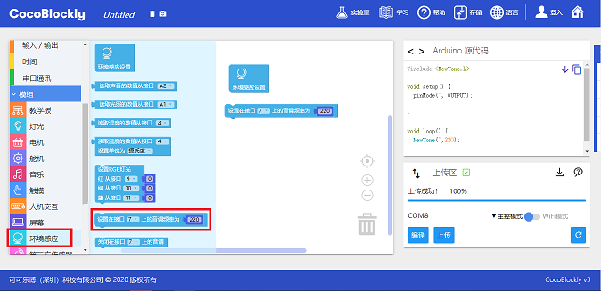

# Apply Environmental Sensing Module

## Introduction

Environmental sensing module can get and react to the environmental data of temperature, moisture, sound and light.

## Main Components

<table style="margin-top:20px;">
	<tr>
		<td width="6%" style="font-weight: bold;">No.</td>
		<td width="20%" style="font-weight: bold;">Name</td>
		<td style="font-weight: bold;">Description</td>
	</tr>
	<tr>
		<td>1.</td>
		<td>Light Sensing Component</td>
		<td>used for monitoring the surrounding light intensity; relevant data range from 0 to 1023.</td>
	</tr>
	<tr>
		<td>2.</td>
		<td>Sound Sensing Component</td>
		<td>used for monitoring the surrounding sound intensity; relevant data range from 0 to 1023.</td>
	</tr>
	<tr>
		<td>3.</td>
		<td>Temperature/Moisture Sensing Component</td>
		<td>used for monitoring the surrounding temperature (the unit can be "Celsius" or "Fahrenheit") and moisture (the unit is "%").</td>
	</tr>
	<tr>
		<td>4.</td>
		<td>Temperature/Moisture Sensing Component Sensitivity Adjustment Button</td>S
		<td>used for adjusting the sensitivity of sensing components only when something is wrong with the components.</td>
	</tr>
	<tr>
		<td>5.</td>
		<td>Buzzer</td>
		<td>used to generating sounds of different frequencies; data is expressed in HZ.</td>
	</tr>
	<tr>
		<td>6.</td>
		<td>RGB LED Light Component</td>
		<td>used for generating lights of different colors through RGB value.</td>
	</tr>
	<tr>
		<td>7.</td>
		<td>Third-party Sensor Pin A3</td>
		<td>used for connecting to sensors produced by other manufactures; the pin receives analog signals.（A3）</td>
	</tr>
	<tr>
		<td>8.</td>
		<td>Third-party Sensor Pin A0</td>
		<td>used for connecting to sensors produced by other manufactures; the pin receives analog signals.（A0）</td>
	</tr>
</table>

#### Pinout

| Pinout Position | Pinout Description           |
| -------- | ------------------ |
| (analog signal) A1    |    Light Sensing Component    |
| (analog signal) A2   | Sound Sensing Component |
| (digital signal) D4    | Temperature/Moisture Sensing Component       |
| (digital signal) D7   | Buzzer |
| (digital signal) D9, D10, D11    | RGB LED Light Component: D9, the brightness of red light; D10, the brightness of green light; D11, the brightness of blue light     |

> To avoid pinout clashes between different kinds of modules, please refer to [cocorobo-modules-pinout-map](/cocomod/pinout-map).

---

## Environmental Sensing Module

### Get the Data of Temperature and Moisture

#### Assemble Modules

Put the environmental sensing module and the main controller together, and connect the main controller and a computer via a USB data cable:

#### Code by CocoBlockly

#### Effects

---

	FAQ: Why can't the program be successfully uploaded after using the serial port window?

The reason is that the serial port tool is connecting to development board port so that the port of the main controller is occupied.

#### Solution:

Switch to serial port tool connection area and disconnect the serial port tool, then you can upload the program successfully.

---

### Get the Data of Light

#### Assemble Modules

Put the environmental sensing module and the main controller together, and connect the main controller and a computer via a USB data cable:

#### Code by CocoBlockly

#### Effects

---

### Get the Data of Sound

#### Assemble Modules

Put the environmental sensing module and the main controller together, and connect the main controller and a computer via a USB data cable:

#### Code by CocoBlockly

#### Effects

---

### Turn on RGB LED Light

#### Assemble Modules

Put the environmental sensing module and the main controller together, and connect the main controller and a computer via a USB data cable:

#### Code by CocoBlockly

#### Effects

---

### Activate the Buzzer

#### Assemble Modules

Put the environmental sensing module and the main controller together, and connect the main controller and a computer via a USB data cable:

#### Code by CocoBlockly

#### Effects

Buzzer Emits Sounds

---

### Print the Environmental Data on the Screen Module

#### Assemble Modules

Put the environmental sensing module, screen module and the main controller together, and connect the main controller and a computer via a USB data cable:

#### Code by CocoBlockly

#### Effects

---
Updated in August 2019
