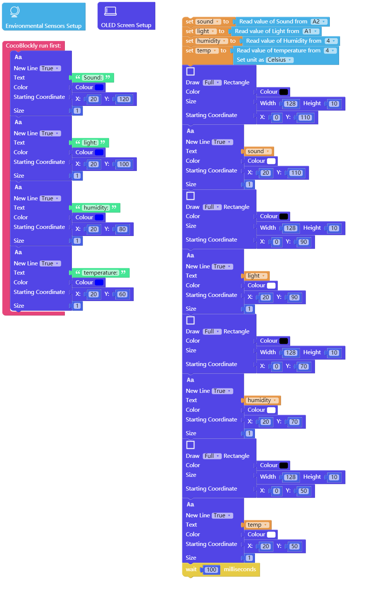

# Apply Parallel Adapting Module

---

## Introduction

Parallel adapting module is used to change vertically assembled modules to horizontally assembled ones so as to be more conducive to observation.

## Main Components

---

## Basic Application

### Horizontally Assemble Screen Module and Environmental Sensing Module

#### Assemble Modules

Put the environmental sensing module, the screen module, the parallel adapting module and the main controller together, and connect the main controller to a computer via a USB data cable.

#### Code by CocoBlockly

> Note: You can also choose the “ENV SHOW SCREEN” in the “SCREEN” toolbar.

#### Effects

After the program is successfully uploaded, four data obtained by the environmental sensing module will be shown on the screen module: the data of sound, light, humidity and temperature:

---
Updated in August 2019
