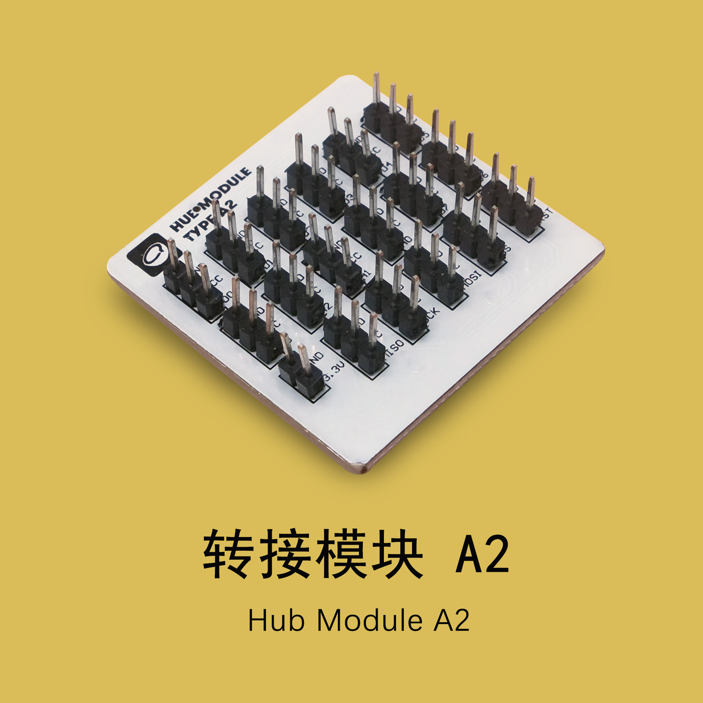
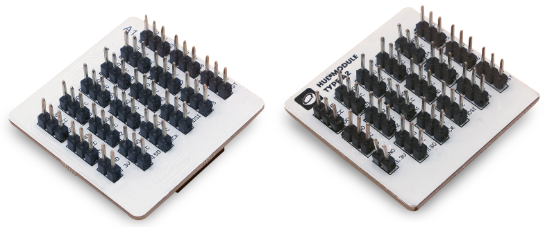
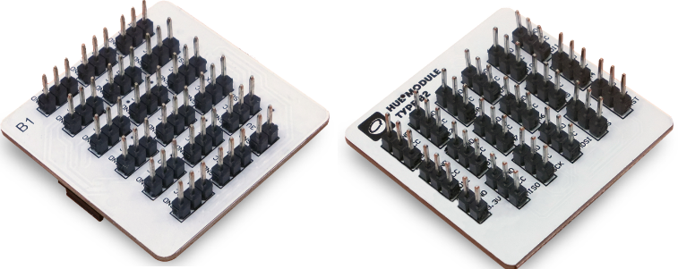
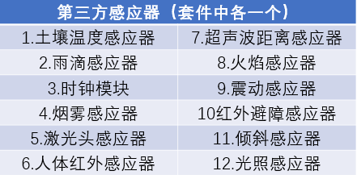

# 使用转接模块

---

## 模块简介

转接模块上嵌有多组接口，用于多种外接设备如伺服电机，电机的转接，还可以外接第三方传感器，如红外线传感器和超声波传感器等等。每组接口由地线（GND），电源输出（VCC），信号接口（Digital / Analog）组成。

## 模块主要部件

| 编号 | 部件名称 | 部件描述                                             |
| ---- | -------- | ---------------------------------------------------- |
| 1.   | 接口     | 每组接口由「地线（GND）、电源输出（VCC）、信号接口」组成 |

> 为了避免不同类型的电子模块在使用时有接口（Pin out）的冲突，请注意前往[此页面](/cocomod/pinout-map)查看接口示意图

---

### 模块使用说明

1. 转接模块上有较多针脚，使用时请小心谨慎，以免伤手；

2. 其中，编码「A」和「B」指示转接模块上提供的不同信号接口，编码「1」和「2」指示转接模块两侧不同类型的拼接口，也即接入型和接出型；

3. 两种类型拼接口的转接模块尽在拼接口上存在区别，其他使用方法是一样的；

4. 转接模块的接入方式存在有两种：

**接入型（转接模块A1，转接模块B1）**

<b>接出型（转接模块A2，转接模块B2）</b>

5. 转接模块A1、转接模块A2提供
   - 数字信号接口：D0~D7
   - 模拟信号接口：A0~A3
   - MISO、MOSI、SCK、SS、RST 和3.3V供电接口

6. 转接模块B1、转接模块B2提供
   - 数字信号接口：D6~D13
   - 模拟信号接口：A4~A7
   - MISO、MOSI、SCK、SS、RST 和3.3V供电接口

## 转接模块基础使用

### 使用第三方传感器

为了让用户在使用智能家居套件时有更多样的创作可能性，我们提供了数 10 种第三方传感器，让用户有更多创作选择。

注：（套件中不再含有该模块） 激光头模块：
用于发射低功率的激光光束。
支持：数字信号输出 

#### 模块组装
第三方传感器可以通过杜邦线和转接模块连接起来，并将转接模块与主控模块拼接在一起，用USB连接主控模块至电脑，如下图（图中为雨滴传感器）：

每个第三方传感器使用的连接引脚都不尽相同，**关于第三方传感器的具体介绍及使用方法请参见 [使用第三方传感器](/cocomod/3rd-party)**

<!--
1. **土壤湿度传感器**
将传感器插入土壤中，通过模拟／数字转换电压信号，即可检测土壤水分，土壤越干燥，输出电压越小，越湿润输出电压越大。
支持：数字信号、模拟信号输入

2. **雨滴传感器**
可用于不同天气状况的监测，并转换成数字信号或模拟信号；使用时，传感板上没有水滴时，数字输出为高电平，开关指示灯灭，滴上一滴水，数字输出为低电平，开关指示灯亮。
支持：数字信号、模拟信号输入

3. **时钟模块**
该模块具备时间功能，并且为了断电时依然可以保留时间。

4. **烟雾传感器**
当传感器所处环境中存在可燃性气体时，传感器的电导率随空气中可燃性气体浓度的增加而增大，模拟信号对应的输出电压随浓度越高电压越高。
支持：数字信号、模拟信号输入

（套件中不再含有该模块）5. 激光头模块：
用于发射低功率的激光光束。
支持：数字信号输出 

6. **人体红外传感器**
当有人进入其传感范围则输出高电平，人离开传感范围则自动延时关闭高电平，否则输出低电平。
支持：数字信号输入

7. **超声波距离传感器**
该传感器利用超声波测距离，多应用于机器人避开障碍物或其他距离测量的项目。
支持：数字信号、模拟信号输入

8. **火焰传感器**
可监测火焰或者波长在 760nm-1100nm 范围内的光源，打火机测试火焰距离为80cm，与火焰的距离越大，测试距离越远。
支持：数字信号、模拟信号输入

9. **震动传感器**
用于各种震动触发作用，不震动时，震动开关呈闭合导通状态，输出端输出低电平信号，绿色指示灯亮。
支持：数字信号输入

10. **红外避障传感器**
当传感器发射管与接收管检测到前方障碍物信号时，绿色指示灯将被点亮，同时数字端口持续输出低电平信号。
支持：数字信号输入

11. **倾斜传感器**
传感器可感知物体角度的变化，将传感器轻轻平放在桌面上，将模块朝一个方向慢慢旋转，开关指示灯会点亮，然后再将模块朝相反的方向旋转，回到最初的状态，开关指示灯会灭。
支持：数字信号输入

12. **光照传感器**
该光照传感器对环境光线最敏感，一般用来检测周围环境的光线的亮度，触发单片机或继电器模块等。
支持：数字信号、模拟信号输入

---

## 转接模块基础使用

请参见 [使用第三方传感器](/cocomod/3rd-party)
-->

<!--

# 使用平行转接模块

## 模块简介

平行转接模块适用于将垂直拼接的模块转换成为平行拼接，更易于观察使用。

## 模块主要部件

## 平行转接基础使用

### 萤幕模块和环境传感模块平行拼接

#### 模块组装

主控模块、环境传感模块、OLED萤幕模块和平行转接模块

#### 积木编程

#### 最终效果

---
# 使用正反转接模块

## 模块简介
正反转接模块两边均为接出型插口，用于将模块按照相反接入。
## 模块主要部件

---

## 正反转接基础使用
### 转接LED模块和教学模块
#### 模块组装

#### 积木编程

#### 最终效果

-->
---
更新时间：2019年8月
