# Apply Hub Module

---

## Introduction

There are several groups of pinouts in the hub module. They serve as adaptor for either external equipment such as motor and servo motor, or third-party sensors such as infrared sensors and ultrasonic sensors. Each group consists of ground (GND), power output (VCC) and signal pinouts (Digital/Analog).

## Main Components

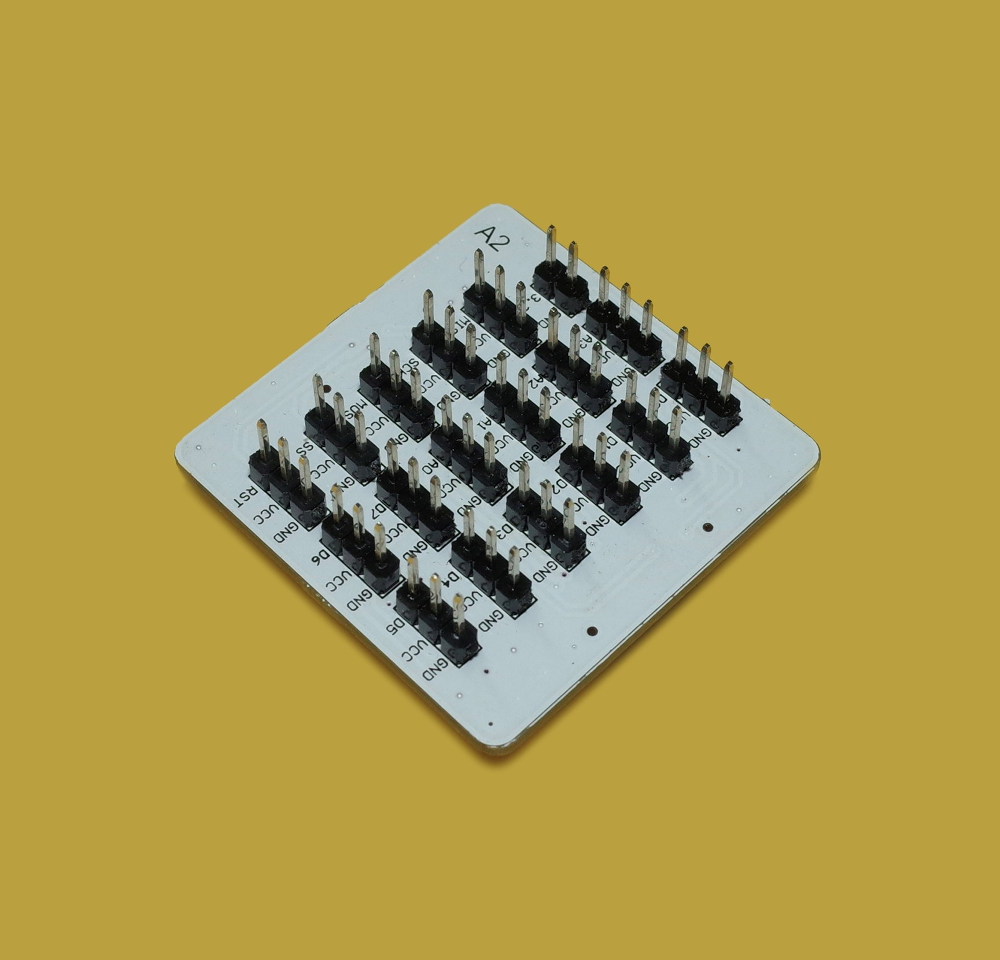

| No. | Name | Description                                             |
| ---- | -------- | ---------------------------------------------------- |
| 1.   | Pinouts     | Each group consists of ground (GND), power output (VCC) and signal pinouts (Digital/Analog) |

> To avoid pinout clashes between different kinds of modules, please refer to [cocorobo-modules-pinout-map](/cocomod/pinout-map).

---

### Instructions

1. Mind your hands. There are many pins in the module.

2. The "A" and "B" indicate that the module provides different signal pinouts. The "1" and "2" indicate that there are different types of joints, namely the input joints and the output joints.

3. The two types of hub modules share the same using method although they have different pinouts.

4. The hub module can be connected in two ways:

**Input（Hub Module A1, Hub Module B1）**

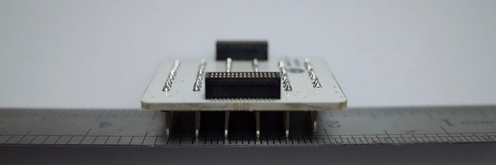

<b>Output（Hub Module A2, Hub Module B2）</b>

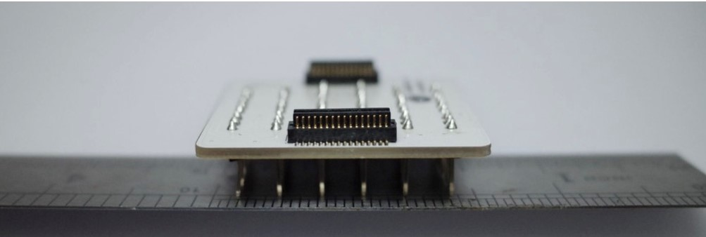

5. Hub Module A1 and Hub Module A2 provide:
   - Digital Signal Pinouts: D0~D7
   - Analog Signal Pinouts: A0~A3
   - MISO, MOSI, SCK, SS, RST and pinout of 3.3V power supply

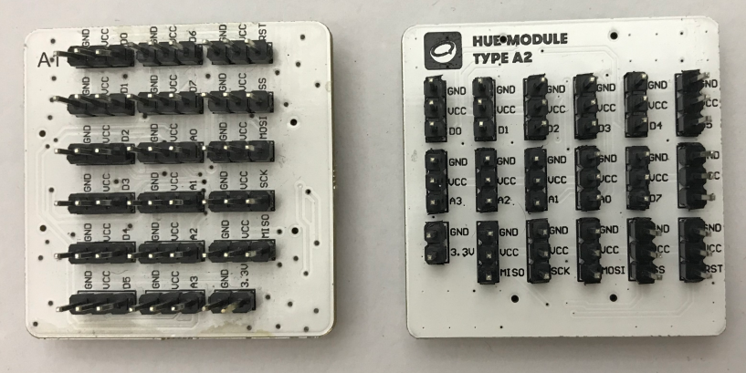

6. Hub Module B1 and Hub Module B2 provide:
   - Digital Signal Pinouts: D6~D13
   - Analog Signal Pinouts: A4~A7
   - MISO, MOSI, SCK, SS, RST and pinout of 3.3V power supply

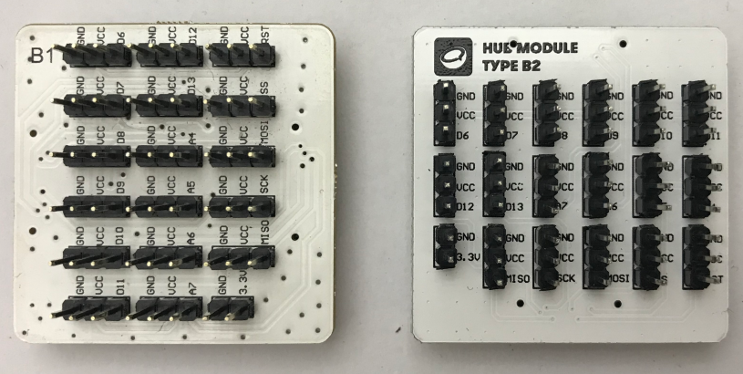

## Basic Application

### Use Third-party Sensors

To provide you with more possibilities of creation in the process of using smart home kit, we offer dozens of third-party sensors for your selection.

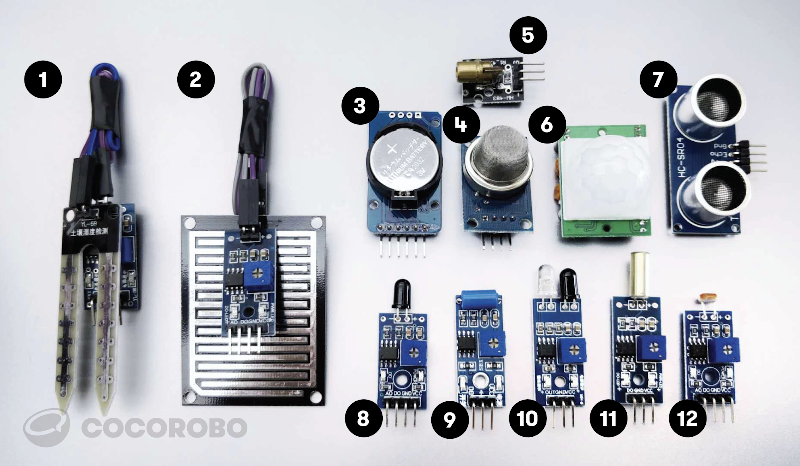

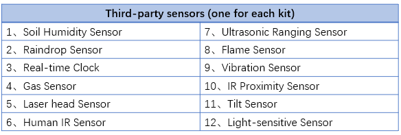

Note: (the module is not incorporated in the kit again) laser sensor:
used for emitting low power laser beam.
Support the output of digital signal 

#### Assemble Modules
Connect third-party sensors to the hub module via a Dupont jumper wire, put the hub module and the main controller together, and connect the main controller and a computer via a USB data cable. The following picture shows how the raindrop sensor is connected:

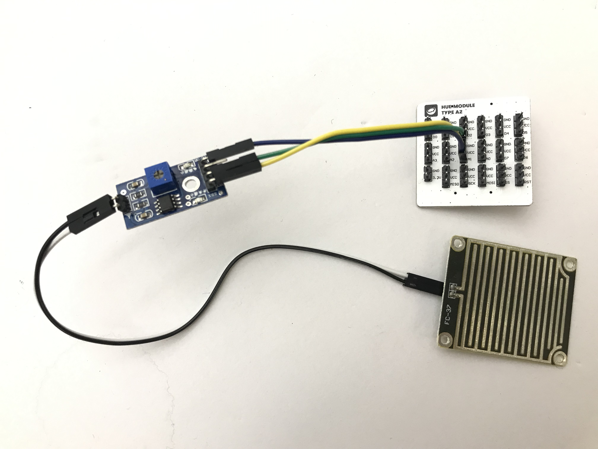

Third-party sensors connect to the hub module via different pins **You can refer to [Basic Application of Third-party Sensors](/cocomod/3rd-party) for more information on third-party sensors.**

<!--
1. **Soil Moisture Sensor**
Insert the sensor into soil. You can detect the moisture of the soil by converting digital/analog signals into voltage signals. The more the moisture, the higher the output voltage.
Support the input of digital and analog signal

2. **Raindrop Sensor**
The module can be used in different weather conditions and convert the detected data into digital/analog signals. When there is no water on the sensing board, the digital output is at high level and the switch indicator is off. But When there is water on the sensing board, the digital output is at low level and the switch indicator is on.
Support the input of digital and analog signal

3. **Real-time clock**
The module is used to record time and keeps recording time when it is disconnected with power supply.

4. **Gas Sensor**
The sensor is used to detect the combustible gas in its surroundings. The conductivity of the sensor and analog signal’s corresponding output voltage grow with the increasing of the combustible gas’s concentrations.
Support the input of digital and analog signal

(the module is not incorporated in the kit again)5. laser sensor:
used for emitting low power laser beam.
Support the output of digital signal 

6. **Human IR Sensor**
When someone enters the sensing range, high level will be output. When the person leaves the sensing range, high level will be automatically turned off with delay. Otherwise, low level will be output.
Support the input of digital signal

7. **Ultrasonic Distance Sensor**
The sensor uses ultrasound to measure distance. It is usually used by robots to avoid obstacles or used in some projects to measure distance.
Support the input of digital and analog signal

8. **Flame Sensor**
可監測火焰或者波長在 760nm-1100nm 範圍內的光源，打火機測試火焰距離爲80cm，與火焰的距離越大，測試距離越遠。
Support the input of digital and analog signal

9. **Vibration Sensor**
用於各種震動觸發作用，不震動時，震動開關呈閉合導通狀態，輸出端輸出低電平訊號，綠色指示燈亮。
Support the input of digital signal

10. **IR Proximity Sensor**
當感應器發射管與接收管檢測到前方障礙物訊號時，綠色指示燈將被點亮，同時數位端口持續輸出低電平訊號。
Support the input of digital signal

11. **Tilt Sensor**
感應器可感知物體角度的變化，將感應器輕輕平放在桌面上，將模組朝一個方向慢慢旋轉，開關指示燈會點亮，然後再將模組朝相反的方向旋轉，回到最初的狀態，開關指示燈會滅。
Support the input of digital signal

12. **Light-sensitive Sensor**
該光照感應器對環境光線最敏感，一般用來檢測周圍環境的光線的亮度，觸發單片機或繼電器模組等。
Support the input of digital and analog signal

---

## Basic Application

Please refer to "Use Third-party Sensors"(/cocomod/3rd-party)
-->

<!--

# Apply Parallel Adapting Module

## Introduction

平行轉接模組適用於將垂直拼接的模組轉換成爲平行拼接，更易於觀察使用。

## Main Components

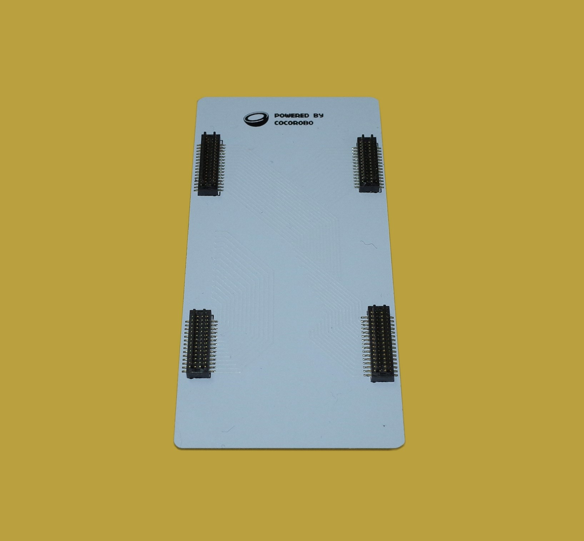

## Basic Application

### 螢幕模組和環境感測模組平行拼接

#### Assemble Modules

主機板模組、環境感測模組、OLED螢幕模組和平行轉接模組

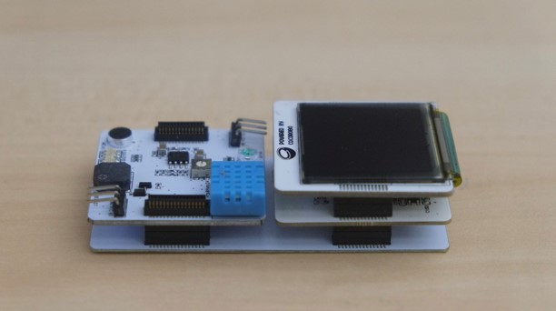

#### Code by CocoBlockly

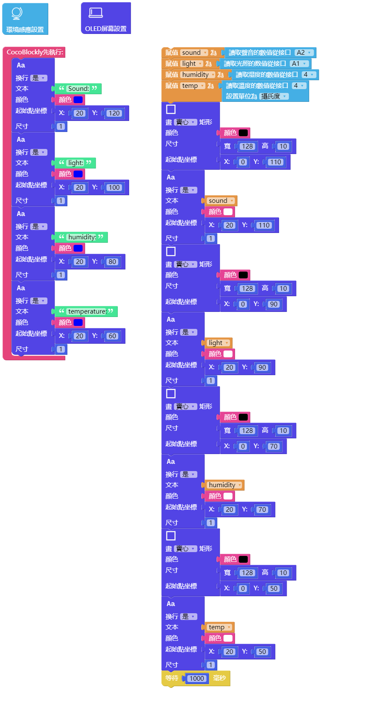

#### Effects

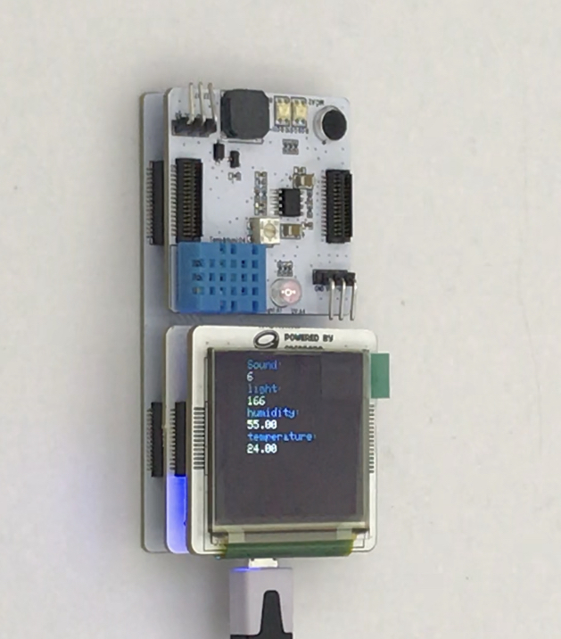

---
# Apply Reverse Adapting Module

## Introduction
正反轉接模組兩邊均爲接出型插口，用於將模組按照相反接入。
## Main Components
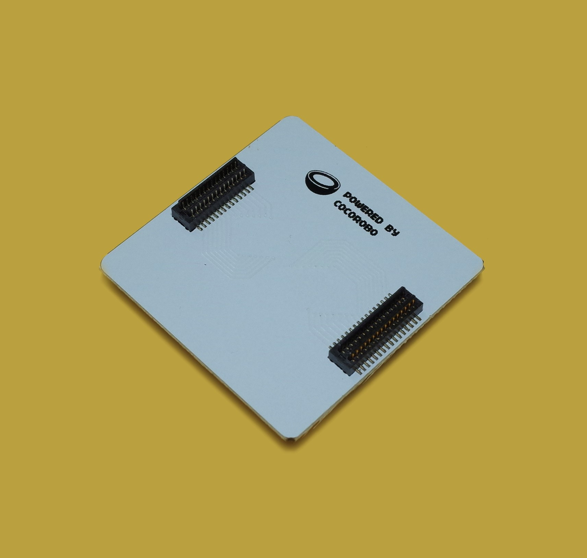

---

## Basic Application
### 轉接LED模組和教學模組
#### Assemble Modules
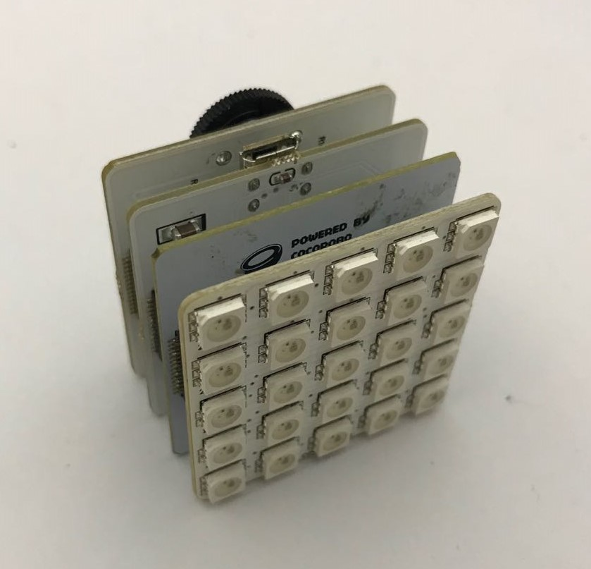
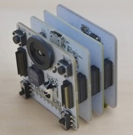
#### Code by CocoBlockly
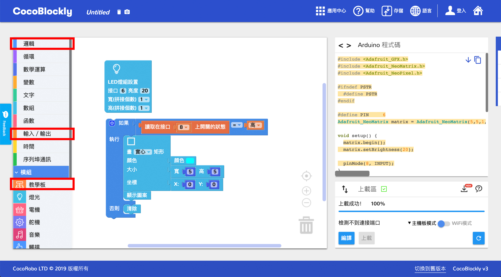
#### Effects
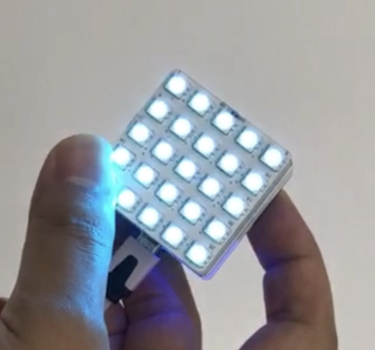
-->
---
Updated in August 2019
