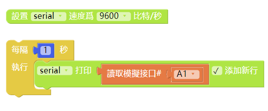
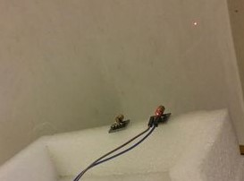
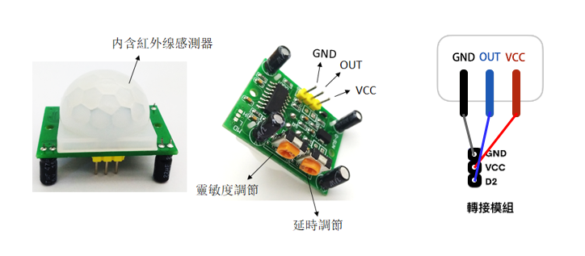
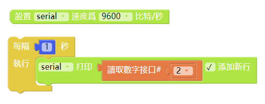
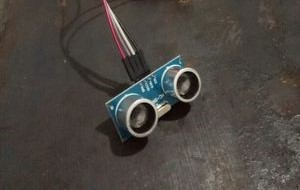

# 使用轉接模組

---

## 模組簡介
轉接模組上嵌有多組引腳，用於多種外接設備如舵機，電機的轉接，還可以外接協力廠商感測器，如紅外線感測器和超聲波感測器等等。每組引腳由**地線（GND）**，**電源輸出（VCC）**，**訊號引腳**組成。

## 模組主要部件

| 編號 | 部件名稱 | 部件描述                                             |
| ---- | -------- | ---------------------------------------------------- |
| 1.   | 引腳     | 每組引腳由地線（GND），電源輸出（VCC），訊號引腳組成 |

## 模組使用說明
1. 轉接模組包括 4 種：轉接模組A1、轉接模組A2、轉接模組B1及轉接模組B2
2. 轉接模組的接入方式存在有兩種：
    - 接入型（轉接模組A1，轉接模組B1）
    
    - 接出型（轉接模組A2，轉接模組B2）
    
3. 轉接模組A1、轉接模組A2提供
   - 數位訊號引腳：0~7
   - 模擬訊號引腳：A0~A3
   - MISO、MOSI、SCK、SS、RST 和3.3V供電引腳
    
4. 轉接模組A1、轉接模組A2提供
   - 數位訊號引腳：6~13
   - 模擬訊號引腳：A4~A7
   - MISO、MOSI、SCK、SS、RST 和3.3V供電引腳
    
5. 為了讓用戶在使用智能家居套件時有更多樣的創作可能性，我們提供了數 10 種第三方感測器，讓用戶有更多創作選擇。
    
    
    1. **土壤溼度感測器**
    將感測器插入土壤中，通過類比／數位轉換電壓訊號，即可檢測土壤水分，土壤越乾燥，輸出電壓越小，越溼潤輸出電壓越大。
    支持：數位訊號輸入
    2. **雨滴感測器**
    可用於不同天氣狀況的監測，並轉換成數位訊號或類比訊號；使用時，感應板上沒有水滴時，數位輸出為高電平，開關指示燈滅，滴上一滴水，數位輸出為低電平，開關指示燈亮。
    支持：數位訊號、類比訊號輸入
    3. **時鐘模塊**
    該模組具備時間功能，並且為了斷電時依然可以保留時間。
    4. **煙霧感測器**
    當感測器所處環境中存在可燃性氣體時，感測器的電導率隨空氣中可燃氣體濃度的增加而增大，類比訊號對應的輸出電壓隨濃度越高電壓越高。
    支持：數位訊號、類比訊號輸入
    5. **激光頭模塊**
    用於發射低功率的激光光束。
    支持：數位訊號輸出
    6. **人體紅外感測器**
    當有人進入其感應範圍則輸出高電平，人離開感應範圍則自動延時關閉高電平，否則輸出低電平。
    支持：數位訊號輸入
    7. **超聲波距離感測器**
    該感測器利用超聲波測距離，多應用於機器人避開障礙物或其他距離測量的項目。
    8. **火焰感測器**
    可監測火焰或者波長在 760nm~1100nm 範圍內的光源，打火機測試火焰距離為80cm，與火焰的距離越大，測試距離越遠。
    支持：數位訊號、類比訊號輸入
    9. **震動感測器**
    用於各種震動觸發作用，不震動時，震動開關呈閉合導通狀態，輸出端輸出低電平，綠色指示燈亮。
    支持：數位訊號輸入
    10. **紅外避障感測器**
    當感測器發射管與接收管檢測到前方障礙物訊號時，綠色指示燈將被點亮，同時數位端口持續輸出低電平訊號。
    支持：數位訊號輸入
    11. **傾斜感測器**
    感測器可感知物體角度的變化，將感測器平輕放桌面上，將模塊朝一個方向慢慢旋轉，開關指示燈會點亮，然後再將模塊朝相反的方向旋轉，回到最初的狀態，開關指示燈會滅。
    支持：數位訊號輸入
    12. **光照感測器**
    該光照感測器對環境光線最敏感，一般用來檢測周圍環境的光線的亮度，觸發單片機或繼電器模塊等。
    支持：數位訊號、類比訊號輸入

---

## 轉接模組基礎使用
### 使用土壤濕度感測器
#### 模組組裝

> 註：
> 1、檢測深度：40mm
> 2、工作溫度：0~60℃（標稱溫度20℃）
> 3、工作濕度：95%RH 以下非結露（標稱濕度 65%RH）
> 4、濕度檢測精度為 ±5%。
#### 積木編程

#### 最終效果

---

### 使用雨滴感測器
#### 模組組裝

#### 積木編程

#### 最終效果

---

### 使用時鐘模塊
#### 模組組裝

#### 積木編程

#### 最終效果

---

### 使用煙霧感測器
#### 模組組裝

> 註：
> 1、探測範圍：300 to 10000ppmm（可燃氣體）
> 2、模擬輸出：數據變化介於0-800；當數字在20-62之間時，表示相對無污染
> 3、可偵側類型：液化氣、丁烷、丙烷、甲烷、酒精、氫氣、煙霧（可燃氣體、煙霧）
> 4、注意：感測器通電後，需要預熱20秒左右，測量的數據才穩定，感測器發熱屬於正常現象，如果燙手就不正常了
#### 積木編程

#### 最終效果

---

### 使用激光頭模塊
#### 模組組裝

#### 積木編程

#### 最終效果

---

### 使用人體紅外感測器
#### 模組組裝

> 1、偵測距離：3~7公尺
> 2、最大感應角度：110°
> 3、訊號輸出信號（OUT）：高電位3.3V、低電位0V
> 4、延遲時間：5~200秒，預設5秒
> 5、封鎖時間：2.5秒
> 
> 4.a 延遲時間代表偵測到人體時，訊號輸出高電位的持續時間。
> 5.a 封鎖時間代表感應模組在每一次感應輸出后，不接受任何感應信號的一段時間
#### 積木編程

#### 最終效果

---

### 使用超聲波距離感測器
#### 模組組裝

> 1、偵測距離：2~450cm
> 2、感測角度：不大於 15°
> 3、被測物體的面積不小於50c㎡ 並且盡量平整
> 4、具有溫度補償電路
#### 積木編程

#### 最終效果

---

### 使用火焰感測器
#### 模組組裝

#### 積木編程

#### 最終效果

---

### 使用震動感測器
#### 模組組裝

#### 積木編程

#### 最終效果

---

### 使用紅外避障感測器
#### 模組組裝

#### 積木編程

#### 最終效果

---

### 使用傾斜感測器
#### 模組組裝

#### 積木編程

#### 最終效果

---

### 使用光照感測器
#### 模組組裝

#### 積木編程

#### 最終效果

---

## 轉接模組進階使用
### SPI、I2C、UART的連接，不同場景下的模組組合
#### 模組組裝
It's comming soon.
#### 積木編程
It's comming soon.
#### 最終效果
It's comming soon.
