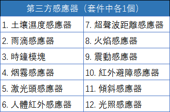

# 使用轉接模組

---

## 模組簡介

轉接模組上嵌有多組接口，用於多種外接設備如伺服馬達，馬達的轉接，還可以外接第三方感測器，如紅外線感測器和超聲波感測器等等。每組接口由地線（GND），電源輸出（VCC），訊號接口（Digital / Analog）組成。

## 模組主要部件

| 編號 | 部件名稱 | 部件描述                                             |
| ---- | -------- | ---------------------------------------------------- |
| 1.   | 接口     | 每組接口由「地線（GND）、電源輸出（VCC）、訊號接口」組成 |

> 爲了避免不同類型的電子模組在使用時有接口（Pin out）的衝突，請注意前往[此頁面](/cocomod/pinout-map)查看接口示意圖

---

### 模組使用說明

1. 其中，編碼「A」和「B」指示轉接模組上提供的不同訊號接口，編碼「1」和「2」指示轉接模組兩側不同類型的拼接口，也即接入型和接出型。 建議圈出圖中的接入口以突出區別

2. 轉接模組的接入方式存在有兩種：

**接入型（轉接模組A1，轉接模組B1）**

<b>接出型（轉接模組A2，轉接模組B2）</b>

3. 轉接模組A1、轉接模組A2提供
   - 數位訊號接口：0~7
   - 類比訊號接口：A0~A3
   - MISO、MOSI、SCK、SS、RST 和3.3V供電接口

4. 轉接模組A1、轉接模組A2提供
   - 數位訊號接口：6~13
   - 類比訊號接口：A4~A7
   - MISO、MOSI、SCK、SS、RST 和3.3V供電接口

### 使用第三方感應器

5. 爲了讓用戶在使用智慧家居套件時有更多樣的創作可能性，我們提供了數 10 種第三方感應器，讓用戶有更多創作選擇。

1. **土壤濕度感應器**
將感應器插入土壤中，通過類比／數位轉換電壓訊號，即可檢測土壤水分，土壤越乾燥，輸出電壓越小，越濕潤輸出電壓越大。
支持：數位訊號輸入、類比訊號輸入

2. **雨滴感應器**
可用於不同天氣狀況的監測，並轉換成數位訊號或類比訊號；使用時，感應板上沒有水滴時，數位輸出爲高電平，開關指示燈滅，滴上一滴水，數位輸出爲低電平，開關指示燈亮。
支持：數位訊號、類比訊號輸入

3. **時鐘模組**
該模組具備時間功能，並且爲了斷電時依然可以保留時間。

4. **煙霧感應器**
當感應器所處環境中存在可燃性氣體時，感應器的電導率隨空氣中可燃氣體濃度的增加而增大，類比訊號對應的輸出電壓隨濃度越高電壓越高。
支持：數位訊號、類比訊號輸入

（套件中不再含有該模組）5. 激光頭模組：
用於發射低功率的激光光束。
支持：數位訊號輸出 

6. **人體紅外感應器**
當有人進入其感應範圍則輸出高電平，人離開感應範圍則自動延時關閉高電平，否則輸出低電平。
支持：數位訊號輸入

7. **超聲波距離感應器**
該感應器利用超聲波測距離，多應用於機器人避開障礙物或其他距離測量的項目。
支持：數位訊號、類比訊號輸入

8. **火焰感應器**
可監測火焰或者波長在 760nm-1100nm 範圍內的光源，打火機測試火焰距離爲80cm，與火焰的距離越大，測試距離越遠。
支持：數位訊號、類比訊號輸入

9. **震動感應器**
用於各種震動觸發作用，不震動時，震動開關呈閉合導通狀態，輸出端輸出低電平，綠色指示燈亮。
支持：數位訊號輸入

10. **紅外避障感應器**
當感應器發射管與接收管檢測到前方障礙物訊號時，綠色指示燈將被點亮，同時數位端口持續輸出低電平訊號。
支持：數位訊號輸入

11. **傾斜感應器**
感應器可感知物體角度的變化，將感應器平輕放桌面上，將模組朝一個方向慢慢旋轉，開關指示燈會點亮，然後再將模組朝相反的方向旋轉，回到最初的狀態，開關指示燈會滅。
支持：數位訊號輸入

12. **光照感應器**
該光照感應器對環境光線最敏感，一般用來檢測周圍環境的光線的亮度，觸發單片機或繼電器模組等。
支持：數位訊號、類比訊號輸入

---

## 轉接模組基礎使用

請參見 [使用第三方感應器](/cocomod/3rd-party)

<!--

# 使用平行轉接模組

## 模組簡介

平行轉接模組適用於將垂直拼接的模組轉換成爲平行拼接，更易於觀察使用。

## 模組主要部件

## 平行轉接基礎使用

### 螢幕模組和環境感測模組平行拼接

#### 模組組裝

主機板模組、環境感測模組、OLED螢幕模組和平行轉接模組

#### 積木編程

#### 最終效果

---
# 使用正反轉接模組

## 模組簡介
正反轉接模組兩邊均爲接出型插口，用於將模組按照相反接入。
## 模組主要部件

---

## 正反轉接基礎使用
### 轉接LED模組和教學模組
#### 模組組裝

#### 積木編程

#### 最終效果

-->
