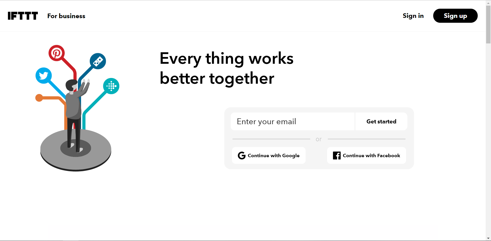

# 使用 IFTTT

### 關於 IFTTT

IFTTT 是 If This Then That 的縮寫，它是一個新生的網絡服務平臺。通俗的來講，IFTTT 的作用就是如果觸發了一件事，則執行設定好的另一件事。所謂的「事」，指的是各種應用、服務之間可以進行有趣的連鎖反應。它就像是一座神奇的橋樑，能連接我們日常所用的各種網絡服務。在 IFTTT 上可以選擇各種類型的服務平臺：

### 注冊&登錄 IFTTT

IFTTT 網址：https://ifttt.com/

#### 方式一

使用email創建賬戶：打開 IFTTT 網站，點擊「Sign up」按鍵，填寫郵箱地址及密碼， 點擊「Sign up」以完成註冊。

#### 方式二

使用 Google 帳號登入：點擊「Continue with Google」按鈕，選擇您的 Google 帳號或輸入您的 Google 帳號和密碼登錄，便可以直接在網站中使用 Google 賬號了。

#### 方式三

使用 Facebook 賬號登入：點擊「Continue with Facebook」按鈕，輸入您的 Facebook 帳號和密碼登錄，便可以直接在網站中使用 Facebook 賬號了。

#### 登錄 IFTTT:

### 創建 New Applet

> 注：此處以 If 「webhooks」 Then 「Email」為例，介紹如何在 IFTTT 上創建 Applet，其他類型的服務程序也是相同的創建步驟

點擊「Get more」，然後選擇「IfThisThenThat」或位於頁面下方的「Create your own」

#### 添加 Webhooks

點擊「+This」

搜索並添加「webhooks」

#### 創建 trigger

點擊「Connect」按鈕連接「webhooks」，然後選擇「trigger」類型

填寫 Event 名字，點擊「Create trigger」完成 trigger 的創建

#### 添加 Email

點擊「Connect」按鈕連接「Email」，鏈接並驗證你的郵箱

#### 創建 Action

填入 PIN 碼，點擊「Connect」按鈕，然後選擇「Send me an email」

在「Subject」中填入郵件的標題，「body」中填入郵件的内容，填寫完成后點擊「Create action」

#### 成功創建 Applet

點擊「Finish」按鍵后即完成 Applet 的創建，界面跳轉回到主界面

> 此 Applet 的含義是儅教學模組的規定按鈕處於高（也即“打開”）的狀態時，通過觸發 Webhooks，就會向郵箱發送郵件

### 獲取 Applet 的 Key

每個 Applet 都有各自獨立且唯一的 Key，用於連接 CocoMod 和 Webhooks，程式會根據 Key ，找到並觸發對應 Applet 的事件，讓 Applet 去執行另外一個事件

在「My services」中點擊「Webhooks」

點擊「Documentation」

頁面中「Your key is:」後面的一串字母數字便是當前這個  Applet 的 Key

### 修改或刪除 Applet

點擊「Settings」

修改 Applet 的内容：在界面中修改内容后點擊「Save」
刪除：直接點擊「Delete」

若要修改或移除 Applet 中的 trigger，也同樣可以在每個 trigger 的「Settings」界面中進行操作

### 案例

如果教學模組電位器的數值高於預定值，就會觸發 Webhooks ，向郵箱發送郵件；否則不發送。

#### 模組組裝

將主機板模組、WiFi 通訊模組以及教學模組拼接在一起

> 注：必須先對主機板模組和 WiFi 通訊模組分別上傳對應模式下的積木程式后，再將這些模組拼接在一起

  
  

#### 積木編程

##### 主機板模式:

程式下載： <a href="../xml/ifttt_project1/project1_main.xml" download >project1_main.xml</a>

  
  

##### WiFi模式:

程式下載： <a href="../xml/ifttt_project1/project1_wifi.xml" download >project1_wifi.xml</a>

> 注：編寫程式時，請注意將聯網積木中的 WiFi 名稱和密碼改成你自己要連接的

  
  

##### 最終效果

程式上傳完成後，轉動教學模組上的電位器，前往你的郵箱查看逆時針旋轉到數值較大時是否會有郵件發送過來

  
  

