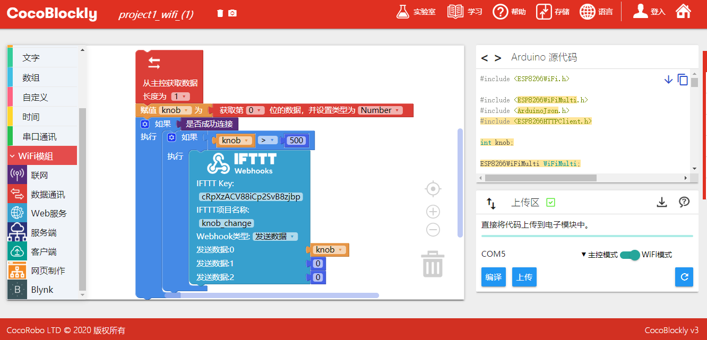

# 使用 IFTTT

### 关于 IFTTT

IFTTT 是 If This Then That 的缩写，它是一个新生的网络服务平台。通俗的来讲，IFTTT 的作用就是如果触发了一件事，则执行设定好的另一件事。所谓的「事」，指的是各种应用、服务之间可以进行有趣的连锁反应。它就像是一座神奇的桥梁，能连接我们日常所用的各种网络服务。在 IFTTT 上可以选择各种类型的服务平台：

### 注册&登录 IFTTT

IFTTT 网址：https://ifttt.com/

#### 方式一

使用email创建账户：打开 IFTTT 网站，点击「Sign up」按键，填写邮箱地址及密码， 点击「Sign up」以完成注册。

#### 方式二

使用 Google 帐号登入：点击「Continue with Google」按钮，选择您的 Google 帐号或输入您的 Google 帐号和密码登录，便可以直接在网站中使用 Google 账号了。

#### 方式三

使用 Facebook 账号登入：点击「Continue with Facebook」按钮，输入您的 Facebook 帐号和密码登录，便可以直接在网站中使用 Facebook 账号了。

#### 登录 IFTTT:

### 创建 New Applet

> 注：此处以 If 「webhooks」 Then 「Email」为例，介绍如何在 IFTTT 上创建 Applet，其他类型的服务程序也是相同的创建步骤

点击「Get more」，然后选择「IfThisThenThat」或位于页面下方的「Create your own」

#### 添加 Webhooks

点击「+This」

搜索并添加「webhooks」

#### 创建 trigger

点击「Connect」按钮连接「webhooks」，然后选择「trigger」类型

填写 Event 名字，点击「Create trigger」完成 trigger 的创建

#### 添加 Email

点击「Connect」按钮连接「Email」，链接并验证你的邮箱

#### 创建 Action

填入 PIN 码，点击「Connect」按钮，然后选择「Send me an email」

在「Subject」中填入邮件的标题，「body」中填入邮件的内容，填写完成后点击「Create action」

#### 成功创建 Applet

点击「Finish」按键后即完成 Applet 的创建，界面跳转回到主界面

> 此 Applet 的含义是儅教学模块的规定按钮处于高（也即“打开”）的状态时，通过触发 Webhooks，就会向邮箱发送邮件

### 获取 Applet 的 Key

每个 Applet 都有各自独立且唯一的 Key，用于连接 CocoMod 和 Webhooks，程序会根据 Key ，找到并触发对应 Applet 的事件，让 Applet 去执行另外一个事件

在「My services」中点击「Webhooks」

点击「Documentation」

页面中「Your key is:」后面的一串字母数字便是当前这个  Applet 的 Key

### 修改或删除 Applet

点击「Settings」

修改 Applet 的内容：在界面中修改内容后点击「Save」
删除：直接点击「Delete」

若要修改或移除 Applet 中的 trigger，也同样可以在每个 trigger 的「Settings」界面中进行操作

### 案例

如果教学模块电位器的数值高于预定值，就会触发 Webhooks ，向邮箱发送邮件；否则不发送。

#### 模块组装

将主控模块、WiFi 通信模块以及教学模块拼接在一起

> 注：必须先对主控模块和 WiFi 通信模块分别上传对应模式下的积木程序后，再将这些模块拼接在一起

  
  

#### 积木编程

##### 主控模式:

程序下载： <a href="../xml/ifttt_project1/project1_main.xml" download >project1_main.xml</a>

  
  

##### WiFi模式:

程序下载： <a href="../xml/ifttt_project1/project1_wifi.xml" download >project1_wifi.xml</a>

> 注：编写程序时，请注意将联网积木中的 WiFi 名称和密码改成你自己要连接的

  
  

##### 最终效果

程序上传完成后，转动教学模块上的电位器，前往你的邮箱查看逆时针旋转到数值较大时是否会有邮件发送过来

  
  

  ---
  更新时间：2019年8月
