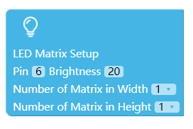
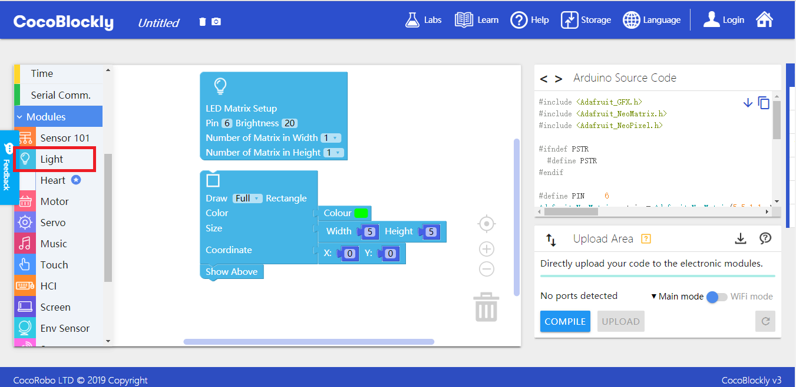
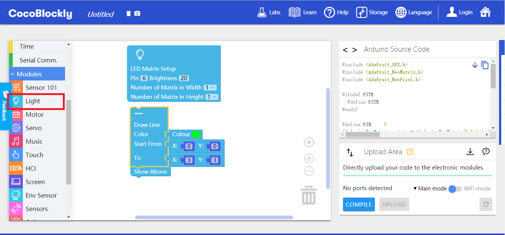
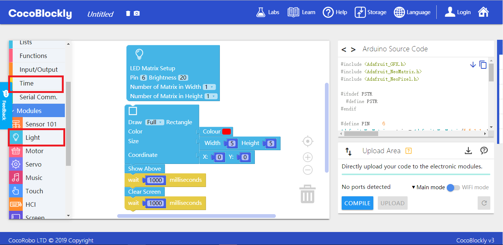
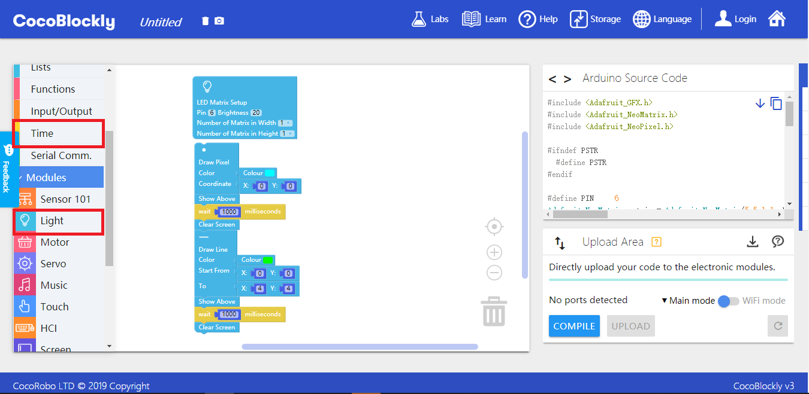
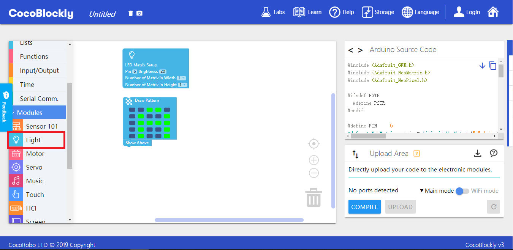
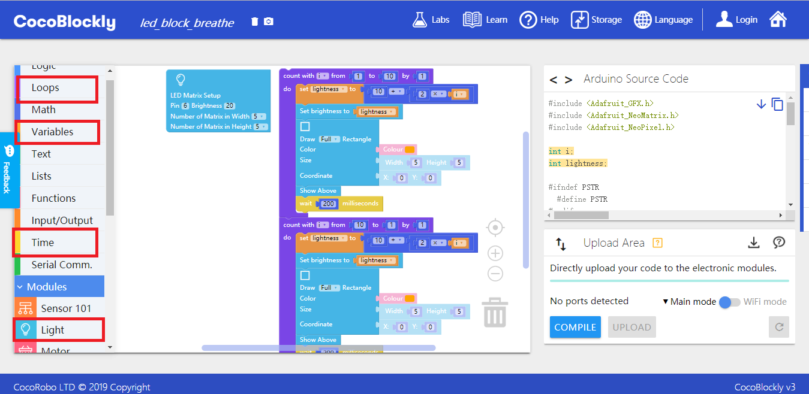

# Apply LED Matrix Module
---

## Introduction

LED matrix module is an electronic module with multiple LED lights in it. You can create various pictures by turning on different lights and controlling the colors of the lights.

## Main Components

<table style="margin-top:20px;">
	<tr>
		<td width="6%" style="font-weight: bold;">No.</td>
		<td width="20%" style="font-weight: bold;">Name</td>
		<td style="font-weight: bold;">Description</td>
	</tr>
	<tr>
		<td>1.</td>
		<td>RGB LED</td>
		<td>There are 25 RGB LED lights, whose luminance can be controlled, on the module. And the module can be connected with other LED matrix modules.</td>
	</tr>
</table>

#### Pinout

| Pinout Position | Pinout Description           |
| -------- | ------------------ |
| (digital signals) D6   | D6 is by default the signal pinout used for controlling the module's LED light.       |
| (digital signals) D7   | D7 is used when two or more LED matric modules need to be assembled. It can be connected to the Pinout D6 of another LED matrix module via a hub module.|

> To avoid pinout clashes between different kinds of modules, please refer to [cocorobo-modules-pinout-map](/cocomod/pinout-map).

---

## Instructions

1. There are 25 LED lights in a LED matrix module. Starting at the lower right corner, the lights are arrayed both horizontally and vertically with 5 ones in each row and each column, thus forming a 5*5 square matrix;
2. The module must be connected with main controller;
3. The module takes up the D6 pin by default. But it can also connect with other pins via a hub module;
4.When using the LED matrix module, you have to initialize the blocks. The "LED Matrix Setup block" is shown below:

5.The "Show Above" block has to be used to display pictures on the LED matrix. The "Show Above" block is shown as below:

---

## Basic Application

### Brightness Adjustment

#### Assemble Modules

Put the LED matrix module and the main controller together, and connect the main controller and a computer via a USB data cable.

#### Code by CocoBlockly

#### Effects

After the program is uploaded successfully, a solid green square whose length and width are all 5 will be displayed in the matrix.

---

### Axis

#### Axis Information

| Number | Axis  | Coordinate Value                                                         |
| --- | --------- | ----------------------------------------------------------------- |
| 1.  | X Axis | 0~4 |
| 2.  | Y Axis | 0~4  |

As is shown in the picture below, the coordinate of the 1-labelled LED light is (0, 0); the coordinate of the 5-labelled LED light is (4, 0); the coordinate of the 21-labelled LED light is (0, 4). The coordinates of other lights can be learned by analogy.

#### Code by CocoBlockly

A line will be shown in the matrix.

#### Effects

After the program is uploaded successfully, you will see the following result:

---
### Clear Screen

#### Assemble Modules

Put the LED matrix module and the main controller together, and connect the main controller and a computer via a USB data cable.

#### Code by CocoBlockly

#### Effects

The LED light keeps blinking as below:

	

---
### Draw an Animated Graphic

#### Assemble Modules

Put the LED matrix module and the main controller together, and connect the main controller and a computer via a USB data cable.

#### Code by CocoBlockly

#### Effects

After the program is uploaded successfully, a point and a line will appear alternately on the matrix every one second:

	

---

## Draw a Customized Picture

#### Assemble Modules

Put the LED matrix module and the main controller together, and connect the main controller and a computer via a USB data cable.

#### Code by CocoBlockly

#### Effects

After the program is uploaded successfully, the picture in the program will be shown (an "A" in the matrix below):

---

### LED Lights who can Blink

#### Assemble Modules

Put the LED matrix module and the main controller together, and connect the main controller and a computer via a USB data cable.

#### Code by CocoBlockly

#### Effects

After the program is uploaded successfully, the light will keep growing brighter and then weaker alternately (the brightness ranges between 0 to 100):

<!--

## Assembly of Multiple LED Matrices

#### Assemble Modules

main controller + LED matrix module + hub module

#### Course

##### Instruction

The assembly of multiple LED matrices entails hub modules. LED matrices and the main controller have to be connected with hub modules. The line used for connecting the main controller and the hub module is subject to the LED matrix initial block setup. And connection methods between LED matrix and hub module is fixed: Pin 6 in and Pin 7 out.

##### Example

Starting from one matrix, you can have a 2x3 screen. The initialized blocks are set as:

Assemble the LED matrices in the order indicated in the picture an you can get a 2x3 screen.

Assemble the LED matrices in the order indicated in the picture an you can get a 3x3 screen.

Assemble the LED matrices in the order shown in the picture an you can get a 4x2 screen.

#### Code by CocoBlockly

Assemble a 2x1 screen: the first screen is red (3x3) and the second is blue (3x3).

#### Effects

#### Reference

to be edited. -->

---
Updated in August 2019
