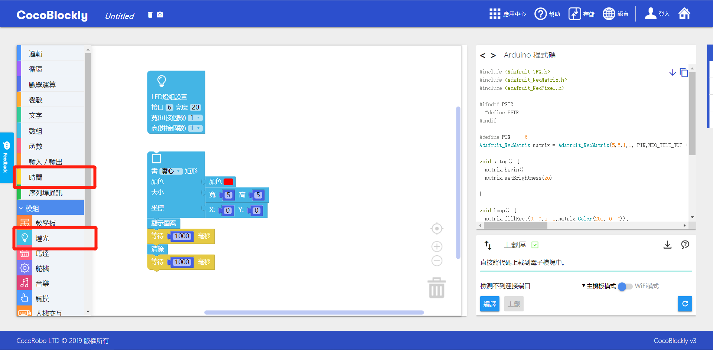
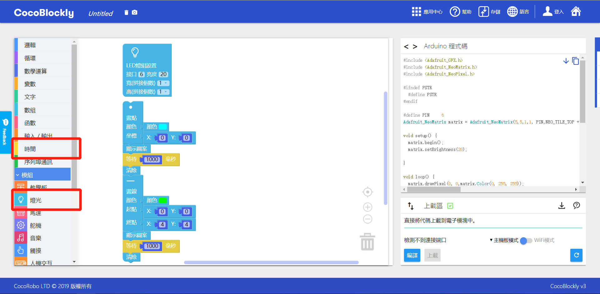

# 使用 LED 灯屏模块
---

## 模块简介

LED 灯屏模块是将多个 LED 灯排列一起而成的电子模块，我们可以通过点亮不同的灯，用不同的颜色，去绘制自己想要的图案

## 模块主要部件

<table style="margin-top:20px;">
	<tr>
		<td width="6%" style="font-weight: bold;">No.</td>
		<td width="20%" style="font-weight: bold;">部件名称</td>
		<td style="font-weight: bold;">部件描述</td>
	</tr>
	<tr>
		<td>1.</td>
		<td>RGB LED</td>
		<td>该模块上载有 25 粒 RGB 的 LED 灯，可控制灯光亮度，同时还支持多个模块进行拼接</td>
	</tr>
</table>

#### 模块接口示意

| 接口位置 | 接口描述           |
| -------- | ------------------ |
| (数字信号) D6   | 控制该模块 LED 灯的信号接口，默认为 D6       |
| (数字信号) D7   | 在组装多个 LED 灯模块使用，使用时，需要将该接口通过转接模块转接至第二块 LED 灯模块的 D6 处|

> 为了避免不同类型的电子模块在使用时有接口（Pin out）的冲突，请注意前往[此页面](/cocomod/pinout-map)查看接口示意图

---

## 模块使用说明

1. 一个模块由25个 LED 灯构成，以右下角为排列起始位置，横排竖排各5个，构成5X5的方阵
2. 需要连接主控模块使用
3.  LED 模块默认占用D6引脚，拼接到转接模块可以设定其他数字引脚
4.使用 LED 灯屏模块时需要先使用初始化设置 LED 灯组的积木，「 LED 灯组设置积木」如下图：

5.需要使用「显示图案」积木才能让绘制的图案显示在 LED 灯屏上，「显示图案」积木如下图：

---

## LED灯屏模块基础使用

### 亮度调整

#### 模块组装

将主控模块和 LED 灯屏模块组合在一起，并让主控模块连接好 USB 数据线至电脑：

#### 积木编程

#### 最终效果

上传完成后，将会在 LED 灯屏上显示一个长和宽各为 5 的绿色实心正方形

---

### 坐标轴介绍

#### 坐标信息

| 编号 | 坐标轴  | 坐标数值                                                          |
| --- | --------- | ----------------------------------------------------------------- |
| 1.  | X 轴 | 0~4 |
| 2.  | Y 轴 | 0~4  |

根据图中坐标轴方向，LED灯屏上标号为1的LED灯坐标是（0.0），标号为5的LED灯坐标是（4，0），标号为21的LED灯坐标是（0，4），以此类推。

#### 积木编程

这里我们将在 LED 灯屏上绘制一条线

#### 最终效果

上传完成后，效果如下：

---
### 清除屏幕

#### 模块组装

将主控模块和 LED 灯屏模块组合在一起，并让主控模块连接好 USB 数据线至电脑：

#### 积木编程

#### 最终效果

实际效果： LED 灯“一亮（红光）一暗”，并且循环显示此效果。

	

---
### 绘制动画

#### 模块组装

将主控模块和 LED 灯屏模块组合在一起，并让主控模块连接好 USB 数据线至电脑：

#### 积木编程

#### 最终效果

程序上传以后，将会以「点 -> 线」的顺序，每隔一秒切换一个图形显示在 LED 灯屏上：

	

---

## 绘制自定义图案

#### 模块组装

将主控模块和 LED 灯屏模块组合在一起，并让主控模块连接好 USB 数据线至电脑：

#### 积木编程

#### 最终效果

程序上传以后，将会呈现处如程序编写时的图案效果，此处为大写字母「A」：

---

### 呼吸灯

#### 模块组装

将主控模块和 LED 灯屏模块组合在一起，并让主控模块连接好 USB 数据线至电脑：

#### 积木编程

#### 最终效果

程序上传以后，LED 灯将会以渐亮和渐暗（亮度在 0 至 100 间变化）的形式交替显示，呈现出白色呼吸灯的效果

<!--

## 多LED拼接

#### 模块组装

主控模块+LED灯屏模块+转接模块

#### 拼接教程

##### 拼接说明

多屏LED的拼接需要结合转接模块使用，每个LED灯屏需要连接转接模块，主控连接转接模块。主控上的转接模块的接线根据LED初始化积木的设定决定，而每个LED灯屏上的转接模块接发固定：接入为引脚6，接出为引脚7

##### 拼接示例

拼接一个2x3的LED屏以第一个LED为起始屏幕，除了初始化积木设置为

LED屏以图示顺序进行连接，最总形成一个2x3的LED面板

LED屏以图示顺序进行连接，拼接一个3x3的LED面板

LED屏以图示顺序进行连接，拼接一个4x2的LED面板

#### 积木编程

拼接一个2x1屏，第一个屏显示红色（3x3），第二个屏显示蓝色（3x3）

#### 最终效果

#### 参考链接

to be edited. -->

---
更新时间：2019年8月
