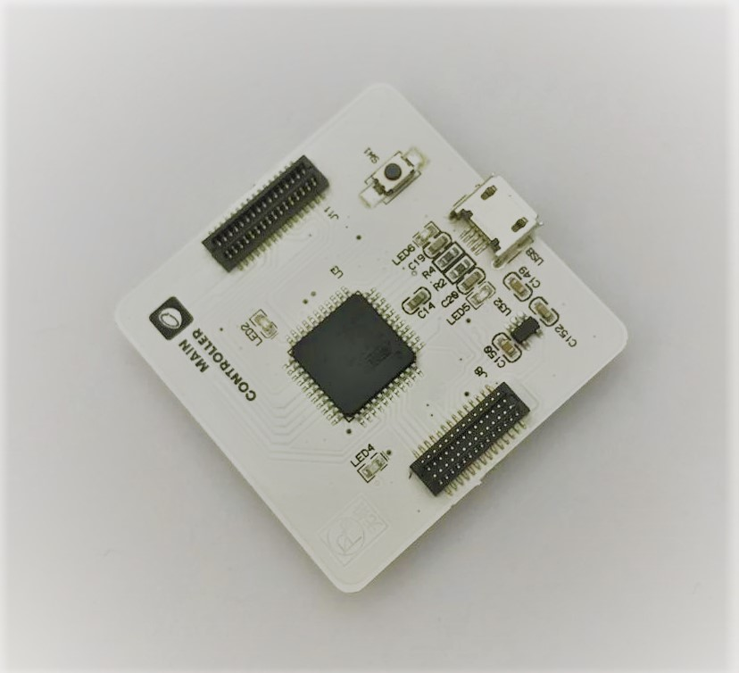
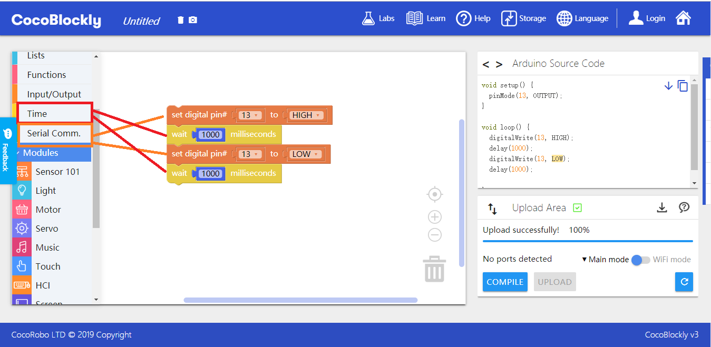
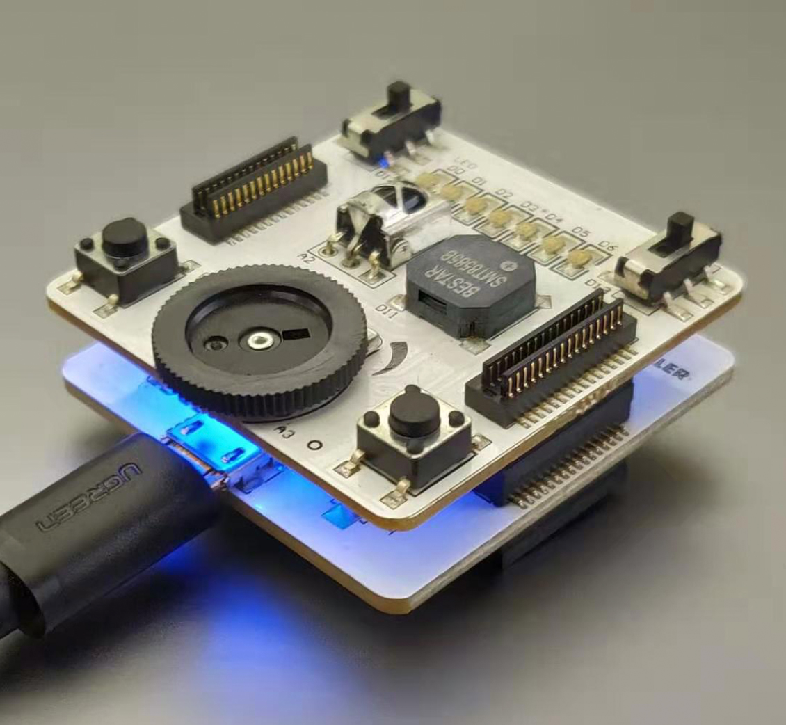
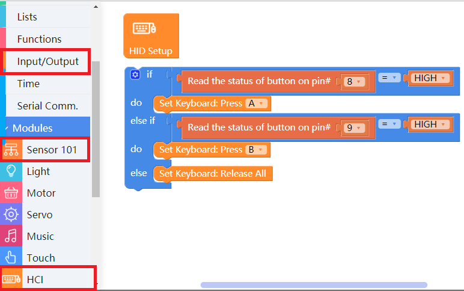
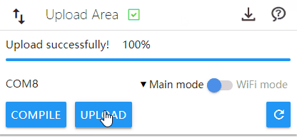

# Apply Main Controller

---

## Introduction

Main Controller can be regarded as "the brain" if electronic modules were the human body. Programs written in CocoBlockly are "the ideas" aiming to tell "the brain" (main controller) what to do. Once "the ideas" are transmitted to "the brain", the main controller will control other modules to do what is commanded.
## Main Components

<table style="margin-top:20px;">
	<tr>
		<td width="6%" style="font-weight: bold;">No.</td>
		<td width="20%" style="font-weight: bold;">Name</td>
		<td style="font-weight: bold;">Description</td>
	</tr>
	<tr>
		<td>1.</td>
		<td>Built-in LED Light</td>
		<td>The built-in LED light (D13) is controllable, and it will blink intermittently until the program has been uploaded completely. </td>
	</tr>
	<tr>
		<td>2.</td>
		<td>Reset Button</td>
		<td>Long press the reset button, and the main controller will be in the resetting mode and then restart. </td>
	</tr>
	<tr>
		<td>3.</td>
		<td>USB Interface</td>
		<td>The MicroUSB interface is used to communicate with computers.</td>
	</tr>
</table>

---

## Instructions

1. Do not use any power supply greater than 5V/2A.
2. The blinking of the bulit-in LED light(D13) indicates that the main controller is resetting, which usually lasts for 10s or so. After that, the main controller will return to normal.
3. In case uploading the program from CocoBlockly to the main controller fails, you can press the reset button for 1s and then upload the program again.
---

## Basic Application

### Blinking Built-in LED Light

#### Assemble Modules

One main controller is needed. Connect the main controller to a computer via a USB cable:

#### Code by CocoBlockly

#### Effects

The built-in LED light (D13) will blink intermittently at 1s intervals (1s=1000ms) after the program is uploaded successfully:

---

### Simulate Mouse and Keyboard (Human-computer interatction mode)

#### Assemble Modules

* One main controller (the bottom in the picture);
* One sensor 101 module (the top in the picture).

#### Code by CocoBlockly

You can make a mini-keyboard in this project. The blocks required can be found in the red boxes respectively:

#### Effects

Press the two buttons in the sensor 101 module to input the letter "A" and "B" after the program is uploaded successfully:

> Ps: In the macOS, the port number at the uploading area in the CocoBlockly interface will change into one with "HIDFG". It means that the main controller is detected as HCI device by the computer and the name change won't affect programs.

---
Updated in August 2019
