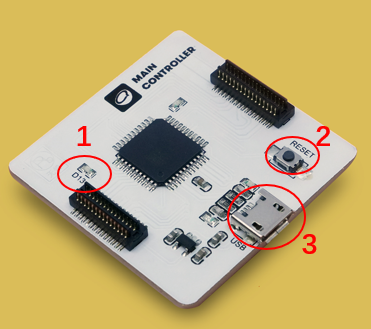
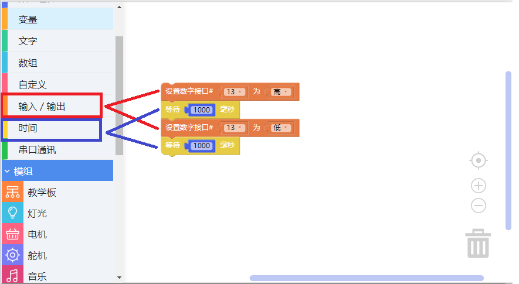
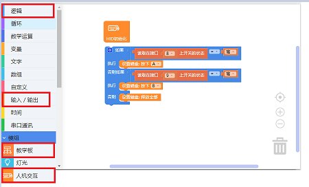

# 使用主控模块

---

## 模块简介

如果将电子模块模拟为人的身体，主控模块就是电子模块的「大脑」(brain)，我们在CocoBlockly中撰写的程序则是主控模块「大脑」思考要做什么动作或发出什么指令时产生的各种「想法」；当「想法」传输至「大脑」后，主控模块从而控制其他模块并令其做出相应的动作或指令。

## 模块主要部件

<table style="margin-top:20px;">
	<tr>
		<td width="6%" style="font-weight: bold;">No.</td>
		<td width="20%" style="font-weight: bold;">部件名称</td>
		<td style="font-weight: bold;">部件描述</td>
	</tr>
	<tr>
		<td>1.</td>
		<td>内置 LED 灯</td>
		<td>主控模块中有 1 个可以控制（D13）的内置 LED 灯，在上传程序过程中，这个内置 LED 灯会间歇性闪烁，直到完成程序上传</td>
	</tr>
	<tr>
		<td>2.</td>
		<td>重置按钮</td>
		<td>长按重置按钮，在主控模块进入重置状态之后，主控模块会重新启动</td>
	</tr>
	<tr>
		<td>3.</td>
		<td>USB 接口</td>
		<td>用于与PC端通信的 MicroUSB 接口</td>
	</tr>
</table>

---

## 模块使用说明

1. 切勿使用超过 5V/2A 的电源供电。
2. 当主控模块的 LED 灯（D13）呈呼吸状态时，意味著模块正处于重置状态，该状态一般会持续 10s 左右，10s 以后将会恢复正常状态。
3. 当从 CocoBlockly 上传程序至主控模块不成功时，可以尝试在按下重置按钮 1s 后再点击上传。

---

## 主控模块基础使用

### 闪烁内置 LED 灯

#### 模块组装

只需要一块主控模块即可，并插入 USB 数据线，同时将 USB 数据线的另一端接入电脑中：

#### 积木编程

#### 最终效果

上传完成后，位于 D13 的 LED 灯将会每隔 1 秒（1 秒 = 1000 毫秒）闪一次：

---

### 人机交互模式（模拟鼠标及键盘）

#### 模块组装

* 1 个主控模块（图中位于底部的电子模块）；
* 1 个教学模块（图中位于顶部的电子模块）。

#### 积木编程

本项目中，我们将制作一个迷你键盘。对应积木可以从下图红圈处找到：

#### 最终效果

上传完成后，使用教学模块上的两个按钮，来在电脑中输入「A」和「B」两个字符：

> 注：在 macOS 作业系统中，上传完人机交互程序后，CocoBlockly 界面中右下角上传区的端口号会变为带有「HIDFG」的名称，这意味著你的主控模块已经成功被电脑识别为人机交互装置，但名称的改变不会影响之后的程序上传

---
更新时间：2019年8月
