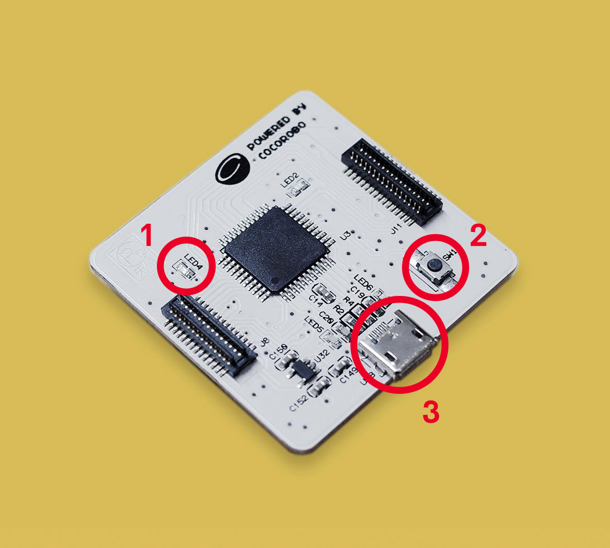

# 使用主機板模組

---

## 模組簡介

如果將電子模組類比爲人的身體，主機板模組就是電子模組的「大腦」(brain)，我們在CocoBlockly中撰寫的程式則是主機板模組「大腦」思考要做什麼動作或發出什麼指令時產生的各種「想法」；當「想法」傳輸至「大腦」後，主機板模組從而控制其他模組並令其做出相應的動作或指令。

## 模組主要部件

<table style="margin-top:20px;">
	<tr>
		<td width="6%" style="font-weight: bold;">No.</td>
		<td width="20%" style="font-weight: bold;">部件名稱</td>
		<td style="font-weight: bold;">部件描述</td>
	</tr>
	<tr>
		<td>1.</td>
		<td>內置 LED 燈</td>
		<td>主機板模組中有 1 個可以控制（D13）的內置 LED 燈，在上傳程式過程中，這個內置 LED 燈會間歇性閃爍，直到完成程式上傳</td>
	</tr>
	<tr>
		<td>2.</td>
		<td>重置按鈕</td>
		<td>長按重置按鈕，在主機板模組進入重置狀態之後，主機板模組會重新啓動</td>
	</tr>
	<tr>
		<td>3.</td>
		<td>USB 接口</td>
		<td>用於與PC端通訊的 MicroUSB 接口</td>
	</tr>
</table>

---

## 模組使用說明

1. 切勿使用超過 5V/2A 的電源供電。
2. 當主機板模組的 LED13 燈呈呼吸狀態時，意味著模組正處於重置狀態，該狀態一般會持續 10s 左右，10s 以後將會恢復正常狀態。
3. 當從 CocoBlockly 上傳程序至主機板模組不成功時，可以嘗試在按下重置按鈕 1s 後再點擊上傳。

---

## 主機板模組基礎使用

### 閃爍內置 LED 燈

#### 模組組裝

只需要一塊主機板模組即可，並插入 USB 數據線，同時將另一端接入電腦中：

#### 積木編程

#### 最終效果

上傳完成後，位於 D13 的 LED 燈將會每隔 1 秒（1 秒 = 1000 毫秒）閃一次：

---

### 人機交互模式（模擬鼠標及鍵盤）

#### 模組組裝

* 1 個主機板模組（圖中位於底部的電子模組）；
* 1 個教學模組（圖中位於頂部的電子模組）

#### 積木編程

本項目中，我們將製作一個迷你鍵盤。對應積木可以從下圖紅圈處找到：

#### 最終效果

上傳完成後，使用教學模組上的兩個按鈕，來在電腦中輸入「A」和「B」兩個字符：

> 註：在 macOS 作業系統中，上傳完人機交互程式後，CocoBlockly 界面中右下角上傳區的端口號會變爲帶有「HIDFG」的名稱，這意味着你的主機板模組已經成功被電腦識別爲人機交互裝置，但改變不會影響之後的程式上傳

