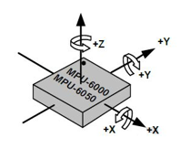
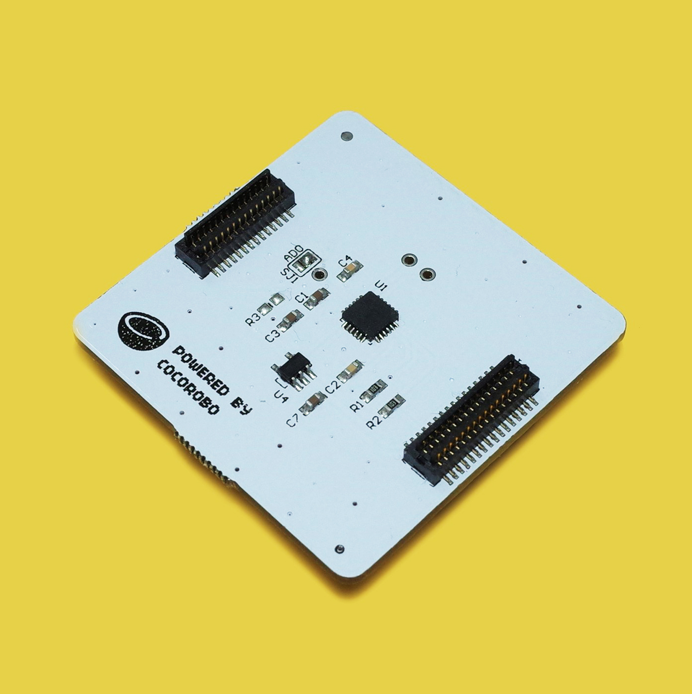
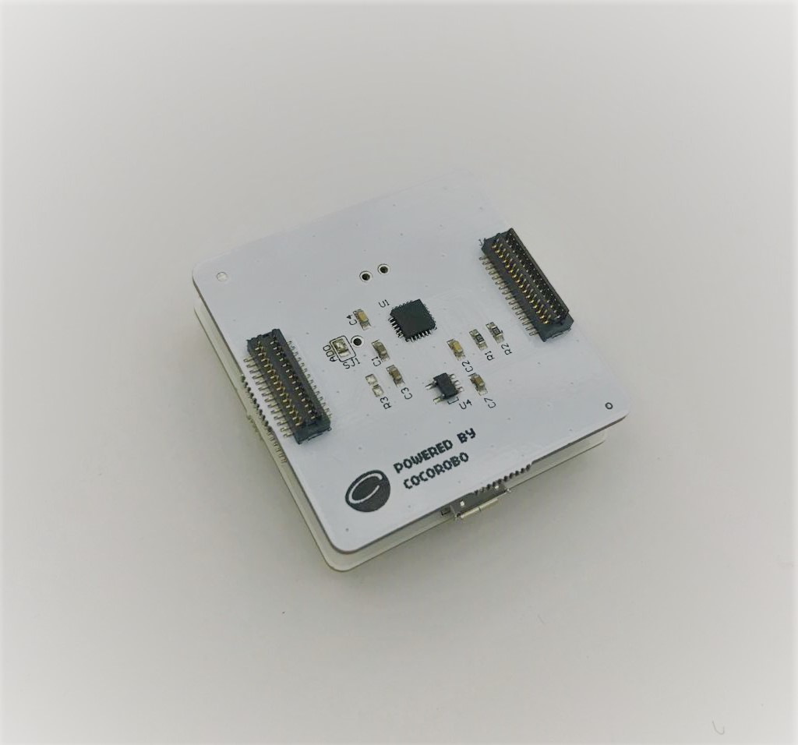
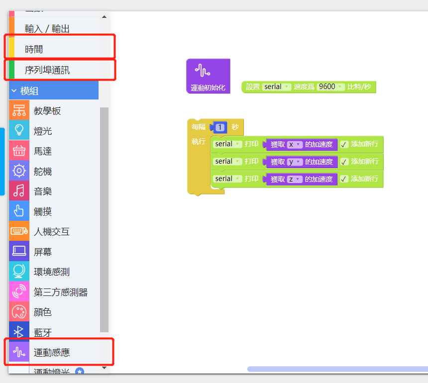
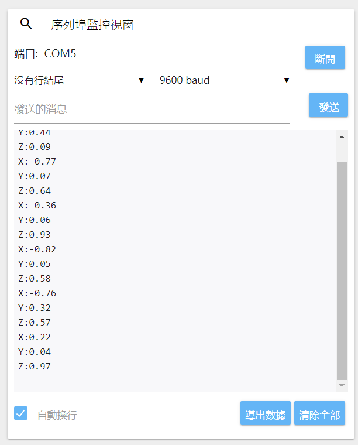
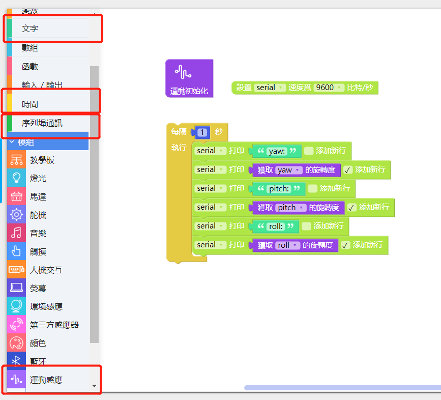
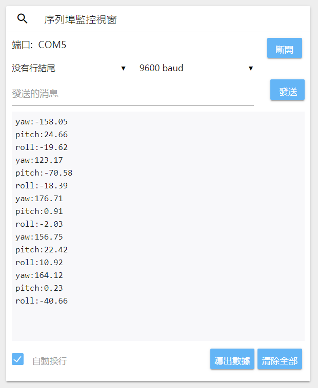
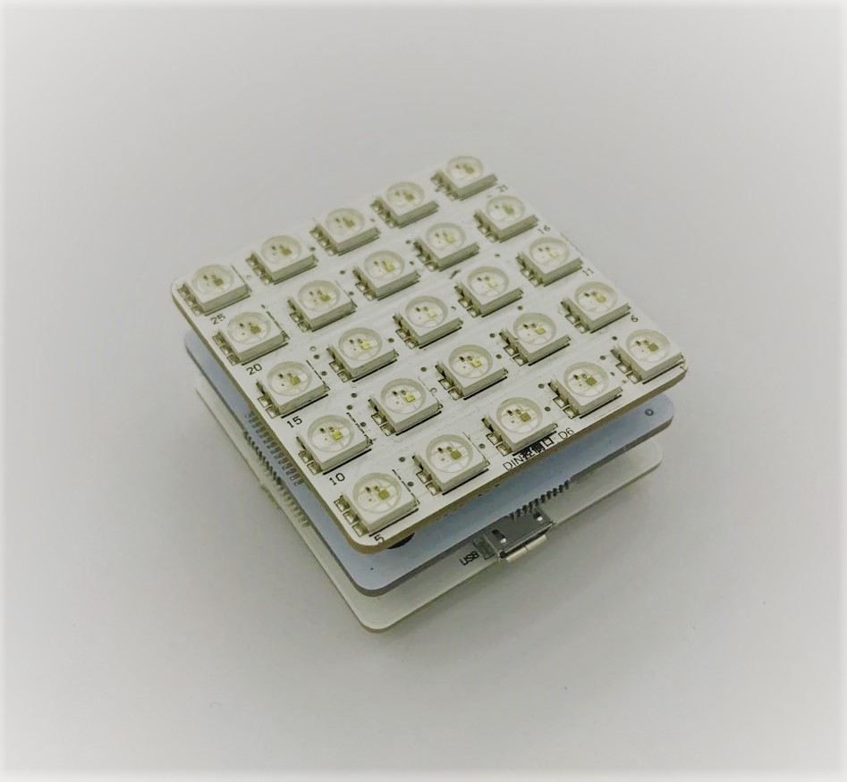
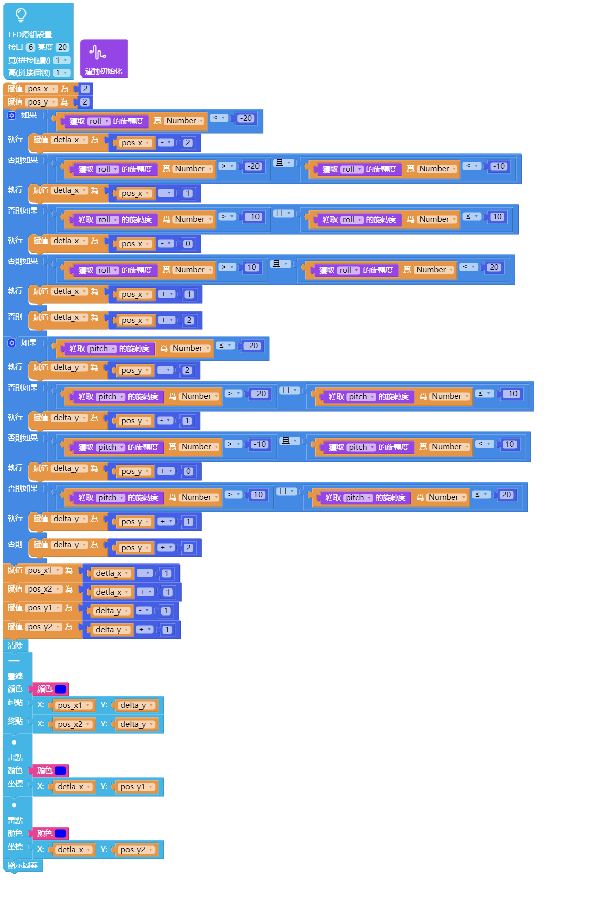
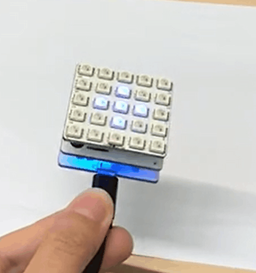

# 使用運動感應模組

---

## 模組簡介

運動感應模組用於反映物體在空間座標系 X，Y，Z 三軸上的運動變化參數。

---

## 模組主要部件

<table style="margin-top:20px;">
	<tr>
		<td width="6%" style="font-weight: bold;">No.</td>
		<td width="20%" style="font-weight: bold;">部件名稱</td>
		<td style="font-weight: bold;">部件描述</td>
	</tr>
	<tr>
		<td>1.</td>
		<td>運動感應芯片</td>
		<td>可以得到物體在空間座標系 X，Y，Z 三軸上的運動變化參數。</td>
	</tr>
</table>

#### 模組接口示意

| 接口位置 | 接口描述           |
| -------- | ------------------ |
| (數位訊號) D2, D3, D7    | 運動感應元件使用的接口 |

> 爲了避免不同類型的電子模組在使用時有接口（Pin out）的衝突，請注意前往[此頁面](/cocomod/pinout-map)查看接口示意圖

---

## 模組使用說明

1. 通常反映運動變化的參數爲加速度和陀螺儀(角速度）。
2. 加速度：反映單位時間內物體在某個方向上速度變化的快慢。
3. 角速度：反映單位時間內物體在某個方向上旋轉的角度。

---

## 運動感應模組基礎使用

### 獲取 XYZ 的加速度值

加速度 (acceleration)表示單位時間内速度改變程度的矢量。一般情況下，加速度是個瞬時概念，它的常用單位是米/秒²，即 m/s²

#### 模組組裝

將主機板模組和運動感應模組拼接在一起，並讓主機板模組連接好 USB 數據線至電腦：

#### 積木編程

#### 最終效果

打開序列埠監控視窗，連接主機板並晃動模組，可以看到加速度的數值改變

<!--
---

## 運動感應模組基礎使用

### 獲取 XYZ 的重力值

#### 模組組裝

Coming soon.

#### 積木編程

Coming soon.

#### 最終效果

Coming soon.
-->
---

## 運動感應模組基礎使用

### 獲取 XYZ 的角度傾斜值

#### 模組組裝

將主機板模組和運動感應模組拼接在一起，並讓主機板模組連接好 USB 數據線至電腦：

#### 積木編程

#### 最終效果

打開序列埠監控視窗，連接主機板並向不同角度轉動模組，可以看到旋轉度的數值改變

---

## 運動感應模組進階使用

### 製作運動感應 LED 燈

#### 模組組裝

將主機板模組和運動感應模組以及LED燈屏模組拼接在一起，並讓主機板模組連接好 USB 數據線至電腦：

#### 積木編程

#### 最終效果

LED燈光會隨著模組的運動方向發生位置的變化。

