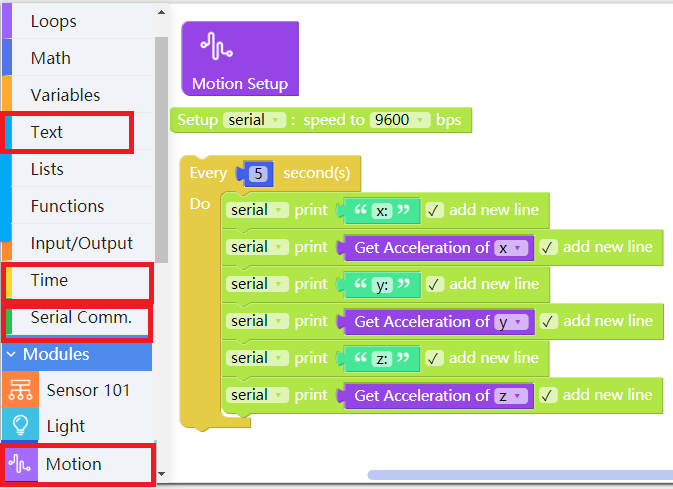
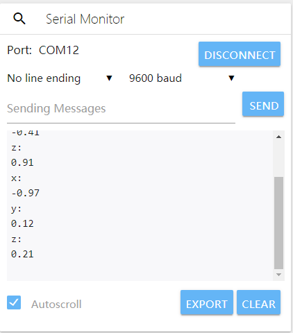
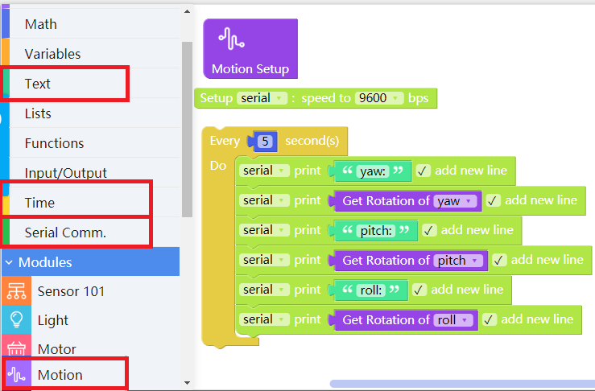
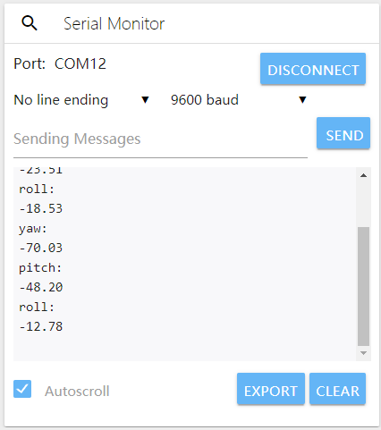
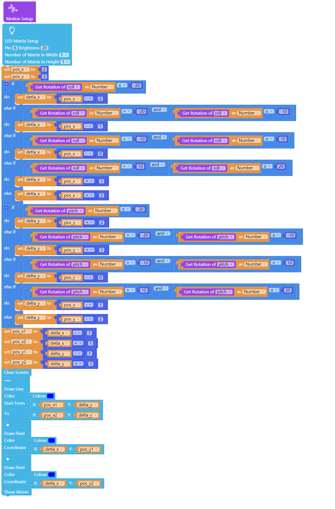

# Apply Motion Sensing Module

---

## Introduction

Motion sensing module is used to show an object's motion changing parameter in the Axes X, Y and Z of a 3-D coordinate system.

---

## Main Components

<table style="margin-top:20px;">
	<tr>
		<td width="6%" style="font-weight: bold;">No.</td>
		<td width="20%" style="font-weight: bold;">Name</td>
		<td style="font-weight: bold;">Description</td>
	</tr>
	<tr>
		<td>1.</td>
		<td>motion sensing chip</td>
		<td>used for obtaining an object's motion changing parameter in the Axes X, Y and Z of a 3-D coordinate system</td>
	</tr>
</table>

#### Pinout

| Pinout Position | Pinout Description           |
| -------- | ------------------ |
| (digital signal) D2, D3, D7    | used by motion sensing components |

> To avoid pinout clashes between different kinds of modules, please refer to [cocorobo-modules-pinout-map](/cocomod/pinout-map).

---

## Instructions

1. Acceleration and angular velocity are usually used as parameters to show motion changes.
2. Acceleration: the rate at which the velocity of an object changes.
3. Angular velocity: the rate at which an object rotates in a particular direction.

---

## Basic Application

### Get the Acceleration Value in the Axes X, Y and Z

Acceleration is a vector expressing the rate at which the velocity of an object changes. For the most part, acceleration, whose unit is m/s², is a concept of instantaneous change.

#### Assemble Modules

Put the motion sensing module and the main controller together, and connect the main controller and a computer via a USB data cable.

#### Code by CocoBlockly

#### Effects

Open the serial monitor window, click to "CONNECT" establish communication between the module and the main controller, shake the module and you will see the change of the acceleration value.

<!--
---

## Basic Application

### Get the Gravity Value in the Axes X, Y and Z

#### Assemble Modules

Coming soon.

#### Code by CocoBlockly

Coming soon.

#### Effects

Coming soon.
-->
---

## Basic Application

### Get the Tilt Angle Value in the Axes X, Y and Z

#### Assemble Modules

Put the motion sensing module and the main controller together, and connect the main controller and a computer via a USB data cable.

#### Code by CocoBlockly

#### Effects

Open the serial monitor window, click "CONNECT" to establish communication between the module and the main controller, rotate the module in different directions and you will see the change of the angular velocity value.

---

## Advanced Application

### Make Motion Sensing LED Lights

#### Assemble Modules

Put the motion sensing module, the LED matrix module and the main controller together, and connect the main controller and a computer via a USB data cable.

#### Code by CocoBlockly

#### Effects

Different LED lights will be turned on or off with the change of the module's moving direction.

---
Updated in August 2019
