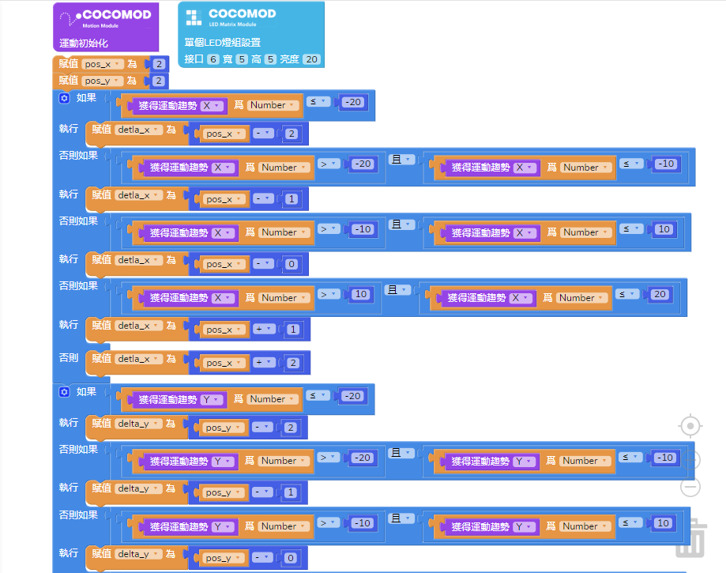
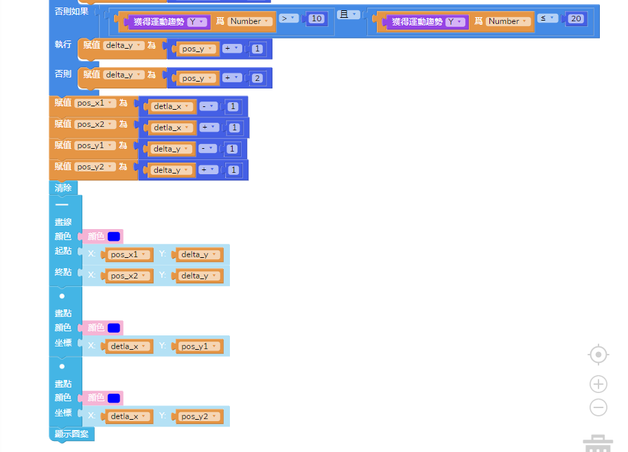
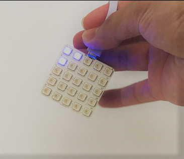

# 使用運動感測模組

---

## 模組簡介
運動感應模組用於反映物體在空間坐標系 X，Y，Z 三軸上的運動變化參數。

## 模組主要部件

| 編號 | 部件名稱     | 部件描述                                            |
| ---- | ----------- | -------------------------------------------------- |
| 1.   | 運動感測芯片 | 可以得到物體在空間坐標系 X，Y，Z 三軸上的運動變化參數。 |
## 模組使用說明
1. 通常反映運動變化的參數為加速度和陀螺儀(角速度）。
2. 加速度：反映單位時間內物體在某個方向上速度變化的快慢。
3. 角速度：反映單位時間內物體在某個方向上旋轉的角度。

---

## 運動感測模組基礎使用
### 獲取 XYZ 的加速度值
#### 模組組裝

#### 積木編程

#### 最終效果
It's comming soon.

---

## 運動感測模組基礎使用
### 獲取 XYZ 的重力值
#### 模組組裝
It's comming soon.
#### 積木編程
It's comming soon.
#### 最終效果
It's comming soon.

---

## 運動感測模組基礎使用
### 獲取 XYZ 的角度傾斜值
#### 模組組裝
It's comming soon.
#### 積木編程
It's comming soon.
#### 最終效果
It's comming soon.

---

## 運動感測模組進階使用
### 製作運動感應 LED 燈
#### 模組組裝

#### 積木編程

#### 最終效果

