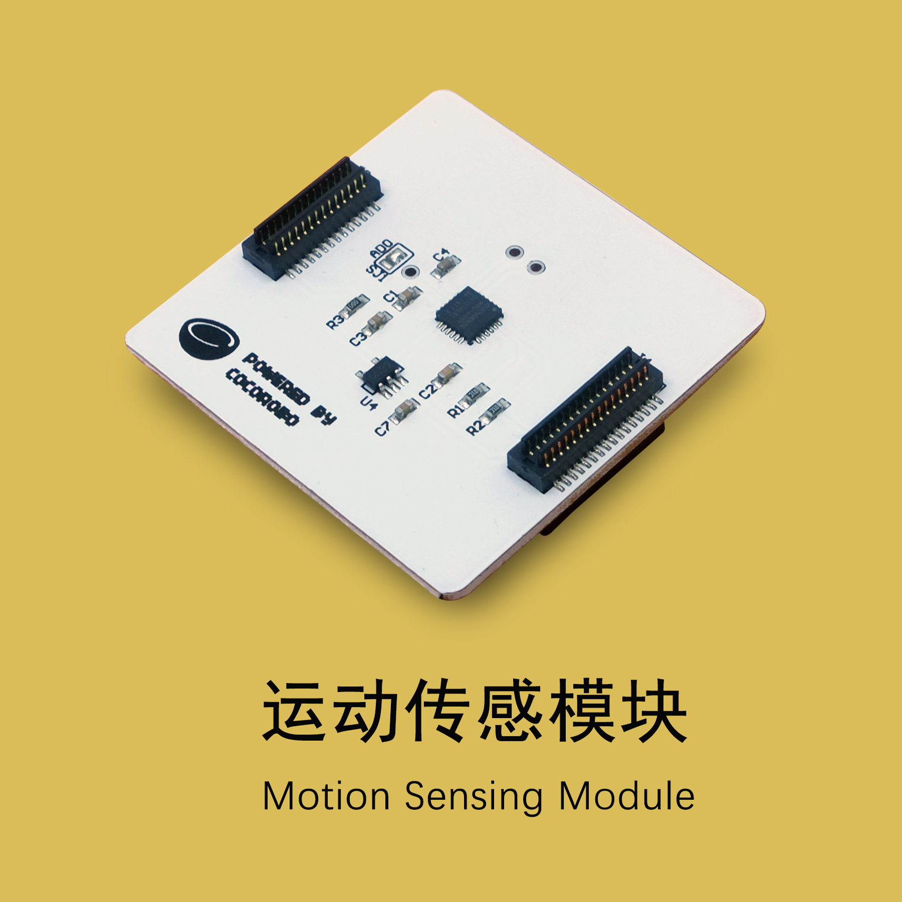
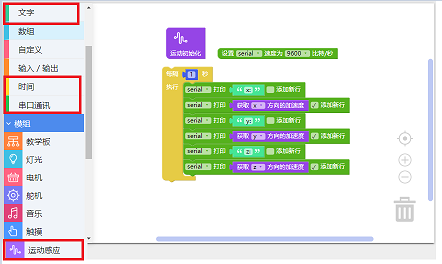
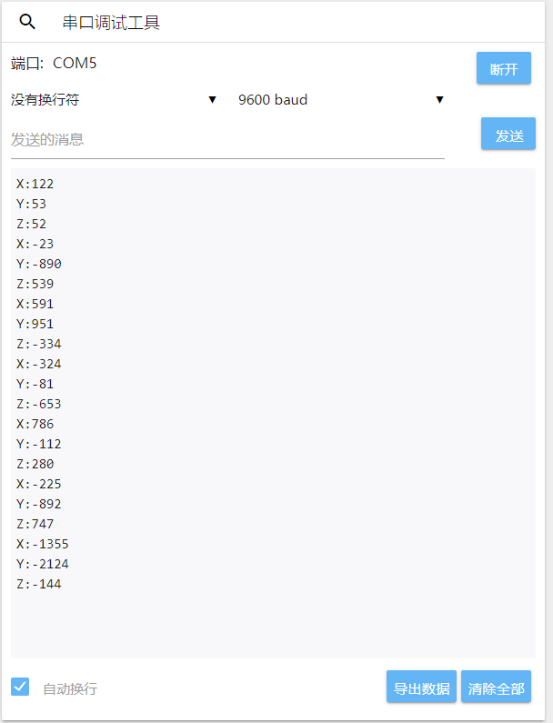
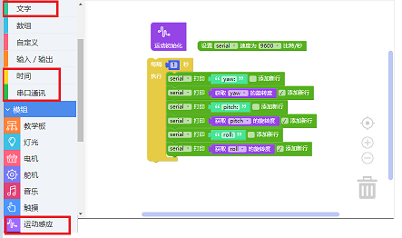
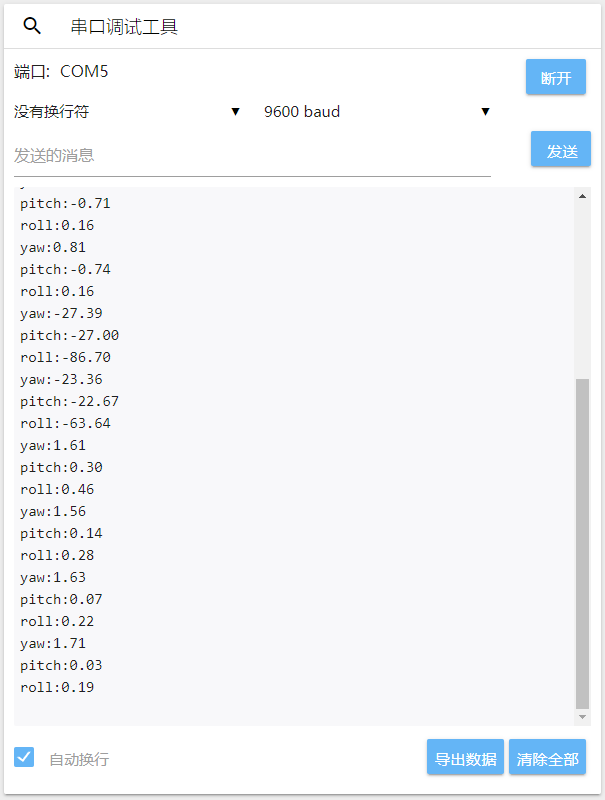
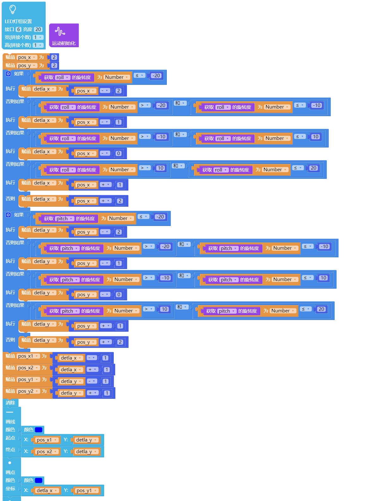

# 使用运动传感模块

---

## 模块简介

运动传感模块用于反映物体在空间座标系 X，Y，Z 三轴上的运动变化参数。

---

## 模块主要部件

<table style="margin-top:20px;">
	<tr>
		<td width="6%" style="font-weight: bold;">No.</td>
		<td width="20%" style="font-weight: bold;">部件名称</td>
		<td style="font-weight: bold;">部件描述</td>
	</tr>
	<tr>
		<td>1.</td>
		<td>运动传感芯片</td>
		<td>可以得到物体在空间座标系 X，Y，Z 三轴上的运动变化参数。</td>
	</tr>
</table>

#### 模块接口示意

| 接口位置 | 接口描述           |
| -------- | ------------------ |
| (数字信号) D2, D3, D7    | 运动传感元件使用的接口 |

> 为了避免不同类型的电子模块在使用时有接口（Pin out）的冲突，请注意前往[此页面](/cocomod/pinout-map)查看接口示意图

---

## 模块使用说明

1. 通常反映运动变化的参数为加速度和陀螺仪(角速度）。
2. 加速度：反映单位时间内物体在某个方向上速度变化的快慢。
3. 角速度：反映单位时间内物体在某个方向上旋转的角度。

---

## 运动传感模块基础使用

### 获取 XYZ 的加速度值

加速度 (acceleration)表示单位时间内速度改变程度的矢量。一般情况下，加速度是个瞬时概念，它的常用单位是米/秒²，即 m/s²

#### 模块组装

将主控模块和运动传感模块拼接在一起，并让主控模块连接好 USB 数据线至电脑：

#### 积木编程

#### 最终效果

打开串口监控视窗，连接主控并晃动模块，可以看到加速度的数值改变

<!--
---

## 运动传感模块基础使用

### 获取 XYZ 的重力值

#### 模块组装

Coming soon.

#### 积木编程

Coming soon.

#### 最终效果

Coming soon.
-->
---

## 运动传感模块基础使用

### 获取 XYZ 的角度倾斜值

#### 模块组装

将主控模块和运动传感模块拼接在一起，并让主控模块连接好 USB 数据线至电脑：

#### 积木编程

#### 最终效果

打开串口监控视窗，连接主控并向不同角度转动模块，可以看到旋转度的数值改变

---

## 运动传感模块进阶使用

### 制作运动传感 LED 灯

#### 模块组装

将主控模块和运动传感模块以及LED灯屏模块拼接在一起，并让主控模块连接好 USB 数据线至电脑：

#### 积木编程

#### 最终效果

LED灯光会随著模块的运动方向发生位置的变化。

---
更新时间：2019年8月
