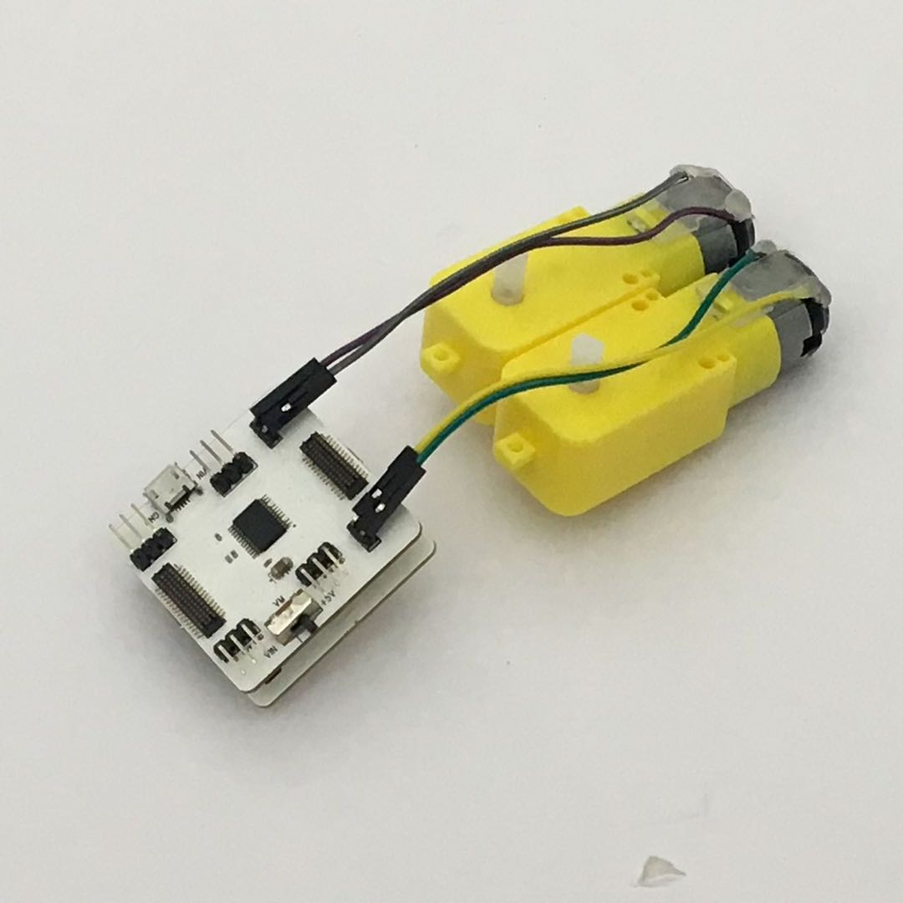

# 使用馬達驅動模組

## 模組簡介

馬達驅動模組能夠同時控制兩個馬達，另外設定了四個外接感應器接口，可供使用者接入第三方感應器。

## 模組主要部件

<table style="margin-top:20px;">
	<tr>
		<td width="6%" style="font-weight: bold;">No.</td>
		<td width="20%" style="font-weight: bold;">部件名稱</td>
		<td style="font-weight: bold;">部件描述</td>
	</tr>
	<tr>
		<td>1.</td>
		<td>馬達接口A</td>
		<td>在此處接入馬達的兩極</td>
	</tr>
	<tr>
		<td>2.</td>
		<td>馬達接口B</td>
		<td>在此處接入馬達的兩極</td>
	</tr>
	<tr>
		<td>3.</td>
		<td>外接第三方 感應器接口 A3</td>
		<td>支持接入類比訊號讀入的感應器，接口爲 A3</td>
	</tr>
	<tr>
		<td>4.</td>
		<td>外接第三方 感應器接口 A1</td>
		<td>支持接入類比訊號讀入的感應器，接口爲 A1</td>
	</tr>
	<tr>
		<td>5.</td>
		<td>外接第三方 感應器接口 A4</td>
		<td>支持接入類比訊號讀入的感應器，接口爲 A4</td>
	</tr>
	<tr>
		<td>6.</td>
		<td>外接第三方 感應器接口 A0</td>
		<td>支持接入類比訊號讀入的感應器，接口爲 A0</td>
	</tr>
	<tr>
		<td>7.</td>
		<td>外接供電 USB 接口</td>
		<td>通過 MicroUSB 線來單獨供電，與主機板模組 USB 接口爲統一類型</td>
	</tr>
	<tr>
		<td>8.</td>
		<td>供電選擇切換開關</td>
		<td>有「+5V：使用主機板模組供電」和「VIN：外接供電」的選擇，當馬達的輸出電流過高，以導致主機板模組可能重置時，需要撥動開關至「外接供電」處</td>
	</tr>
</table>

#### 模組接口示意

| 接口位置 | 接口描述           |
| -------- | ------------------ |
| (數位訊號) D5, D9, D10    | 控制馬達 B 所需要使用的接口 |
| (數位訊號) D6, D4, D8    | 控制馬達 A 所需要使用的接口 |
| (類比訊號) A5    | 馬達驅動芯片所需要使用的接口（STBY） |

> 爲了避免不同類型的電子模組在使用時有接口（Pin out）的衝突，請注意前往[此頁面](/cocomod/pinout-map)查看接口示意圖

---

## 馬達驅動模組基礎使用

### 控制馬達的轉速與方向

#### 所需模組與材料

1個馬達驅動模組、1個主機板模組及1個馬達

#### 模組組裝

將馬達上的杜邦綫連接到馬達驅動模組的A接口，然後將主機板模組和馬達驅動模組組合在一起，並讓主機板模組連接好 USB 數據線至電腦：

#### 積木編程

#### 最終效果

程式上傳成功後，請確保馬達驅動模組上的撥動開關處於「+5V」 一側的狀態（使用主機板模組供電）

---

### 控制兩個馬達：實現前後左右行動

#### 所需模組與材料

1個馬達驅動模組、1個主機板模組及2個馬達

#### 模組組裝

將兩個馬達上的杜邦綫分別連接到馬達驅動模組的A接口和B接口，然後將主機板模組和馬達驅動模組組合在一起，並讓主機板模組連接好 USB 數據線至電腦：

#### 積木編程

##### 注意事項

正反轉間隔需大於 **400ms**，否則會引起主機板模組重置

#### 最終效果

程式上傳成功後，請確保馬達驅動模組上的撥動開關處於+5V 一側的狀態（使用主機板模組供電）

---
更新時間：2019年8月
