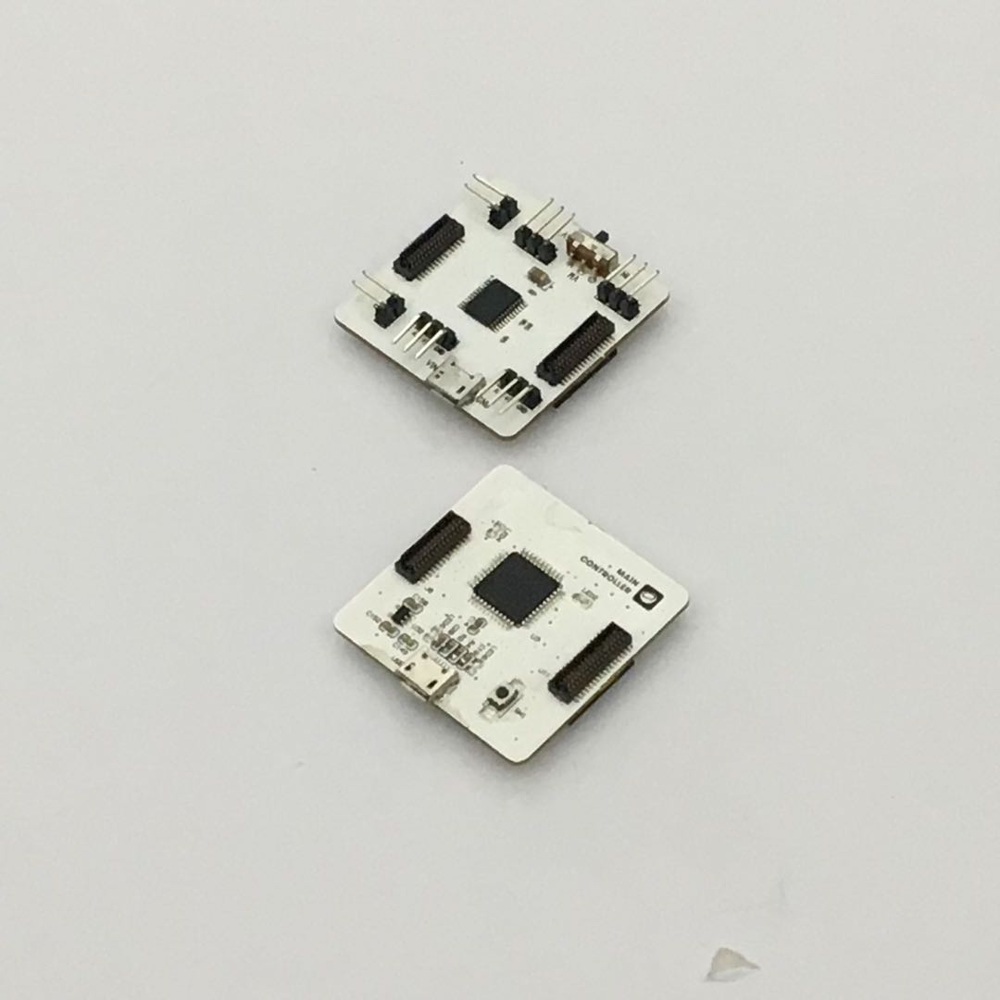

# 使用電機驅動模組

## 模組簡介

電機驅動模組能夠同時控制兩個電機，另外設定了四個外接感測器接口，可供使用者接入第三方感測器。

## 模組主要部件

 

| 編號 |部件名稱 | 部件描述  |
|-  |-  |-  |
|**1** |電機接口A  | 在此處接入電機的兩極 |
|**2** |電機接口B  | 在此處接入電機的兩極 |
|**3** |外接第三方感測器接口 A3 | 支持接入類比訊號讀入的感測器，接口為 A3 |
|**4** |外接第三方感測器接口 A1 | 支持接入類比訊號讀入的感測器，接口為 A1 |
|**5** |外接第三方感測器接口 A4 | 支持接入類比訊號讀入的感測器，接口為 A4 |
|**6** |外接第三方感測器接口 A0 | 支持接入類比訊號讀入的感測器，接口為 A0 |
|**7** |供電選擇切換開關 | 有「+5V：使用主機板模組供電」和「VIN：外接供電」的選擇，當電機的輸出電流過高，以導致主機板模組可能重置時，需要撥動開關至「外接供電」處 |
|**8** |外接供電 USB 接口 | 通過 MicroUSB 線來單獨供電，與主機板模組 USB 接口為統一類型 |

> 為了避免不同類型的電子模組在使用時有接口（Pin out）的衝突，請注意前往[此頁面](/cocomod/pinout-map)查看接口示意圖

## 電機驅動模組基礎使用

### 控制電機的轉速與方向

#### 所需模組與材料

#### 組裝

#### 積木編程

#### 最終效果

---

### 控制兩個電機：實現前後左右行動

#### 所需模組與材料

#### 模組組裝

#### 積木編程

##### 注意事項

1. 正反轉間隔需大於 **400ms**，否則會引起主機板板重置

#### 最終效果

---
