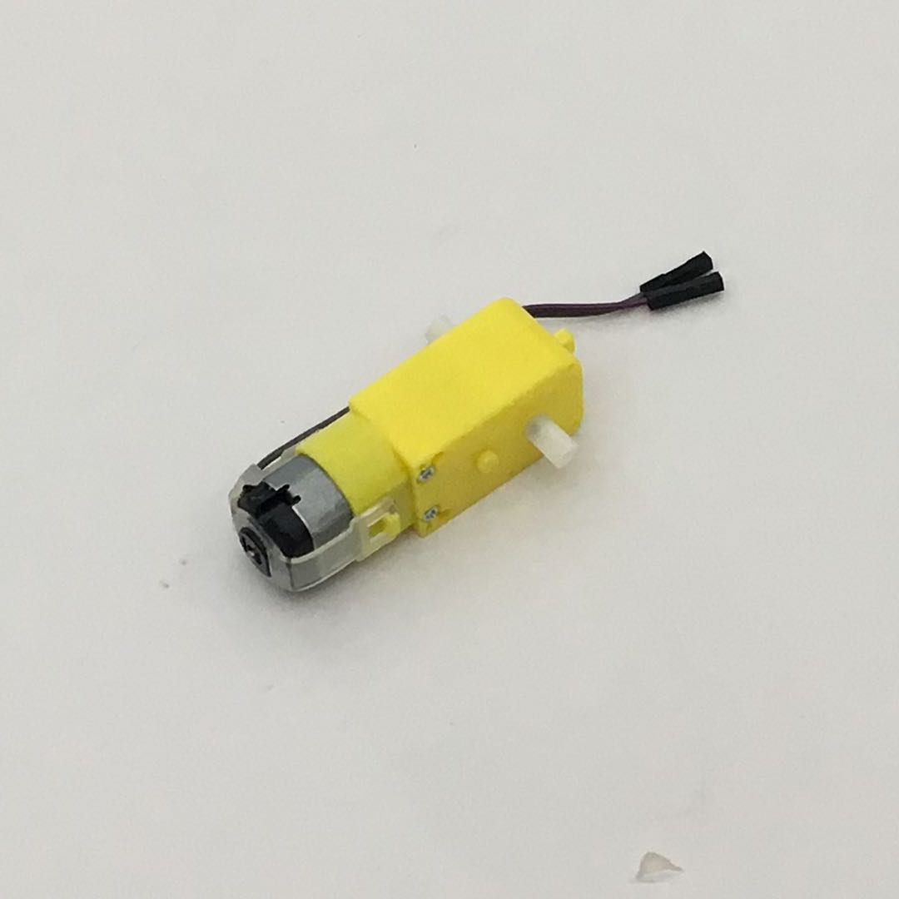
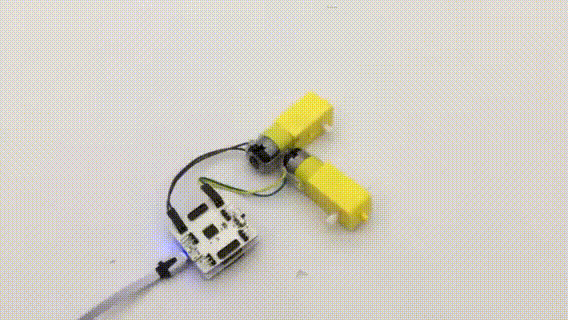

# 使用电机驱动模块

## 模块简介

电机驱动模块能够同时控制两个电机，另外设定了四个外接传感器接口，可供使用者接入第三方传感器。

## 模块主要部件

<table style="margin-top:20px;">
	<tr>
		<td width="6%" style="font-weight: bold;">No.</td>
		<td width="20%" style="font-weight: bold;">部件名称</td>
		<td style="font-weight: bold;">部件描述</td>
	</tr>
	<tr>
		<td>1.</td>
		<td>电机接口A</td>
		<td>在此处接入电机的两极</td>
	</tr>
	<tr>
		<td>2.</td>
		<td>电机接口B</td>
		<td>在此处接入电机的两极</td>
	</tr>
	<tr>
		<td>3.</td>
		<td>外接第三方 传感器接口 A3</td>
		<td>支持接入模拟信号读入的传感器，接口为 A3</td>
	</tr>
	<tr>
		<td>4.</td>
		<td>外接第三方 传感器接口 A1</td>
		<td>支持接入模拟信号读入的传感器，接口为 A1</td>
	</tr>
	<tr>
		<td>5.</td>
		<td>外接第三方 传感器接口 A4</td>
		<td>支持接入模拟信号读入的传感器，接口为 A4</td>
	</tr>
	<tr>
		<td>6.</td>
		<td>外接第三方 传感器接口 A0</td>
		<td>支持接入模拟信号读入的传感器，接口为 A0</td>
	</tr>
	<tr>
		<td>7.</td>
		<td>外接供电 USB 接口</td>
		<td>通过 MicroUSB 线来单独供电，与主控模块 USB 接口为统一类型</td>
	</tr>
	<tr>
		<td>8.</td>
		<td>供电选择切换开关</td>
		<td>有「+5V：使用主控模块供电」和「VIN：外接供电」的选择，当电机的输出电流过高，以导致主控模块可能重置时，需要拨动开关至「外接供电」处</td>
	</tr>
</table>

#### 模块接口示意

| 接口位置 | 接口描述           |
| -------- | ------------------ |
| (数字信号) D5, D9, D10    | 控制电机 B 所需要使用的接口 |
| (数字信号) D6, D4, D8    | 控制电机 A 所需要使用的接口 |
| (模拟信号) A5    | 电机驱动芯片所需要使用的接口（STBY） |

> 为了避免不同类型的电子模块在使用时有接口（Pin out）的冲突，请注意前往[此页面](/cocomod/pinout-map)查看接口示意图

---

## 电机驱动模块基础使用

### 控制电机的转速与方向

#### 所需模块与材料

1个电机驱动模块、1个主控模块及1个电机

#### 模块组装

将电机上的杜邦线连接到电机驱动模块的A接口，然后将主控模块和电机驱动模块组合在一起，并让主控模块连接好 USB 数据线至电脑：

#### 积木编程

#### 最终效果

程序上传成功后，请确保电机驱动模块上的拨动开关处于「+5V」 一侧的状态（使用主控模块供电）

---

### 控制两个电机：实现前后左右行动

#### 所需模块与材料

1个电机驱动模块、1个主控模块及2个电机

#### 模块组装

将两个电机上的杜邦线分别连接到电机驱动模块的A接口和B接口，然后将主控模块和电机驱动模块组合在一起，并让主控模块连接好 USB 数据线至电脑：

#### 积木编程

##### 注意事项

正反转间隔需大于 **400ms**，否则会引起主控模块重置

#### 最终效果

程序上传成功后，请确保电机驱动模块上的拨动开关处于+5V 一侧的状态（使用主控模块供电）

---
更新时间：2019年8月
