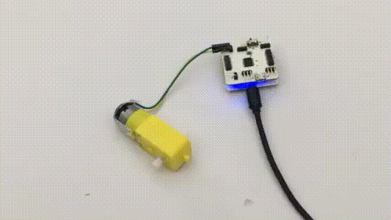

# Apply Motor Driver Module

## Introduction

Motor driver module can control two motors simultaneously. And it is equipped with four sensor pinouts, which can be used to connect to third-party sensors.

## Main Components

<table style="margin-top:20px;">
	<tr>
		<td width="6%" style="font-weight: bold;">No.</td>
		<td width="20%" style="font-weight: bold;">Name</td>
		<td style="font-weight: bold;">Description</td>
	</tr>
	<tr>
		<td>1.</td>
		<td>Motor Pinout A</td>
		<td>used for connecting to the two electrodes of the motor</td>
	</tr>
	<tr>
		<td>2.</td>
		<td>Motor Pinout B</td>
		<td>used for connecting to the two electrodes of the motor</td>
	</tr>
	<tr>
		<td>3.</td>
		<td>External third-party Sensor Pinout A3</td>
		<td>used for connecting to sensors with analog signal</td>
	</tr>
	<tr>
		<td>4.</td>
		<td>External third-party Sensor Pinout A1</td>
		<td>used for connecting to sensors with analog signal</td>
	</tr>
	<tr>
		<td>5.</td>
		<td>External third-party Sensor Pinout A4</td>
		<td>used for connecting to sensors with analog signal</td>
	</tr>
	<tr>
		<td>6.</td>
		<td>External third-party Sensor Pinout A0</td>
		<td>used for connecting to sensors with analog signal</td>
	</tr>
	<tr>
		<td>7.</td>
		<td>Power supply selector switch</td>
		<td>Two options are available: "+5V" (+5V: powered by main controller) and "VIN" (externally powered). When the motor's output current is too high, you need to put the switch to the "VIN" for the main controller may be reset.</td>
	</tr>
	<tr>
		<td>8.</td>
		<td>External power supply USB interface</td>
		<td>The interface is of the same type as that of the main controller. It is used as a single power supply for the motor via a MicroUSB cable.</td>
	</tr>
</table>

#### Pinout

| Pinout Position | Pinout Description           |
| -------- | ------------------ |
| (digital signals) D5, D9, D10    | Used for controlling Motor B |
| (digital signals) D6, D4, D8    | Used for controlling Motor A |
| (analog signal) A5    | Used by motor driver chip (STBY) |

> To avoid pinout clashes between different kinds of modules, please refer to [cocorobo-modules-pinout-map](/cocomod/pinout-map).

---

## Basic Application

### Control the Motor's Rotation Speed and Rotation Direction

#### Moudule and Components

a motor driver module, a main controller and a motor

#### Assemble Modules

Connect the Dupont jumper wire in the motor to Pinout A in the motor driver module. And put the motor driver module and the main controller together, and connect the main controller and a computer via a USB data cable:

#### Code by CocoBlockly

#### Effects

After the program is uploaded successfully, please make sure that the switch on the motor driver module is at the "+5V" (powered by the main controller).

---

### Control Two Motors to Move Back and Forth, Left and Right

#### Moudule and Components

a motor driver module, a main controller and two motors

#### Assemble Modules

Connect the Dupont jumper wires in the two motors to Pinout A and Pinout B in the motor driver module respectively. And put the motor driver module and the main controller together, and connect the main controller and a computer via a USB data cable:

#### Code by CocoBlockly

##### Important Note

The interval between the motor's positive and negative rotation should be over **400ms**. Or the main controller will be reset.

#### Effects

After the program is uploaded successfully, please make sure that the switch on the motor driver module is at the "+5V" (powered by the main controller).

---
Updated in August 2019
