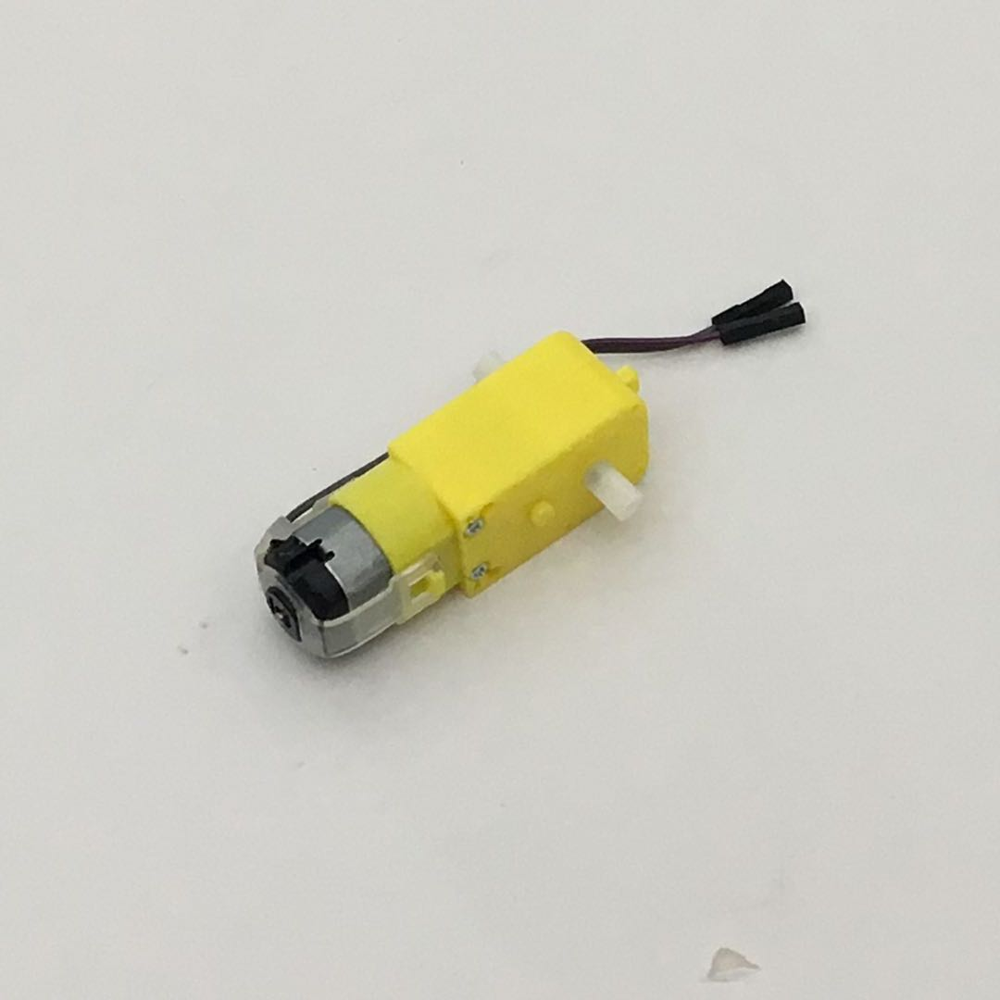
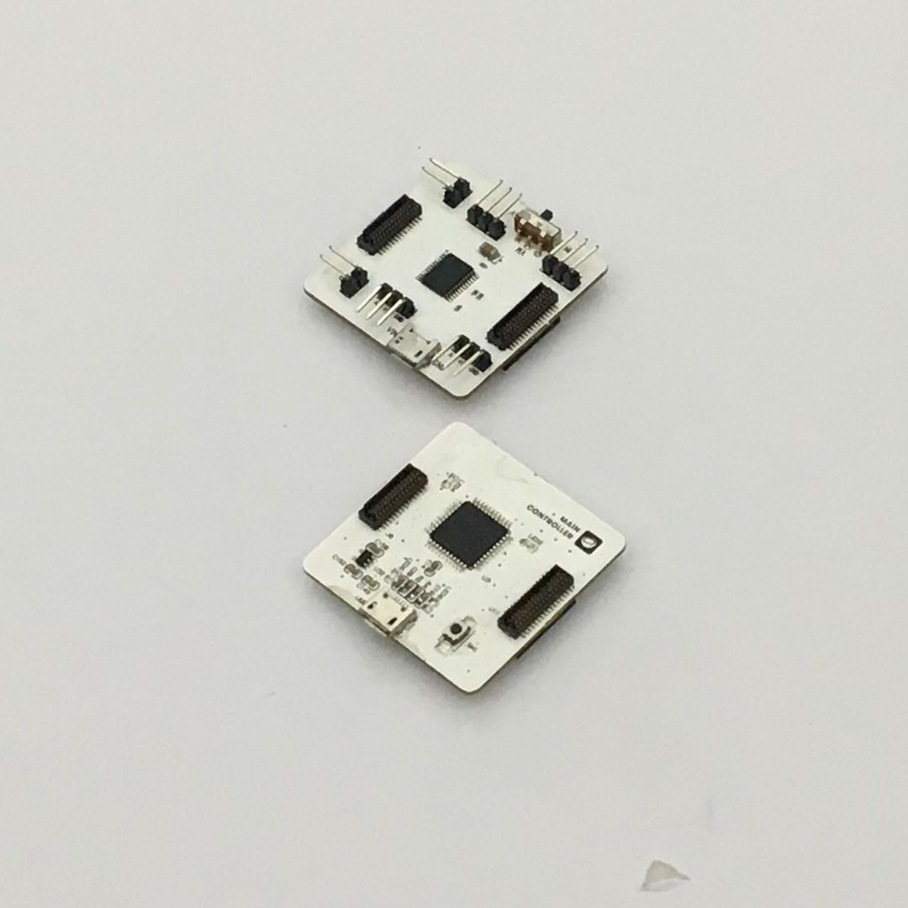
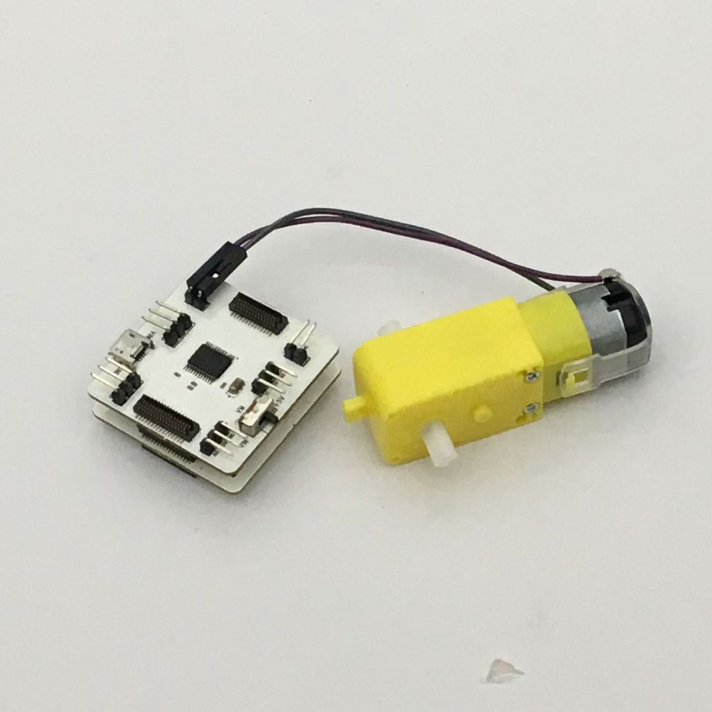
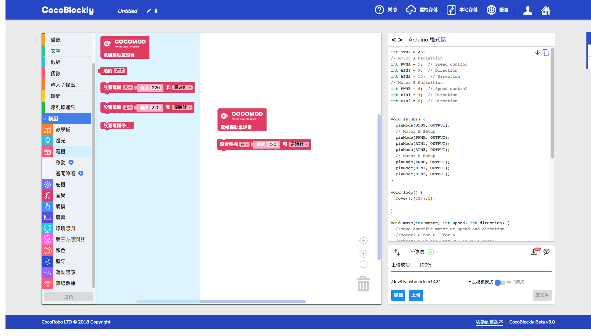
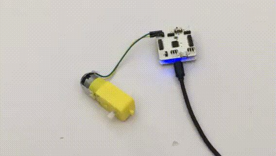
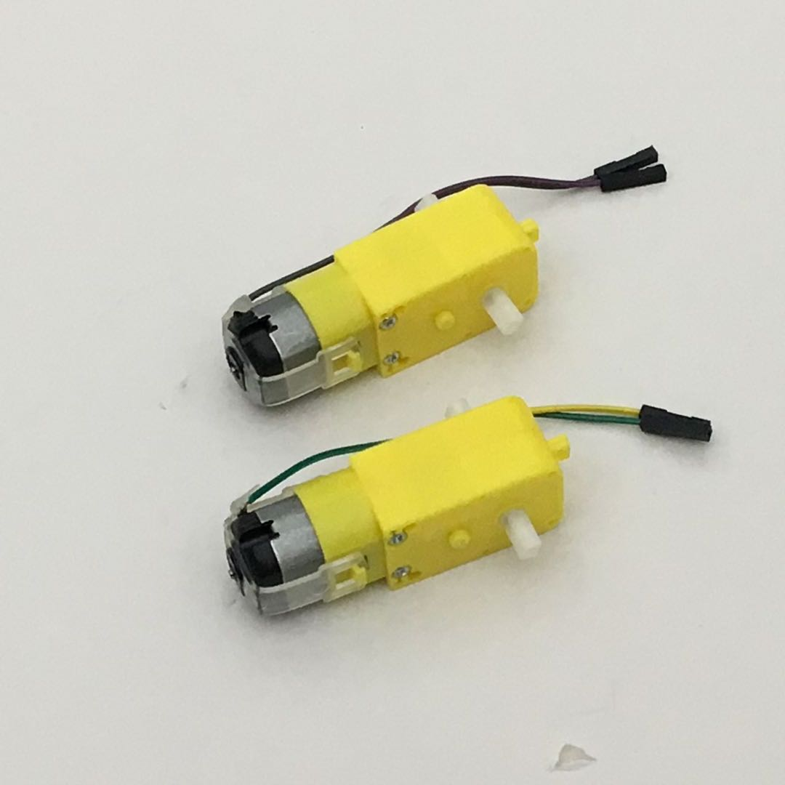
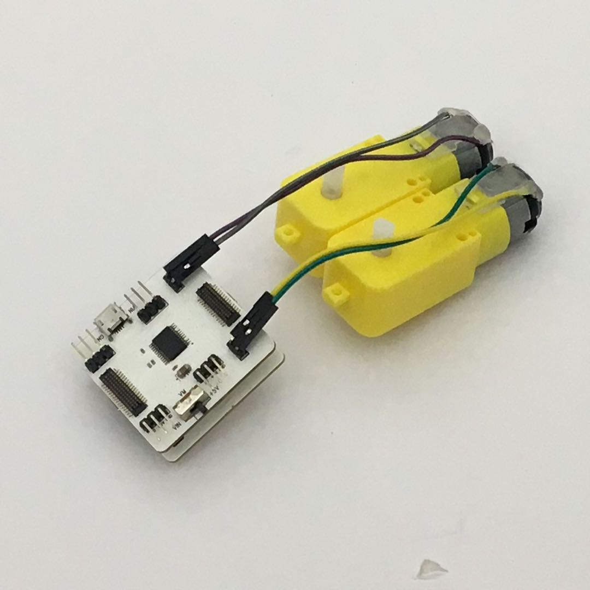
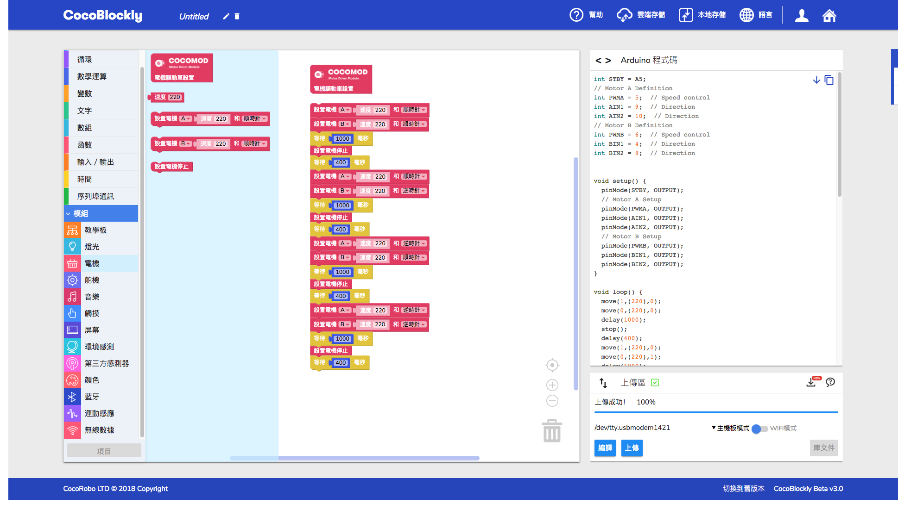
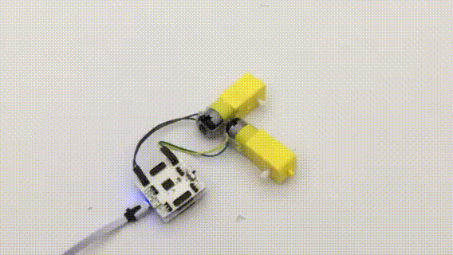

# 使用電機驅動模組

## 模組簡介

## 模組主要部件

|編號 |部件名稱 | 部件描述  |
|-  |-  |-  |
|1. |電機接口A  | |
|2. |電機接口B  | |
|3. |Analog Pin |A3, VCC, GND |
|4. |Analog Pin |A4, VCC, GND |
|5. |Analog Pin |A1, VCC, GND |
|6. |Analog Pin |A0, VCC, GND |

## 注意事項

1. 正反轉間隔需大於 **400ms** 否則會引起主控板重置

## 電機驅動模組基礎使用

### 控制電機的轉速與方向

#### 所需模組與材料

#### 組裝

#### 積木編程

#### 最終效果

---

### 控制兩個電機：實現前後左右行動

#### 所需模組與材料

#### 模組組裝

#### 積木編程

#### 最終效果

---
