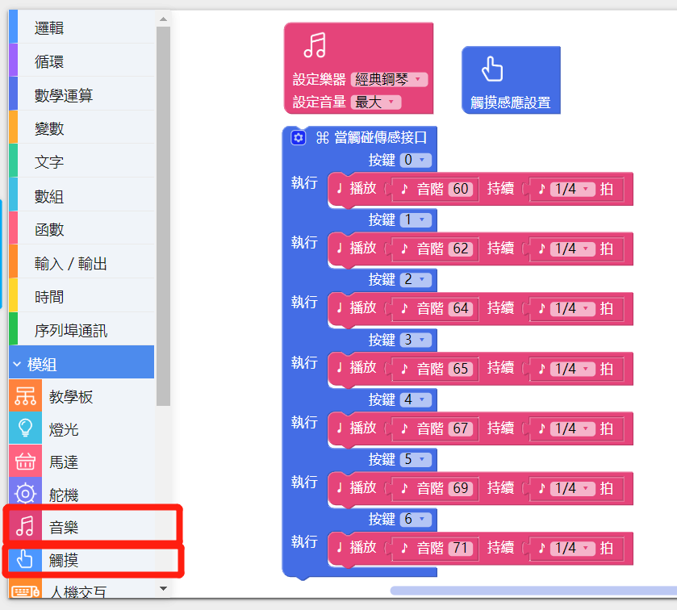

# 使用音乐模块

---

## 模块简介

音乐模块为播放乐器声音和音乐文档所用，音乐模块可以发出超过 100 种乐器的声音，模块也有1个SD卡扩展插口，支援播放 **.ogg** 或者 **.mp3** 的音乐档。目前版本的 CocoBlockly 中，我们已经支持使用者通过音乐模块，演奏出不同乐器的声音，以及播放单个音乐文件。

## 模块主要部件

<table style="margin-top:20px;">
	<tr>
		<td width="6%" style="font-weight: bold;">No.</td>
		<td width="20%" style="font-weight: bold;">部件名称</td>
		<td style="font-weight: bold;">部件描述</td>
	</tr>
	<tr>
		<td>1.</td>
		<td>音频输出接口</td>
		<td>通过音讯线将音箱和音乐模块连接起来</td>
	</tr>
	<tr>
		<td>2.</td>
		<td>音频处理芯片</td>
		<td>用于处理 MIDI 音乐、音乐文件播放的芯片</td>
	</tr>
</table>

#### 模块接口示意

| 接口位置 | 接口描述           |
| -------- | ------------------ |
| D10, A0, A1, A2, A3   | 音乐模块芯片所使用到的接口       |
| (模拟信号) A5   | 音频接口使用的接口，用户也可自己外接至扬声器模块播放音频  |

> 为了避免不同类型的电子模块在使用时有接口（Pin out）的冲突，请注意前往[此页面](/cocomod/pinout-map)查看接口示意图

---

## 模块使用说明
1. 使用前的准备：1 个音箱、1 条音讯线，使用音讯线将音箱和「音乐模块」连接在一起，确保音箱的模式为「线输入」模式。

   

2. MIDI 的全称为「音乐数字接口」，其原理是将各个乐器的音色加以编号，但这些音色并不储存于 MIDI 的档案中，相对的，为了减少档案大小，MIDI档案里面只记录了音乐的代号及一些高低音的设定，这些档案就存置于音乐模块中。

   

3. 当你聆听歌曲或音乐片段的时候，有时会不知不觉地跟著歌曲或音乐片段拍手或跺脚——这就是这首歌曲或音乐片段的拍子。拍子在曲谱中通过音符来表示，以某一音符为一拍能说明这一拍子在音乐片段中持续的时间。以形态各异的音符为一拍的拍子高高低低地组合在一起，使得歌曲或音乐片段具有轻重缓急的丰盈与流动之感，其有规律地循环往复则构成音乐的节拍。

   

---

##  音乐模块基础使用

### MIDI音乐

#### 模块组装

将主控模块和音乐模块组合在一起，并让主控模块连接好 USB 数据线至电脑：

#### 积木编程

#### 最终效果

---

### MP3音乐

#### 积木示意图
| 积木图示  | 简介  |
 |-  |-  |
|  |  a.MP3初始化积木: 可设置初始音量高低 |
| | a.音乐播放积木: 播放指定名称音乐  |
| | a.音乐播放设置积木: 可设置音乐播放暂停、启动、终止、上一首、下一首  |

#### 模块组装

音乐模块支持MP3音乐播放功能，须配合TF卡使用，歌曲存放在TF卡中，将TF卡插入到SD卡扩展插口，然后将主控模块和音乐模块组合在一起，并让主控模块连接好 USB 数据线至电脑：

	
	

#### 积木编程

#### 最终效果

播放TF卡内命名为E1.mp3的歌曲

---

##  音乐模块进阶使用

### 触摸电子琴

#### 模块组装

将主控模块、音乐模块和触摸传感模块组合在一起，并让主控模块连接好 USB 数据线至电脑：

#### 积木编程

##### 提示
使用触摸传感模块时，为「当触碰传感接口」积木添加按键接口可参考下图提示：

#### 最终效果

程序上传成功后，触摸触摸传感模块上的针脚，来发出不同的音阶；

---

### 制作 MP3 Player

#### 模块组装
将TF卡插入音乐模块对应位置上，然后将主控模块、音乐模块和触摸传感模块组合在一起，并让主控模块连接好 USB 数据线至电脑：

#### 积木编程

触摸传感模块和音乐模块结合而成的简易MP3播放器,积木程序:

#### 最终效果

不同按键实现三个歌曲的切换和歌曲启动暂停功能

---
更新时间：2019年8月
