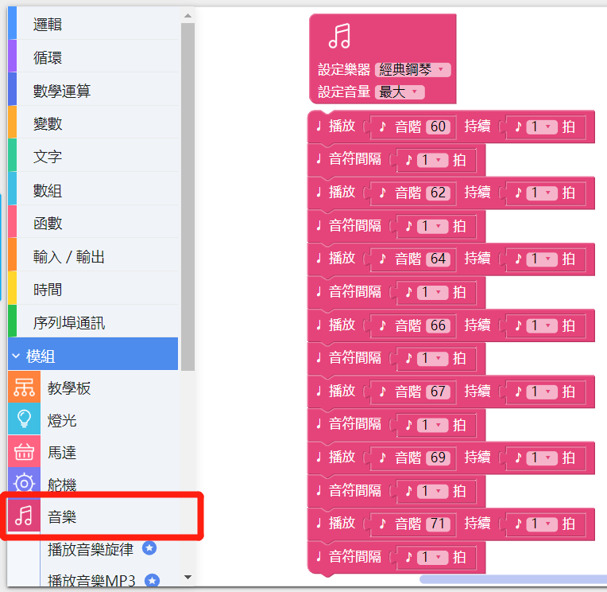
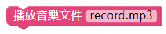

# 使用音樂模組

---

## 模組簡介

音樂模組為播放樂器聲音和音樂文檔所用，音樂模組可以發出超過 100 種樂器的聲音，模組也有1個SD卡擴展插口，支援播放 **.ogg** 或者 **.mp3** 的音樂檔。目前版本的 CocoBlockly 中，我們已經支持使用者通過音樂模組，演奏出不同樂器的聲音，以及播放單個音樂文件。

## 模組主要部件

<table style="margin-top:20px;">
	<tr>
		<td width="6%" style="font-weight: bold;">No.</td>
		<td width="20%" style="font-weight: bold;">部件名稱</td>
		<td style="font-weight: bold;">部件描述</td>
	</tr>
	<tr>
		<td>1.</td>
		<td>音頻輸出接口</td>
		<td>通過音訊線將音箱和音樂模組連接起來</td>
	</tr>
	<tr>
		<td>2.</td>
		<td>音頻處理芯片</td>
		<td>用於處理 MIDI 音樂、音樂文件播放的芯片</td>
	</tr>
</table>

#### 模組接口示意

| 接口位置 | 接口描述           |
| -------- | ------------------ |
| D10, A0, A1, A2, A3   | 音樂模組芯片所使用到的接口       |
| (類比信號) A5   | 音頻接口使用的接口，用户也可自己外接至揚聲器模組播放音頻  |

> 為了避免不同類型的電子模組在使用時有接口（Pin out）的衝突，請注意前往[此頁面](/cocomod/pinout-map)查看接口示意圖

---

## 模組使用説明
1. 使用前的準備：1 個音箱、1 條音訊線，使用音訊線將音箱和「音樂模組」連接在一起，確保音箱的模式為「線輸入」模式。

   

2. MIDI 的全稱為「音樂數位接口」，其原理是將各個樂器的音色加以編號，但這些音色並不儲存於 MIDI 的檔案中，相對的，為了減少檔案大小，MIDI檔案裏面只記錄了音樂的代號及一些高低音的設定，這些檔案就存置於音樂模組中。

   

3. 當你聆聽歌曲或音樂片段的時候，有時會不知不覺地跟著歌曲或音樂片段拍手或跺腳——這就是這首歌曲或音樂片段的拍子。拍子在曲譜中透過音符來表示，以某一音符為一拍能説明這一拍子在音樂片段中持續的時間。以形態各異的音符為一拍的拍子高高低低地組合在一起，使得歌曲或音樂片段具有輕重緩急的豐盈與流動之感，其有規律地循環往復則構成音樂的節拍。

   

---

##  音樂模組基礎使用

### MIDI音樂

#### 模組組裝

將主機板模組和音樂模組組合在一起，並讓主機板模組連接好 USB 數據線至電腦：

#### 積木編程

#### 最終效果

---

### MP3音樂

#### 積木示意圖
| 積木圖示  | 簡介  |
 |-  |-  |
|  |  a.MP3初始化積木: 可設置初始音量高低 |
| | a.音樂播放積木: 播放指定名稱音樂  |
| | a.音樂播放設置積木: 可設置音樂播放暫停、啟動、終止、上一首、下一首  |

#### 模組組裝

音樂模組支持MP3音樂播放功能，須配合TF卡使用，歌曲存放在TF卡中，將TF卡插入到SD卡擴展插口，然後將主機板模組和音樂模組組合在一起，並讓主機板模組連接好 USB 數據線至電腦：

	
	

#### 積木編程

#### 最終效果

播放TF卡內命名為E1.mp3的歌曲

---

##  音樂模組進階使用

### 觸摸電子琴

#### 模組組裝

將主機板模組、音樂模組和觸摸感應模組組合在一起，並讓主機板模組連接好 USB 數據線至電腦：

#### 積木編程

##### 提示
使用觸摸感應模塊時，為「當觸碰傳感接口」積木添加按鍵接口可參考下圖提示：

#### 最終效果

程式上傳成功後，觸摸觸摸感應模組上的針腳，來發出不同的音階；

---

### 製作 MP3 Player

#### 模組組裝
將TF卡插入音樂模組對應位置上，然後將主機板模組、音樂模組和觸摸感應模組組合在一起，並讓主機板模組連接好 USB 數據線至電腦：

#### 積木編程

觸摸感應模組和音樂模組結合而成的簡易MP3播放器,積木程式:

#### 最終效果

不同按鍵實現三個歌曲的切換和歌曲啟動暫停功能

---
更新時間：2019年8月
