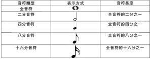

# Apply Music Module

---

## Introduction

Music module is used for playing the sounds of musical instruments and music files. The module can emit the sounds of more than 100 musical instruments. It has a SD card socket and supports playing music of ".ogg" format or ".mp3" format. In the current version of CocoBlockly, users can play the sounds of various musical instruments and music files through music module.

## Main Components

<table style="margin-top:20px;">
	<tr>
		<td width="6%" style="font-weight: bold;">No.</td>
		<td width="20%" style="font-weight: bold;">Name</td>
		<td style="font-weight: bold;">Description</td>
	</tr>
	<tr>
		<td>1.</td>
		<td>Audio Output Interface</td>
		<td>Connect the speaker and the music module via an audio line.</td>
	</tr>
	<tr>
		<td>2.</td>
		<td>Audio Processing Chip</td>
		<td>Used for dealing with MIDI music and playing music files</td>
	</tr>
</table>

#### Pinout

| Pinout Position | Pinout Description           |
| -------- | ------------------ |
| D10, A0, A1, A2, A3   | used by music module       |
| (analog signal) A5   | an audio pinout, through which a speaker or an earphone can be connected to the music module  |

> To avoid pinout clashes between different kinds of modules, please refer to [cocorobo-modules-pinout-map](/cocomod/pinout-map).

---

## Instructions
1. Preparation: a speaker and an audio line. The speaker is to be connected with the "music module" via the line. So it has to be made sure that the speaker is compatible with the line.

   

2. MIDI, short for Musical Instrument Digital Interface, numbers the tones of various musical instruments. But the tones are not stored in MIDI files. Instead, to reduce the size of the files, only the numbers and the pitch settings are stored in them. The files are in the music module.

   

3. When listening to a piece of music, you may sometimes clap your hands or stamp your foot with the music, which manifests the beats of the music. The beats are made up of notes. In a piece of music, different notes (be it high or low) repeat regularly forming the beats.

   

---

##  Basic Application

### MIDI Music

#### Assemble Modules

Put the music module and the main controller together, and connect the main controller and a computer via a USB data cable.

#### Code by CocoBlockly

#### Effects

---

### MP3 Music

#### Blocks
| Block Image  | Description  |
 |-  |-  |
|  |  a. MP3 player initialization block: set the initial volume |
| | a. music-playing block: play a piece of music with a specific name  |
| | a. music player setting block: set "pause", "play", "stop", "previous" or "next" for the player  |

#### Assemble Modules

Music module supports playing music of MP3 format. It has to be used in combination with TF card in which the music is stored. Insert the TF card into the SD card socket, put the music module and the main controller together, and connect the main controller and a computer via a USB data cable:

	
	

#### Code by CocoBlockly

#### Effects

Play the piece of music named E1.mp3 in the TF card:

---

##  Advanced Application

### Touch Electronic Oragn

#### Assemble Modules

Put the music module, touch analysing module and the main controller together, and connect the main controller and a computer via a USB data cable.

#### Code by CocoBlockly

##### Tip
When adding keys to the “When Touch Pins” block in a touch analyzing module, you can refer to the picture below:

#### Effects

After the program is uploaded successfully, touch the pins on the touch analyzing module to produce different scales:

---

### Make an MP3 Player

#### Assemble Modules
Insert TF card into the music module, then put the music module, the touch analyzing module and the main controller together, and connect the main controller and a computer via a USB data cable.

#### Code by CocoBlockly

Program for making a MP3 player by combining touch analyzing module and music module:

#### Effects

You can switch among the three pieces of music and realize the function of "play" and "stop" by pressing different buttons:

---
Updated in August 2019
