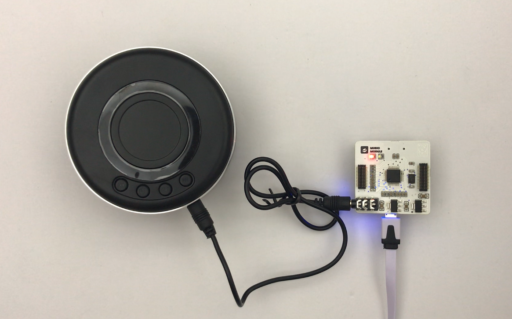

# 使用音樂模組

---

## 模組簡介
音樂模組為播放樂器聲音和音樂文檔所用，音樂模組可以發出超過 100 種樂器的聲音，模組也有1個SD卡擴展插口，支援播放 **.ogg** 或者 **.mp3** 的音樂檔。目前版本的 CocoBlockly 中，我們已經支持使用者通過音樂模組，演奏出不同樂器的聲音。
## 模組主要部件

| 編號 | 部件名稱     | 部件描述                           |
| ---- | ------------ | ---------------------------------- |
| 1.   | 音頻輸出接口 | 通過音訊線將音箱和音樂模組連接起來 |

## 模組使用說明
1. 使用前的準備：1 個音箱、1 條音訊線，使用音訊線將音箱和「音樂模組」連接在一起，確保音箱的模式為「線輸入」模式。
   
2. MIDI 的全稱為「音樂數位介口」，其原理是將各個樂器的音色加以編號，但這些音色並不儲存於 MIDI 的檔案中，相對的，為了減少檔案大小，MIDI檔案裡面只記錄了音樂的代號及一些高低音的設定，這些檔案就存置於音樂模組中。
   
3. 在音樂中，節拍（metre，美國英語meter；實際應用俗稱time）指小節或拍子等有規律反覆出現的模式和權重分佈。 節拍與節奏不同，其開端不一定會發聲，但會被聽眾內心期待到。
   

---

##  音樂模組基礎使用
### MIDI音樂
#### 模組組裝

#### 積木編程

#### 最終效果

---

### MP3音樂
#### 模組組裝
It's comming soon.
#### 積木編程
It's comming soon.
#### 最終效果
It's comming soon.

---

##  音樂模組進階使用
### 觸摸電子琴
#### 模組組裝

#### 積木編程

#### 最終效果

---

### 製作 MP3 Player
#### 模組組裝
It's comming soon.
#### 積木編程
It's comming soon.
#### 最終效果
It's comming soon.
