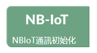
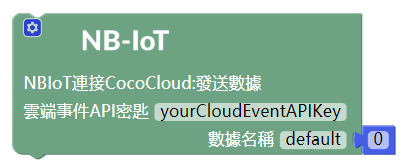
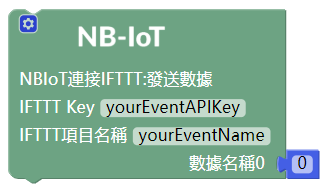

# 使用 NB-IoT 通訊模組

---

## 模組簡介

NBIoT 通訊模組可以通過移動互聯網訪問 Coco Cloud 平臺或 IFTTT 平臺，實現向平臺進行無綫數據傳輸，因此用戶也可以利用此模組搭建智慧家居小應用。

## 模組主要部件

<table style="margin-top:20px;">
	<tr>
		<td width="6%" style="font-weight: bold;">No.</td>
		<td width="20%" style="font-weight: bold;">部件名稱</td>
		<td style="font-weight: bold;">部件描述</td>
	</tr>
	<tr>
		<td>1.</td>
		<td>天綫</td>
		<td>延伸 NBIoT 通訊模組訊號的擴展部件，建議將天綫與模組連接后再使用</td>
	</tr>
	<tr>
		<td>2.</td>
		<td>重置按鍵</td>
		<td>點擊重置按鍵後將會讓 NBIoT 通訊模組重啓</td>
	</tr>
	<tr>
		<td>3.</td>
		<td>Power on 按鍵</td>
		<td>通電以後，按住2秒才能讓模組開機</td>
	</tr>
	<tr>
		<td>4.</td>
		<td>網絡指示燈</td>
		<td>儅 NBIoT 通訊模組通電以後，若模組未聯網成功時，該指示燈閃爍較快，若模組聯網成功時，指示燈閃爍變慢</td>
	</tr>
</table>

#### 模組接口示意

| 接口位置 | 接口描述           |
| -------- | ------------------ |
| (數位訊號) D0: 主機板 Rx    | Tx:  NBIoT 通訊模組端 (UART 通訊)       |
| (數位訊號) D1: 主機板 Tx   | Rx:  NBIoT 通訊模組端 (UART 通訊) |

> 爲了避免不同類型的電子模組在使用時有接口（Pin out）的衝突，請注意前往[此頁面](/cocomod/pinout-map)查看接口示意圖

---

## 模組使用說明

1. 切勿使用超過 5V/2A 的電源供電
2. NBIoT 擁有一個特性，叫休眠模式，也稱作低功耗模式，若連續十秒鐘未使用該模組的情況下，模組會自動休眠，直到下一次發起請求時，模組便會重新開機，這種模式的作用是爲了省電

### NBIoT 積木示意圖

<table width="800">
  <tr>
    <th>積木圖示</th>
    <th>簡介</th>
  </tr>
  <tr  >
    <td>  </td>
    <td> NBIoT 通訊模組初始化積木：初始化設置 NBIoT 通訊模組，</td>
  </tr>
	<tr>
	<td>  </td>
	<td>主機板模組控制 NB-IoT 通訊模組必須使用的積木</td>
</tr>
<tr>
	<td>  </td>
	<td> 連接判斷積木：判斷模組與移動互聯網是否連接成功 </td>
</tr>
<tr>
	<td>  </td>
	<td> 獲取 IP 積木： 用於獲取 NB-IoT 通訊模組的網絡 IP 地址，比如：10.10.10.10 </td>
</tr>
  <tr>
    <td>  </td>
    <td> NBIoT 與 Coco Cloud 數據傳輸積木： 向 Coco Cloud 發送數據，需要設置項目 API-key 以及發送數據的屬性名</td>
  </tr>
  <tr>
    <td>  </td>
    <td> NBIoT 與 IFTTT 數據傳輸積木：向 IFTTT 項目發送數據，需從 IFTTT 項目獲取項目的名稱及對應的 API-Key </td>
  </tr>
</table>

為 NBIoT 與 Coco Cloud 數據傳輸積木（左圖）以及 NBIoT 與 IFTTT 數據傳輸積木（右圖）增添發送數據的方法如下：

***

## NBIoT 通訊模組使用

### 組裝 NBIoT 通訊模組

拿出 NBIoT 通訊模組和天綫

組裝 NBIoT 通訊模組

將 sim 卡放入 NBIoT 通訊模組的卡槽中

### 与主機板模组进行數據通訊

#### 模組組裝

將 NBIoT 通訊模組和主機板模組拼接在一起

---

### 序列埠顯示網絡 IP

#### 模組組裝

將 NBIoT 通訊模組和主機板模組拼接在一起，並用 USB 綫連接好主機板模組至電腦

#### 積木編程

**注意：**給 NBIoT 通訊模組通電后需按住 power on 按鈕2秒才能讓模組開機，模組開機后會在序列埠監控視窗打印開機提示

##### 最終結果

上傳程式后打開序列埠監控視窗並連接主機板模組，可以看到此時正在打印 NBIoT 通訊模組連接移動互聯網后的網絡IP

***

### 雲端呈現環境模組數據

使用環境模組獲取環境中的聲音、光照、溫度、濕度的數據，NBIoT 通訊模組通過移動互聯網訪問 Coco Cloud 平臺，並將環境模組獲取的數據發送到平臺

#### 模組組裝

將 NBIoT 通訊模組和主機板模組、正反轉接模組、環境模組拼接在一起，並用 USB 綫連接好主機板模組至電腦

> 注意：由於模組的公母接口的原因，連接環境模組時要使用正反轉接模組，保證環境模組位於最外側，這樣讀取的光照數值才是環境中的數值

#### Coco Cloud 事件創建

在 Coco Cloud 雲端平臺上為環境模組收集的數據創建一個事件「Environment」

#### 積木編程

**注意：**給 NBIoT 通訊模組通電后需按住 power on 按鈕2秒才能讓模組開機，模組開機后會在序列埠監控視窗打印開機提示

##### 最終結果

上傳程式后打開序列埠監控視窗並連接主機板模組，在序列埠中可以看到 NBIoT 通訊模組目前的狀態

查看 Coco Cloud 平臺上「Environment」事件的數據

***

更新時間：2019年8月
