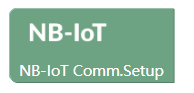
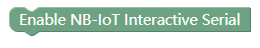
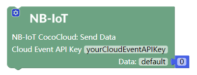
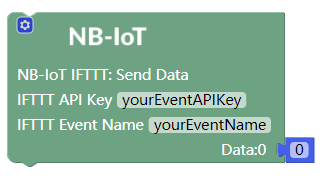

# Apply NB-IoT Communication Module

---

## Introduction

NB-IoT communication module can visit Coco Cloud platform or IFTTT platform via mobile Internet and transmit data to these platforms by wireless communication. Therefore, you can use it to build various apps, such as "smart home".

## Main Components

<table style="margin-top:20px;">
	<tr>
		<td width="6%" style="font-weight: bold;">No.</td>
		<td width="20%" style="font-weight: bold;">Name</td>
		<td style="font-weight: bold;">Description</td>
	</tr>
	<tr>
		<td>1.</td>
		<td>Antenna</td>
		<td>Antenna is an extension part of the module; it is better to connect it to the NB-IoT communication module before using the module.</td>
	</tr>
	<tr>
		<td>2.</td>
		<td>resetting button</td>
		<td>Press the button to reset the NB-IoT communication module.</td>
	</tr>
	<tr>
		<td>3.</td>
		<td>"Power on" button</td>
		<td>After electrifying the module, you can start the module by pressing the button for no less than 2 seconds.</td>
	</tr>
	<tr>
		<td>4.</td>
		<td>Internet indicator</td>
		<td>After electrifying the module, the indicator blinks at a low frequency if the module is connected to the Internet and at a high frequency if not.</td>
	</tr>
</table>

#### Pinout

| Pinout Position | Pinout Description        |
| -------- | ------------------ |
| (digital signals) D0: main controller Rx    | Tx:  NB-IoT communication module terminal (UART communication)       |
| (digital signals) D1: main controller Tx   | Rx:  NB-IoT communication module terminal (UART communication) |

> To avoid pinout clashes between different kinds of modules, please refer to [cocorobo-modules-pinout-map](/cocomod/pinout-map).

---

## Instructions

1. Do not use any power supply greater than 5V/2A.
2. The module has a sleep mode or energy-saving mode. The module would enter the sleep mode automatically if it is not used for more than 10 minutes. And the module will restart when a request is sent to it.

### NB-IoT Blocks

<table width="800">
  <tr>
    <th>Pictures of the Blocks</th>
    <th>Introduction</th>
  </tr>
  <tr  >
    <td>  </td>
    <td> NB-IoT communication module initialization block</td>
  </tr>
	<tr>
	<td>  </td>
	<td>Block that is indispensable for main controller to control the NB-IoT communication module</td>
</tr>
<tr>
	<td>  </td>
	<td> Connection confirmation block: see if the module is successfully connected to mobile Internet </td>
</tr>
<tr>
	<td>  </td>
	<td> GET IP block: used to get the IP address of the NB-IoT communication module such as 10.10.10.10 </td>
</tr>
  <tr>
    <td>  </td>
    <td> Block for transmitting data from NB-IoT communication module to Coco Cloud: The API-key of the project and the attribute name of the data need to be set.</td>
  </tr>
  <tr>
    <td>  </td>
    <td> Block for transmitting data from NB-IoT communication module to IFTTT: The IFTTT project name and its corresponding API-Key should be obtained from the IFTTT project. </td>
  </tr>
</table>

Please refer to the following pictures to add data when transmitting data from NB-IoT communication module to Coco Cloud (the first one) and from NB-IoT communication module to IFTTT (the second one):

***

## Apply NB-IoT Communication Module

### Assemble NB-IoT Communication Module

The NB-IoT Communication Module and the Antenna

Assemble NB-IoT Communication Module

Put the sim card into the slot of the NB-IoT communication module

### Data Communication between the module and the main controller

#### Assemble Modules

Put the NB-IoT communication module and the main controller together.

---

### Show Internet IP on Serial Monitor Window

#### Assemble Modules

Put the NB-IoT communication module and the main controller together, and connect the main controller to a computer via a USB data cable.

#### Code by CocoBlockly

**Note:** To start the NB-IoT communication module, you need to press the “power on” button for at least 2 seconds after it is electrified. And the tip of starting up can be printed on the serial monitor window after the module is started.

##### Effects

After the program is uploaded successfully, you can see on the serial monitor window that the Internet IP of the NB-IoT communication module is being printed.

***

### Show the Data of the Environmental Sensing Module on the Cloud

Use environmental sensing module to get the surroundings’ data of sound, light, temperature and humidity. The NB-IoT communication module visits the Coco Cloud platform via mobile Internet and transmits the data to the platform.

#### Assemble Modules

Put NB-IoT communication module, reverse adapting module, environmental sensing module and the main controller together, and connect the main controller to a computer via a USB data cable.

> Note: Due to the clash between the male and female interfaces, reverse adapting module is needed when connecting the environmental sensing module. This puts the environmental sensing module in the outside thus ensuring the light data is that of the surroundings.

#### Create Coco Cloud Event

Create an event “Environment” for the data collected by the environmental sensing module in the Coco Cloud platform.

#### Code by CocoBlockly

**Note:** To start the NB-IoT communication module, you need to press the “power on” button for at least 2 seconds after it is electrified. And the tip of starting up can be printed on the serial monitor window after the module is started.

##### Effects

After the program is uploaded successfully, you can see the current state of the NB-IoT communication module on the serial monitor window.

Check the data of the event “Environment” in the Coco Cloud platform.

***

Updated in August 2019
