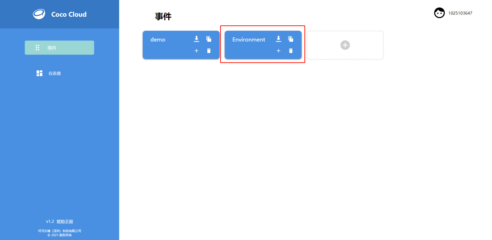

# 使用 NB-IoT 通信模块

---

## 模块简介

NB-IoT 通信模块可以通过移动互联网访问 Coco Cloud 平台或 IFTTT 平台，实现向平台进行无线数据传输，因此用户也可以利用此模块搭建智能家居小应用。

## 模块主要部件

<table style="margin-top:20px;">
	<tr>
		<td width="6%" style="font-weight: bold;">No.</td>
		<td width="20%" style="font-weight: bold;">部件名称</td>
		<td style="font-weight: bold;">部件描述</td>
	</tr>
	<tr>
		<td>1.</td>
		<td>天线</td>
		<td>延伸 NB-IoT 通信模块信号的扩展部件，建议将天线与模块连接后再使用</td>
	</tr>
	<tr>
		<td>2.</td>
		<td>重置按键</td>
		<td>点击重置按键后将会让 NB-IoT 通信模块重启</td>
	</tr>
	<tr>
		<td>3.</td>
		<td>Power on 按键</td>
		<td>通电以后，按住2秒才能让模块开机</td>
	</tr>
	<tr>
		<td>4.</td>
		<td>网络指示灯</td>
		<td>当 NB-IoT 通信模块通电以后，若模块未联网成功时，该指示灯闪烁较快，若模块联网成功时，指示灯闪烁变慢</td>
	</tr>
</table>

#### 模块接口示意

| 接口位置 | 接口描述           |
| -------- | ------------------ |
| (数字信号) D0: 主控 Rx    | Tx:  NB-IoT 通信模块端 (UART 通信)       |
| (数字信号) D1: 主控 Tx   | Rx:  NB-IoT 通信模块端 (UART 通信) |

> 为了避免不同类型的电子模块在使用时有接口（Pin out）的冲突，请注意前往[此页面](/cocomod/pinout-map)查看接口示意图

---

## 模块使用说明

1. 切勿使用超过 5V/2A 的电源供电
2. NB-IoT 拥有一个特性，叫休眠模式，也称作低功耗模式，若连续十秒钟未使用该模块的情况下，模块会自动休眠，直到下一次发起请求时，模块便会重新开机，这种模式的作用是为了省电

### NB-IoT 积木示意图

<table width="800">
  <tr>
    <th>积木图示</th>
    <th>简介</th>
  </tr>
  <tr  >
    <td>  </td>
    <td> NB-IoT 通信模块初始化积木：初始化设置 NB-IoT 通信模块，</td>
  </tr>
	<tr>
	<td>  </td>
	<td>主控模块控制 NB-IoT 通信模块必须使用的积木</td>
</tr>
<tr>
	<td>  </td>
	<td> 连接判断积木：判断模块与移动互联网是否连接成功 </td>
</tr>
<tr>
	<td>  </td>
	<td> 获取 IP 积木： 用于获取 NB-IoT 通信模块的网络 IP 地址，比如：10.10.10.10 </td>
</tr>
  <tr>
    <td>  </td>
    <td> NB-IoT 与 Coco Cloud 数据传输积木： 向 Coco Cloud 发送数据，需要设置项目 API-key 以及发送数据的属性名</td>
  </tr>
  <tr>
    <td>  </td>
    <td> NB-IoT 与 IFTTT 数据传输积木：向 IFTTT 项目发送数据，需从 IFTTT 项目获取项目的名称及对应的 API-Key </td>
  </tr>
</table>

为 NB-IoT 与 Coco Cloud 数据传输积木（左图）以及 NB-IoT 与 IFTTT 数据传输积木（右图）增添发送数据的方法如下：

***

## NB-IoT 通信模块使用

### 组装 NB-IoT 通信模块

拿出 NB-IoT 通信模块和天线

组装 NB-IoT 通信模块

将 sim 卡放入 NB-IoT 通信模块的卡槽中

### 与主控模块进行数据通信

#### 模块组装

将 NB-IoT 通信模块和主控模块拼接在一起

---

### 串口显示网络 IP

#### 模块组装

将 NB-IoT 通信模块和主控模块拼接在一起，并用 USB 线连接好主控模块至电脑

#### 积木编程

**注意：**给 NB-IoT 通信模块通电后需按住 power on 按钮2秒才能让模块开机，模块开机后会在串口监控视窗打印开机提示

##### 最终结果

上传程序后打开串口监控视窗并连接主控模块，可以看到此时正在打印 NB-IoT 通信模块连接移动互联网后的网络IP

***

### 云端呈现环境模块数据

使用环境模块获取环境中的声音、光照、温度、湿度的数据，NB-IoT 通信模块通过移动互联网访问 Coco Cloud 平台，并将环境模块获取的数据发送到平台

#### 模块组装

将 NB-IoT 通信模块和主控模块、正反转接模块、环境模块拼接在一起，并用 USB 线连接好主控模块至电脑

> 注意：由于模块的公母接口的原因，连接环境模块时要使用正反转接模块，保证环境模块位于最外侧，这样读取的光照数值才是环境中的数值

#### Coco Cloud 事件创建

在 Coco Cloud 云端平台上为环境模块收集的数据创建一个事件「Environment」

#### 积木编程

**注意：**给 NB-IoT 通信模块通电后需按住 power on 按钮2秒才能让模块开机，模块开机后会在串口监控视窗打印开机提示

##### 最终结果

上传程序后打开串口监控视窗并连接主控模块，在串口中可以看到 NB-IoT 通信模块目前的状态

查看 Coco Cloud 平台上「Environment」事件的数据

***

更新时间：2019年8月
