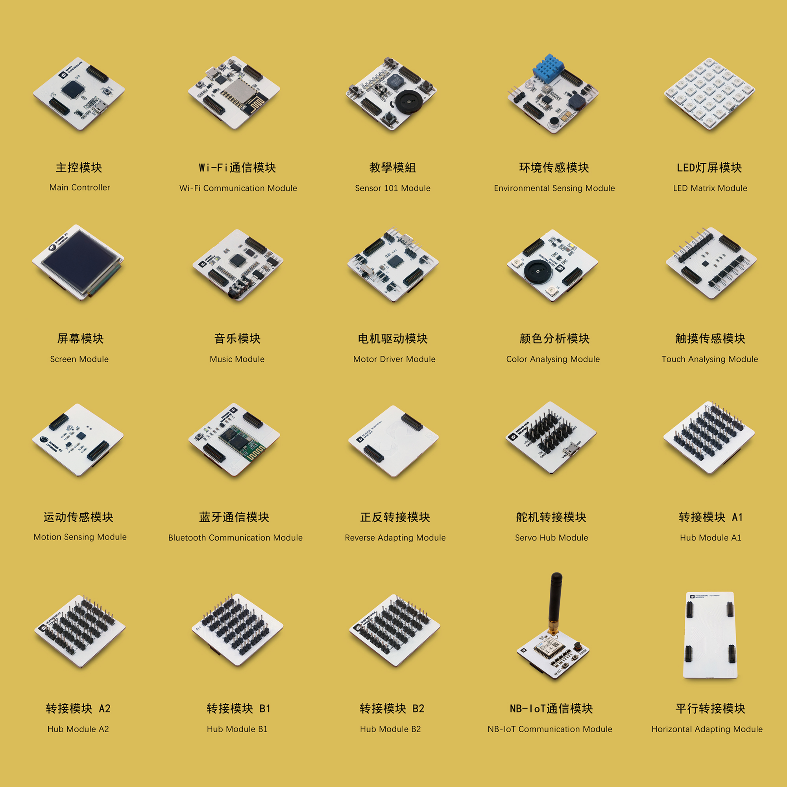
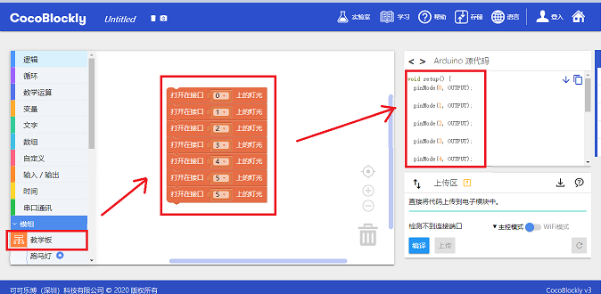

# CocoMod 电子模块

---

CocoMod 是一系列由 CocoRobo 研发的「即插即用式」的电子模块，目前已研发 20 余款，控制类模块是 1 种，输入类模块 6 种，输出类模块 6 种，转接模块 4 种（转接模块 A／转接模块 B／平行转接模块／正反转接模块），通信模块 3 种（蓝牙通信模块、WiFi 通信模块、NB-IoT 通信模块 )。CocoMod 可以让你的作品能够拥有传感、控制真实世界的能力，只要接上各种输入/输出模块或元件， 例如 LED 灯、电机、开关、温湿度传感器、显示装置，或是接上无线通信模块，就可以做出各式各样的小发明。

用户利用这些模块，结合 3D 打印和编程可以轻松地完成各类项目，其扩展性较市面上其他多数 Arduino 套件更适合入门者学习电子及编程知识。同时，CocoRobo鼓励用户通过配套课程来更好、更快地学习使用 CocoMod 电子模块

### 接口使用

模块间会有接口使用冲突。无论是单独使用一个模块还是组合使用，每个接口都只能被使用一次，若两个模块同时使用时需要占用的接口相同，那么这两个模块就不能同时使用，在选择模块组合之前请先查看两个模块之间是否会产生接口冲突。

例如：教学模块不能直接和环境传感模块、运动传感模块、触摸模块以及音乐模块拼接在一起使用，能够和电机驱动模块及屏幕模块组合使用，但只有部分的按键和输出部件能够配合这两个模块使用，其中与电机驱动模块组合的时候，按键只有 D12、D13 以及 A3 能够使用，输出部件只有 D0 ~ D3 以及 D11 能够使用，而与屏幕模块组合的时候，除了 D5、D6、D8 外的按键和输出部件都可以使用。

在CocoBlockly平台上拖拽出一个积木后，可以在「积木对应原始码参考区」看到这个模块当前所占用的接口，每使用多一个接口，就会同步更新在「积木对应原始码参考区」中

**请注意参考下表的接口示意，再进行程序编写：**

高解析度的版本可从[点击此处](http://cocorobo.cn/downloads/cocorobo-modules-pinout-map_v2.pdf)查看。

接口使用冲突可以通过转接接口的方法来解决，具体内容请前往[此页面](/cocomod/pinout-map)查看

---
更新时间：2019年8月
