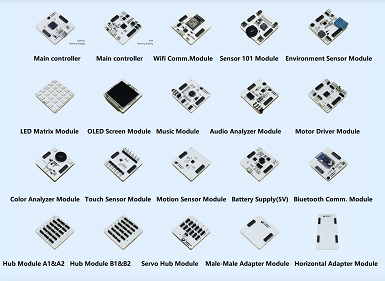
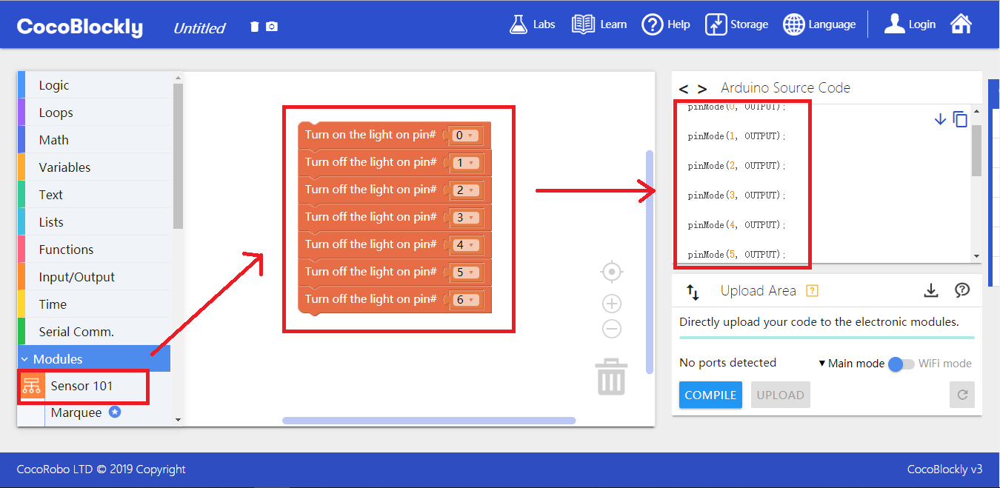

# CocoMod

---

CocoMod, developed by CocoRobo Ltd., is a series of “ready-to-use” electronic modules. At present, twenty kinds of such modules are available: one kind of controlling module, six kinds of input modules, six kinds of output modules, four kinds of hub modules (hub module A, hub module B, parallel adapting module, and reverse adapting module), and three kinds of communication modules (Bluetooth communication module, WiFi communication module, and NBloT communication module). CocoMod empowers your works to sense and control the real world. You can invent a variety of works by connecting the modules with other devices such as LED light, motor, switch, temperature and humidity sensor, display unit, and wireless communication modules.

You can easily accomplish various projects by combining these modules, 3D printing and programming. The extensibility, which can facilitate beginners to learn the knowledge of electronics and programming, is among the best of Arduino suites in the market. In addition, CocoRobo encourages you to learn to use the modules better and faster with matching courses.

### Pinout

Every pinout in a module can be used only once regardless of whether the module is used individually or in combination with others. Two modules, which need to use the same pinout, cannot be used at the same time. Therefore, it has to be made sure that there are no pinout clashes when you choose a module combination.

For example, a sensor 101 module cannot be used in combination with environmental sensing module, motion sensing module, touch analysing module and music module. Yet it can be used in combination with motor driver module and screen module. But only some of the buttons and output components can be used in combination with the two modules. When used in combination with motor-drive module, only the buttons D12, D13 and A3 are usable; while when used in combination with screen module, all the buttons and components except buttons D5, D6 and D8 are usable.

The pinout currently used by a module can be seen in a block’s corresponding source code reference area when you drag the module on the CocoBlockly platform. And each time a pinout is used, it is synchronously updated in the area.

**Please refer to the table below for programming:**

High-resolution version is available [here](http://cocorobo.hk/downloads/cocorobo-modules-pinout-map_v2.pdf).

Pinout clashes can be resolved by switching pinouts. For more information, please refer to [cocorobo-modules-pinout-map](/cocomod/pinout-map).

---
Updated in August 2019
